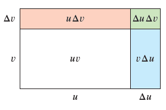
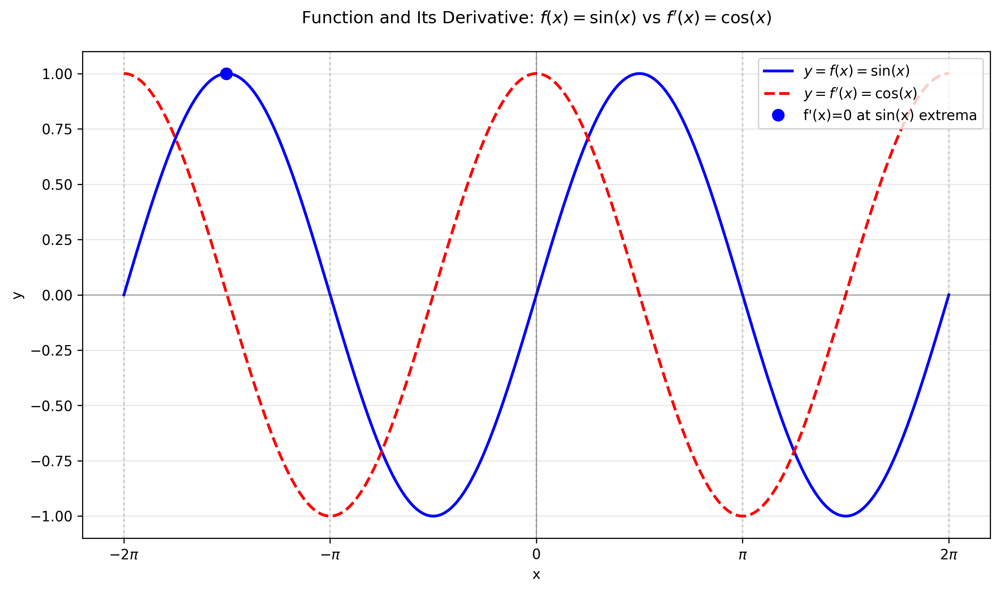
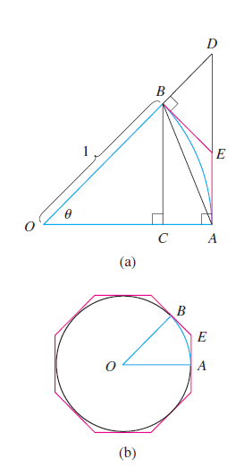
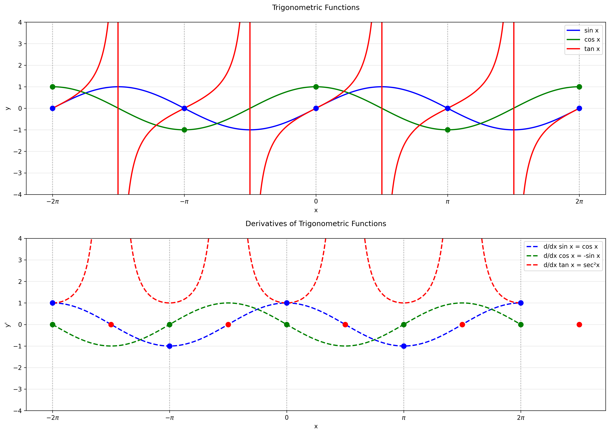
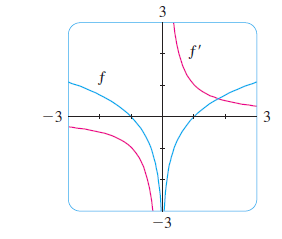
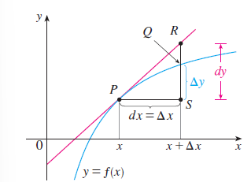
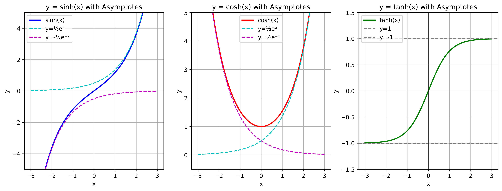
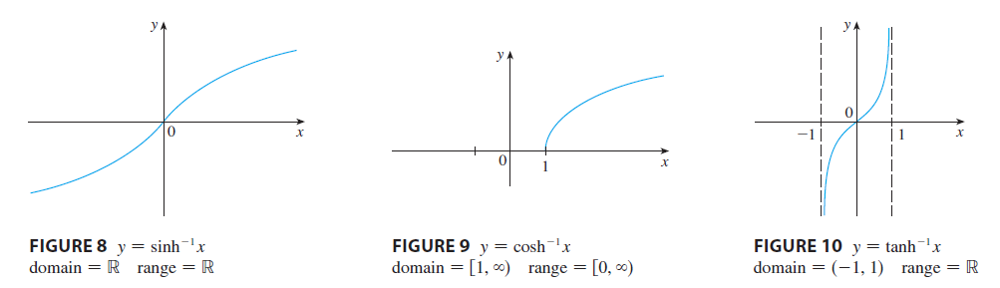

# Differentiation Rules
## 3.1 Derivatives of Polynomials and Exponential Functions
### 1. Constant Function
**Rule**:  
If $f(x) = c$ where $c$ is a constant, then:

$$
\frac{d}{dx}(c) = 0
$$

### 2. Power Rule
**Rule**:  
If $n$ is a positive integer, then:

$$
\frac{d}{dx}(x^n) = nx^{n-1}
$$

**Proof:**
Using the limit definition of derivative:

$$
\begin{aligned}
f'(x) &= \lim_{h \to 0} \frac{f(x+h) - f(x)}{h} \\
&= \lim_{h \to 0} \frac{(x+h)^n - x^n}{h} \\
&= \lim_{h \to 0} \frac{\cancel{x^n} + nx^{n-1}h + \frac{n(n-1)}{2}x^{n-2}h^2 + \cdots + h^n - \cancel{x^n}}{h} \\
&= \lim_{h \to 0} \left(nx^{n-1} + \frac{n(n-1)}{2}x^{n-2}h + \cdots + h^{n-1}\right) \\
&= nx^{n-1}
\end{aligned}
$$

*(Binomial Theorem used for expansion)*

### 3. Constant Multiple Rule
**Rule**:  
If $c$ is a constant and $f$ is differentiable:

$$
\frac{d}{dx}[cf(x)] = c \cdot f'(x)
$$

**Proof:**
Let $g(x) = cf(x)$. Then:

$$
\begin{aligned}
g'(x) &= \lim_{h \to 0} \frac{g(x+h) - g(x)}{h} \\
&= \lim_{h \to 0} \frac{cf(x+h) - cf(x)}{h} \\
&= c \cdot \lim_{h \to 0} \frac{f(x+h) - f(x)}{h} \quad \text{(Limit Law 3)} \\
&= c f'(x)
\end{aligned}
$$

### 4. Sum Rule
**Rule**:  
If $f$ and $g$ are differentiable:

$$
\frac{d}{dx}[f(x) + g(x)] = f'(x) + g'(x)
$$

**Proof:**
Let $F(x) = f(x) + g(x)$. Then:

$$
\begin{aligned}
F'(x) &= \lim_{h \to 0} \frac{F(x+h) - F(x)}{h} \\
&= \lim_{h \to 0} \frac{[f(x+h) + g(x+h)] - [f(x) + g(x)]}{h} \\
&= \lim_{h \to 0} \left(\frac{f(x+h) - f(x)}{h} + \frac{g(x+h) - g(x)}{h}\right) \\
&= f'(x) + g'(x) \quad \text{(Limit Law 1)}
\end{aligned}
$$

### 5. Difference Rule
**Rule**:  
If $f$ and $g$ are differentiable:

$$
\frac{d}{dx}[f(x) - g(x)] = f'(x) - g'(x)
$$

*Proof follows similarly to the Sum Rule.*

### 6. Derivatives of Exponential Functions

#### i. **Derivative of $e^x$**

$$
\frac{d}{dx}(e^x) = e^x
$$

#### Proof
**Using Limit Definition:**

$$
\begin{aligned}
\frac{d}{dx}e^x &= \lim_{h \to 0} \frac{e^{x+h} - e^x}{h} \\
&= e^x \cdot \lim_{h \to 0} \frac{e^h - 1}{h} \quad \text{(Factoring)} \\
&= e^x \cdot 1 \quad \text{(Since } \lim_{h \to 0} \frac{e^h - 1}{h} = 1 \text{)} \\
&= e^x
\end{aligned}
$$

*Definition of Number* $e$ : $e = \lim_{h \to 0} \frac{e^h - 1}{h} = 1 $.

**Using Taylor Series:**

$$ e^x = \sum_{n=0}^\infty \frac{x^n}{n!} $$

Differentiating term-by-term:

$$
\frac{d}{dx}e^x = \sum_{n=1}^\infty \frac{nx^{n-1}}{n!} = \sum_{n=0}^\infty \frac{x^n}{n!} = e^x
$$

**Key Implications**
 - **Euler's Formula Connection**:
   $$ \frac{d}{dt}e^{it} = ie^{it} \quad \text{(Essential in complex analysis)} $$

## 3.2 The Product and Quotient Rule
### 3.2.1 Proof of the Product Rule

Let $u = f(x)$ and $v = g(x)$ be differentiable functions. The change in their product under a small increment $\Delta x$ is:

$$
\Delta(uv) = (u + \Delta u)(v + \Delta v) - uv = u\Delta v + v\Delta u + \Delta u \Delta v
$$

**Geometric Interpretation**:  
This represents the sum of three rectangular areas in the change diagram.

#### Step 1: Difference Quotient
Dividing by $\Delta x$ gives:

$$
\frac{\Delta(uv)}{\Delta x} = u\frac{\Delta v}{\Delta x} + v\frac{\Delta u}{\Delta x} + \Delta u\frac{\Delta v}{\Delta x}
$$

#### Step 2: Take the Limit
As $\Delta x \to 0$:

$$
\begin{align*}
\frac{d}{dx}(uv) &= \lim_{\Delta x \to 0} \left(u\frac{\Delta v}{\Delta x} + v\frac{\Delta u}{\Delta x} + \Delta u\frac{\Delta v}{\Delta x}\right) \\
&= u\lim_{\Delta x \to 0}\frac{\Delta v}{\Delta x} + v\lim_{\Delta x \to 0}\frac{\Delta u}{\Delta x} + \left(\lim_{\Delta x \to 0}\Delta u\right)\left(\lim_{\Delta x \to 0}\frac{\Delta v}{\Delta x}\right) \\
&= u\frac{dv}{dx} + v\frac{du}{dx} + 0 \cdot \frac{dv}{dx} \quad \text{(since differentiability implies continuity, } \Delta u \to 0\text{)}
\end{align*}
$$

#### Final Result:

$$
\boxed{\frac{d}{dx}[f(x)g(x)] = f(x)g'(x) + g(x)f'(x)}
$$

### The Product Rule (Formal Statement):
If $f$ and $g$ are both differentiable at $x$, then:

$$
\frac{d}{dx}\left[f(x)g(x)\right] = f(x)\frac{d}{dx}[g(x)] + g(x)\frac{d}{dx}[f(x)]
$$

### 3.2.2 Proof of the Quotient Rule

Let $u = f(x)$ and $v = g(x) \neq 0$ be differentiable functions. The change in their quotient is:

$$
\Delta\left(\frac{u}{v}\right) = \frac{u + \Delta u}{v + \Delta v} - \frac{u}{v} = \frac{(u + \Delta u)v - u(v + \Delta v)}{v(v + \Delta v)} = \frac{v\Delta u - u\Delta v}{v(v + \Delta v)}
$$

#### Step 1: Difference Quotient
Dividing by $\Delta x$ gives:

$$
\frac{\Delta(u/v)}{\Delta x} = \frac{v\frac{\Delta u}{\Delta x} - u\frac{\Delta v}{\Delta x}}{v(v + \Delta v)}
$$

#### Step 2: Take the Limit
As $\Delta x \to 0$ (which implies $\Delta v \to 0$ since $g$ is differentiable and thus continuous):

$$
\begin{align*}
\frac{d}{dx}\left(\frac{u}{v}\right) &= \lim_{\Delta x \to 0} \frac{v\frac{\Delta u}{\Delta x} - u\frac{\Delta v}{\Delta x}}{v(v + \Delta v)} \\
&= \frac{v\lim_{\Delta x \to 0}\frac{\Delta u}{\Delta x} - u\lim_{\Delta x \to 0}\frac{\Delta v}{\Delta x}}{v \cdot \lim_{\Delta x \to 0}(v + \Delta v)} \\
&= \frac{v\frac{du}{dx} - u\frac{dv}{dx}}{v^2}
\end{align*}
$$

#### Final Result:

$$
\boxed{\frac{d}{dx}\left[\frac{f(x)}{g(x)}\right] = \frac{g(x)f'(x) - f(x)g'(x)}{[g(x)]^2}}
$$

#### The Quotient Rule (Formal Statement):
If $f$ and $g$ are differentiable at $x$ and $g(x) \neq 0$, then:

$$
\frac{d}{dx}\left[\frac{f(x)}{g(x)}\right] = \frac{g(x)f'(x) - f(x)g'(x)}{[g(x)]^2}
$$

### 3.2.3  Table of Differentiation Formulas

| Function Form | Derivative |
|--------------|------------|
| **Constant** $\frac{d}{dx}(c) = 0$ | The derivative of any constant is $0$ |
| **Power Rule** $\frac{d}{dx}(x^n) = nx^{n-1}$ | Works for all real numbers $n$ |
| **Exponential** $\frac{d}{dx}(e^x) = e^x$ | The exponential function is its own derivative |
| **Constant Multiple** $(cf)' = cf'$ | Constants can be factored out |
| **Sum Rule** $(f + g)' = f' + g'$ | The derivative of a sum is the sum of derivatives |
| **Difference Rule** $(f - g)' = f' - g'$ | The derivative of a difference is the difference of derivatives |
| **Product Rule** $(fg)' = fg' + gf'$ | "First times derivative of second plus second times derivative of first" |
| **Quotient Rule** $\left(\frac{f}{g}\right)' = \frac{gf' - fg'}{g^2}$ ($g(x) \neq 0$)| "Bottom times derivative of top minus top times derivative of bottom, all over bottom squared" |

## 3.3 Derivatives of Trigonometric Functions

### 3.3.1 Proof that $\frac{d}{dx}\sin x = \cos x$

**Step 1: Apply the definition of the derivative**

$$
f'(x) = \lim_{h \to 0} \frac{\sin(x+h) - \sin x}{h}
$$

**Step 2: Use the sine addition formula**

$$
= \lim_{h \to 0} \frac{\sin x \cos h + \cos x \sin h - \sin x}{h}
$$

**Step 3: Rearrange terms**

$$
= \lim_{h \to 0} \left[\sin x\left(\frac{\cos h - 1}{h}\right) + \cos x\left(\frac{\sin h}{h}\right)\right]
$$

**Step 4: Evaluate the limits separately**

We need two key trigonometric limits:

1. **Limit of $\frac{\sin θ}{θ}$**:

$$
\lim_{θ \to 0} \frac{\sin θ}{θ} = 1
$$

   *Proof*:
   
   - For small $θ > 0$, from the unit circle:
     
$$
\sin θ < θ < \tan θ
$$

   - Dividing by $\sin θ$:

$$
1 < \frac{θ}{\sin θ} < \frac{1}{\cos θ}
$$

   - Taking reciprocals:

$$
\cos θ < \frac{\sin θ}{θ} < 1
$$
   - By Squeeze Theorem:

$$
\lim_{θ \to 0^+} \frac{\sin θ}{θ} = 1
$$

   - Since $\frac{\sin θ}{θ}$ is even, the two-sided limit exists and equals 1.

2. **Limit of $\frac{\cos θ - 1}{θ}$**:

$$
\lim_{θ \to 0} \frac{\cos θ - 1}{θ} = 0
$$

   *Proof*:

$$
   \lim_{θ \to 0} \frac{\cos θ - 1}{θ} \cdot \frac{\cos θ + 1}{\cos θ + 1} = \lim_{θ \to 0} \frac{-\sin^2 θ}{θ(\cos θ + 1)} = -\lim_{θ \to 0} \frac{\sin θ}{θ} \cdot \frac{\sin θ}{\cos θ + 1} = -1 \cdot 0 = 0
$$

**Step 5: Complete the derivative calculation**

$$
f'(x) = \sin x \cdot \lim_{h \to 0} \frac{\cos h - 1}{h} + \cos x \cdot \lim_{h \to 0} \frac{\sin h}{h} = \sin x \cdot 0 + \cos x \cdot 1 = \cos x
$$

**Final Result**:

$$
\boxed{\frac{d}{dx} \sin x = \cos x}
$$

### 3.3.2 Derivatives of Trigonometric Functions

| Function  | Proof Outline |
|----------|--------------|
| $\frac{d}{dx}(\sin x) = \cos x$ | From first principles using $\lim_{h\to 0}\frac{\sin h}{h}=1$ |
| $\frac{d}{dx}(\cos x) = -\sin x$ | Use $\cos x = \sin\left(\frac{\pi}{2}-x\right)$ and chain rule |
| $\frac{d}{dx}(\tan x) = \sec^2 x$ | Quotient rule on $\frac{\sin x}{\cos x}$ |
| $\frac{d}{dx}(\cot x) = -\csc^2 x$ |  Quotient rule on $\frac{\cos x}{\sin x}$ |
| $\frac{d}{dx}(\sec x) = \sec x \tan x$ | ***Chain rule*** on $(\cos x)^{-1}$ |
| $\frac{d}{dx}(\csc x) = -\csc x \cot x$ | Chain rule on $(\sin x)^{-1}$ |

#### Complete Derivations

1. **Sine Derivative**:

$$
\frac{d}{dx}\sin x = \cos x
$$

   *Proof*: From first principles using angle addition and special limits.

2. **Cosine Derivative**:

$$
\frac{d}{dx}\cos x = -\sin x
$$

   *Proof*: Differentiate $\cos x = \sin\left(\frac{\pi}{2}-x\right)$ using chain rule.

3. **Tangent Derivative**:

$$
\frac{d}{dx}\tan x = \sec^2 x
$$

*Proof*: Apply quotient rule to $\frac{\sin x}{\cos x}$:

$$
\frac{\cos x \cdot \cos x - \sin x \cdot (-\sin x)}{\cos^2 x} = \frac{1}{\cos^2 x} = \sec^2 x
$$

#### Visual Confirmation

## 3.4 The Chain Rule
### The Chain Rule

If $t$ is differentiable at $x$ and $f$ is differentiable at $t(x)$, then the composite function $F = f \circ t$ defined by $F(x) = f(t(x))$ is differentiable at $x$, and $F'$ is given by the product:

$$ F'(x) = f'(t(x)) \cdot t'(x) $$

In Leibniz notation, if $y = f(u)$ and $u = t(x)$ are both differentiable functions, then:

$$ \frac{dy}{dx} = \frac{dy}{du} \cdot \frac{du}{dx} $$

### The Power Rule Combined with the Chain Rule

If $n$ is any real number and $u = t(x)$ is differentiable, then:

$$ \frac{d}{dx} (u^n) = n u^{n-1} \frac{du}{dx} $$

Alternatively:

$$ \frac{d}{dx} \left[ t(x)^n \right] = n \left[ t(x) \right]^{n-1} \cdot t'(x) $$

**Example** Find the derivative of the function:

$$ g(t) = \left( \frac{t - 2}{2t + 1} \right)^9 $$

**Solution** Combining the Power Rule, Chain Rule, and Quotient Rule, we get:

$$
\begin{align*}
g'(t) &= 9 \left( \frac{t - 2}{2t + 1} \right)^8 \cdot \frac{d}{dt} \left( \frac{t - 2}{2t + 1} \right) \\
&= 9 \left( \frac{t - 2}{2t + 1} \right)^8 \cdot \frac{(2t + 1) \cdot 1 - 2(t - 2)}{(2t + 1)^2} \\
&= \frac{45(t - 2)^8}{(2t + 1)^{10}}
\end{align*}
$$

### Differentiating Exponential Functions Using the Chain Rule

We can use the Chain Rule to differentiate an exponential function with any base \( b > 0 \).  
Recall that \( b = e^{\ln b} \). Therefore:

$$ b^x = \left(e^{\ln b}\right)^x = e^{(\ln b) x} $$

Applying the Chain Rule to differentiate \( \frac{d}{dx} (b^x) \):

$$
\begin{align*}
\frac{d}{dx} (b^x) &= \frac{d}{dx} \left( e^{(\ln b) x} \right) \\
&= e^{(\ln b) x} \cdot \frac{d}{dx} \left( (\ln b) x \right) \\
&= e^{(\ln b) x} \cdot \ln b \\
&= b^x \ln b
\end{align*}
$$

Thus, we obtain the formula:

$$ \boxed{ \frac{d}{dx} (b^x) = b^x \ln b } $$

## 3.5 Implicit Diferentiation
### 3.5.1 Examples
#### Example 1
**(a) If $x^2 + y^2 = 25$, find $\frac{dy}{dx}$ .**

**Solution:**  
Differentiate both sides of the equation implicitly with respect to $x$ :

$$
\frac{d}{dx}(x^2 + y^2) = \frac{d}{dx}(25)
$$

Apply the derivative term-by-term:

$$
\frac{d}{dx}(x^2) + \frac{d}{dx}(y^2) = 0
$$

Using the Chain Rule for $\frac{d}{dx}(y^2)$ (since $y$ is a function of $x$ ):

$$
\frac{d}{dx}(y^2) = \frac{d}{dy}(y^2) \cdot \frac{dy}{dx} = 2y \frac{dy}{dx}
$$

Substitute back into the equation:

$$
2x + 2y \frac{dy}{dx} = 0
$$

Solve for \( \frac{dy}{dx} \):

$$
2y \frac{dy}{dx} = -2x \quad \Rightarrow \quad \frac{dy}{dx} = -\frac{x}{y}
$$

**Final answer:**

$$
\boxed{\frac{dy}{dx} = -\frac{x}{y}}
$$

**(b) Find an equation of the tangent to the circle $x^2 + y^2 = 25$ at the point $(3, 4)$.**

**Solution:**  
From part (a), the slope of the tangent line is:

$$
\frac{dy}{dx} \bigg|_{(3,4)} = -\frac{3}{4}
$$

Using the point-slope form of a line:

$$
y - 4 = -\frac{3}{4}(x - 3)
$$

Simplify to standard form:

$$
4(y - 4) = -3(x - 3) \quad \Rightarrow \quad 4y - 16 = -3x + 9
$$

$$
3x + 4y - 25 = 0
$$

**Final answer:**

$$
\boxed{3x + 4y - 25 = 0}
$$

#### Example 2
Find $y'$ if $\sin(x + y) = y^2 \cos x$.

**Solution:**  
Differentiate both sides implicitly with respect to $x$ (remembering that $y$ is a function of $x$):

$$
\frac{d}{dx} \left[ \sin(x + y) \right] = \frac{d}{dx} \left[ y^2 \cos x \right]
$$

Apply the **Chain Rule** to the left side and the **Product Rule + Chain Rule** to the right side:

$$
\cos(x + y) \cdot (1 + y') = y^2 (-\sin x) + (\cos x)(2y y')
$$

Simplify the equation:

$$
\cos(x + y) (1 + y') = -y^2 \sin x + 2y \cos x \cdot y'
$$

Expand and collect terms involving $y'$:

$$
\cos(x + y) + y' \cos(x + y) = -y^2 \sin x + 2y y' \cos x
$$

Group $y'$ terms on one side:

$$
y' \cos(x + y) - 2y y' \cos x = -y^2 \sin x - \cos(x + y)
$$

Factor out $y'$:

$$
y' \left[ \cos(x + y) - 2y \cos x \right] = -y^2 \sin x - \cos(x + y)
$$

Solve for $y'$:

$$
y' = \frac{-y^2 \sin x - \cos(x + y)}{\cos(x + y) - 2y \cos x} = \frac{y^2 \sin x + \cos(x + y)}{2y \cos x - \cos(x + y)}
$$

**Final answer:**

$$
\boxed{y' = \frac{y^2 \sin x + \cos(x + y)}{2y \cos x - \cos(x + y)}}
$$

### Key Steps:
1. **Implicit differentiation**: Applied $\frac{d}{dx}$ to both sides, treating $y$ as $y(x)$.
2. **Chain Rule**: Used for $\sin(x + y)$ and $y^2$ terms.
3. **Product Rule**: Applied to $y^2 \cos x$.
4. **Algebraic manipulation**: Isolated $y'$ and factored/simplified the expression.

### 3.5.2 derivatives of inverse Trigonometric functions

Recall the definition of the arcsine function:

$$ y = \sin^{-1}x \quad \text{means} \quad \sin y = x \quad \text{and} \quad -\frac{\pi}{2} \leq y \leq \frac{\pi}{2} $$

Differentiating $\sin y = x$ implicitly with respect to $x$:

$$ \cos y \frac{dy}{dx} = 1 \quad \Rightarrow \quad \frac{dy}{dx} = \frac{1}{\cos y} $$

Since $\cos y > 0$ for $-\frac{\pi}{2} < y < \frac{\pi}{2}$, we can write:

$$ \cos y = \sqrt{1 - \sin^2 y} = \sqrt{1 - x^2} $$

Therefore:

$$ \frac{dy}{dx} = \frac{1}{\cos y} = \frac{1}{\sqrt{1 - x^2}} $$

**Final result:**

$$ \boxed{\frac{d}{dx} (\sin^{-1}x) = \frac{1}{\sqrt{1 - x^2}}} $$

**Similarly, for $y = \tan^{-1}x$, we have:**

$$ \tan y = x \quad \text{with} \quad -\frac{\pi}{2} < y < \frac{\pi}{2} $$

Differentiating implicitly with respect to $x$:
$$ \sec^2 y \frac{dy}{dx} = 1 \quad \Rightarrow \quad \frac{dy}{dx} = \frac{1}{\sec^2 y} $$

Using the identity $1 + \tan^2 y = \sec^2 y$:
$$ \frac{dy}{dx} = \frac{1}{1 + \tan^2 y} = \frac{1}{1 + x^2} $$

**Final result:**
$$ \boxed{\frac{d}{dx} (\tan^{-1}x) = \frac{1}{1 + x^2}} $$

---

### Key Points:
1. Both derivations use **implicit differentiation**.
2. The restrictions on $y$ ensure the correct sign for square roots and division.
3. Trigonometric identities are crucial for simplifying the final expressions.

### 3.5.3 Derivatives of Inverse Trigonometric Functions

$$
\begin{aligned}
\frac{d}{dx} (\sin^{-1}x) &= \frac{1}{\sqrt{1 - x^2}} \\
\frac{d}{dx} (\cos^{-1}x) &= -\frac{1}{\sqrt{1 - x^2}} \\
\frac{d}{dx} (\tan^{-1}x) &= \frac{1}{1 + x^2} \\
\frac{d}{dx} (\cot^{-1}x) &= -\frac{1}{1 + x^2} \\
\frac{d}{dx} (\sec^{-1}x) &= \frac{1}{|x|\sqrt{x^2 - 1}} \quad (|x| > 1) \\
\frac{d}{dx} (\csc^{-1}x) &= -\frac{1}{|x|\sqrt{x^2 - 1}} \quad (|x| > 1)
\end{aligned}
$$

**Key Notes:**
1. All derivatives are valid for the principal values of the functions.
2. The $\sqrt{x^2 - 1}$ terms require $|x| > 1$ for $\sec^{-1}x$ and $\csc^{-1}x$.
3. The absolute value $|x|$ ensures the correct sign for all domains.
4. The derivatives of $\cos^{-1}x$, $\cot^{-1}x$, and $\csc^{-1}x$ are negatives of their counterparts.

## 3.6 Derivatives of Logarithmic Functions
### 3.6.1 Rules
#### 1. Derivative of $\log_b x$
**Theorem:**

$$ \frac{d}{dx} (\log_b x) = \frac{1}{x \ln b} $$

**Proof:**
Let $y = \log_b x$. By definition:

$$ b^y = x $$

Differentiate both sides implicitly with respect to $x$:

$$ \frac{d}{dx}(b^y) = \frac{d}{dx}(x) $$
$$ b^y \ln b \cdot \frac{dy}{dx} = 1 $$

Solve for $\frac{dy}{dx}$:

$$ \frac{dy}{dx} = \frac{1}{b^y \ln b} $$

Substitute back $b^y = x$:

$$ \boxed{\frac{d}{dx} (\log_b x) = \frac{1}{x \ln b}} $$

#### 2. Derivative of $\ln x$ (Special Case when $b = e$)
**Theorem:**

$$ \frac{d}{dx} (\ln x) = \frac{1}{x} $$

**Proof:**
Using the general logarithmic derivative with $b = e$:

$$ \frac{d}{dx} (\ln x) = \frac{1}{x \ln e} = \frac{1}{x \cdot 1} = \frac{1}{x} $$

Thus:

$$ \boxed{\frac{d}{dx} (\ln x) = \frac{1}{x}} $$

#### Chain Rule Form:

$$ \frac{d}{dx} (\ln u) = \frac{1}{u} \cdot \frac{du}{dx} $$

#### Applied to a Function $t(x)$:

$$ \frac{d}{dx} \left[ \ln t(x) \right] = \frac{t'(x)}{t(x)} $$

**Example 1:**
For $f(x) = \ln(x^2 + 1)$:
1. Let $t(x) = x^2 + 1$, so $t'(x) = 2x$
2. Apply the formula:

$$ f'(x) = \frac{t'(x)}{t(x)} = \frac{2x}{x^2 + 1} $$

**Example 2**
Find $f'(x)$ if $f(x) = \ln|x|$.

The function can be expressed piecewise:

$$
f(x) = \begin{cases}
\ln x & \text{if } x > 0 \\
\ln(-x) & \text{if } x < 0
\end{cases}
$$

**Case 1 ($x > 0$):**
Differentiating $\ln x$ directly:

$$
f'(x) = \frac{1}{x}
$$

**Case 2 ($x < 0$):**
Using the Chain Rule on $\ln(-x)$:

$$
f'(x) = \frac{1}{-x} \cdot (-1) = \frac{1}{x}
$$

**Conclusion:**
For all $x \neq 0$:

$$
\boxed{f'(x) = \frac{1}{x}}
$$

**Important Result:**

$$
\frac{d}{dx} \ln|x| = \frac{1}{x} \quad (x \neq 0)
$$

### 3.6.2 Logarithmic Diferentiation

 >The calculation of derivatives of complicated functions involving products, quotients, or powers can often be simplified by taking logarithms.

#### Example
Differentiate the function:

$$ y = \frac{x^{3/4}\sqrt{x^2 + 1}}{(3x + 2)^5} $$

**Solution:**

We use **logarithmic differentiation**:

1. **Take natural logarithms of both sides**:

$$ \ln y = \ln\left(\frac{x^{3/4}\sqrt{x^2 + 1}}{(3x + 2)^5}\right) $$

2. **Apply logarithm properties to expand**:

$$ \ln y = \frac{3}{4}\ln x + \frac{1}{2}\ln(x^2 + 1) - 5\ln(3x + 2) $$

3. **Differentiate implicitly with respect to x**:

$$ \frac{1}{y}\frac{dy}{dx} = \frac{3}{4}\cdot\frac{1}{x} + \frac{1}{2}\cdot\frac{2x}{x^2 + 1} - 5\cdot\frac{3}{3x + 2} $$

4. **Simplify the derivative expression**:

$$ \frac{1}{y}\frac{dy}{dx} = \frac{3}{4x} + \frac{x}{x^2 + 1} - \frac{15}{3x + 2} $$

5. **Solve for dy/dx**:

$$ \frac{dy}{dx} = y\left(\frac{3}{4x} + \frac{x}{x^2 + 1} - \frac{15}{3x + 2}\right) $$

6. **Substitute back the original expression for y**:

$$ \frac{dy}{dx} = \frac{x^{3/4}\sqrt{x^2 + 1}}{(3x + 2)^5}\left(\frac{3}{4x} + \frac{x}{x^2 + 1} - \frac{15}{3x + 2}\right) $$

**Final Answer:**

$$ \boxed{\frac{dy}{dx} = \frac{x^{3/4}\sqrt{x^2 + 1}}{(3x + 2)^5}\left(\frac{3}{4x} + \frac{x}{x^2 + 1} - \frac{15}{3x + 2}\right)} $$

#### Key Steps:
1. Applied logarithmic differentiation to handle the complex fraction
2. Used logarithm properties to simplify before differentiating
3. Differentiated term-by-term using standard rules
4. Multiplied through by y to isolate dy/dx
5. Substituted back the original expression for y

**Steps in Logarithmic Diferentiation**
1. Take natural logarithms of both sides of an equation $y = f(x)$ and use the Laws
of Logarithms to simplify.
2. Differentiate implicitly with respect to $x$.
3. Solve the resulting equation for $y'$.

### The Power Rule

**Theorem:**
If $n$ is any real number and $f(x) = x^n$, then the derivative of $f$ is:

$$
\boxed{f'(x) = nx^{n-1}}
$$

**Key Points:**
1. Applies to **all real numbers** $n$ (integer, fractional, positive, negative)
2. For $n=0$:  
   $f(x)=x^0=1 \Rightarrow f'(x)=0$ (consistent with $0\cdot x^{-1}=0$)
3. Works in combination with other rules (Chain Rule, Product Rule, etc.)

### Differentiation of Exponential Forms

#### Four Cases for Exponents and Bases:

1. **Constant Base and Exponent**  

$$ \frac{d}{dx} (b^n) = 0 \quad \text{(where $b$ and $n$ are constants)} $$

2. **Variable Base, Constant Exponent (Power Rule)**  

$$ \frac{d}{dx} [f(x)^n] = n[f(x)]^{n-1} \cdot f'(x) $$

3. **Constant Base, Variable Exponent** 

$$ \frac{d}{dx} [b^{t(x)}] = b^{t(x)} (\ln b) \cdot t'(x) $$

4. **Variable Base and Exponent**  
   For $[f(x)]^{t(x)}$, use logarithmic differentiation (shown in example below).

#### Example: Differentiate $y = x^{\sqrt{x}}$

**Solution 1: Logarithmic Differentiation**
1. Take natural log of both sides:

$$ \ln y = \ln(x^{\sqrt{x}}) = \sqrt{x} \ln x $$

2. Differentiate implicitly:

$$ \frac{y'}{y} = \sqrt{x} \cdot \frac{1}{x} + (\ln x) \cdot \frac{1}{2\sqrt{x}} $$
$$ \frac{y'}{y} = \frac{1}{\sqrt{x}} + \frac{\ln x}{2\sqrt{x}} $$

3. Solve for $y'$ and substitute back $y = x^{\sqrt{x}}$:

$$ y' = x^{\sqrt{x}} \left( \frac{2 + \ln x}{2\sqrt{x}} \right) $$

**Solution 2: Exponential Rewrite**
1. Rewrite using $e^{\ln x}$:

$$ x^{\sqrt{x}} = e^{\sqrt{x} \ln x} $$

2. Differentiate using chain rule:

$$ \frac{d}{dx} \left( e^{\sqrt{x} \ln x} \right) = e^{\sqrt{x} \ln x} \cdot \frac{d}{dx} (\sqrt{x} \ln x) $$
$$ = x^{\sqrt{x}} \left( \frac{2 + \ln x}{2\sqrt{x}} \right) $$

**Final Answer:**

$$ \boxed{\frac{d}{dx} \left( x^{\sqrt{x}} \right) = x^{\sqrt{x}} \left( \frac{2 + \ln x}{2\sqrt{x}} \right)} $$

#### Key Observations:
- Both methods yield identical results
- Logarithmic differentiation simplifies complex exponent cases
- The derivative combines power and exponential rule aspects

###  *expand knowledge: The number $e$ as a Limit*
#### Derivation:
1. **Given** the natural logarithm function \( f(x) = \ln x \), its derivative is:

$$ f'(x) = \frac{1}{x} \quad \Rightarrow \quad f'(1) = 1 $$

2. **Express the derivative as a limit**:

$$ f'(1) = \lim_{h \to 0} \frac{f(1+h) - f(1)}{h} = \lim_{x \to 0} \frac{\ln(1+x) - \ln 1}{x} = \lim_{x \to 0} \frac{1}{x} \ln(1+x) $$

3. **Rewrite the limit** using logarithm properties:

$$ \lim_{x \to 0} \ln\left( (1+x)^{1/x} \right) = 1 $$

4. **Exponentiate both sides** (using the continuity of the exponential function):

$$ e^1 = e^{\lim_{x \to 0} \ln\left( (1+x)^{1/x} \right)} = \lim_{x \to 0} (1+x)^{1/x} $$

5. **Final expression**:

$$ \boxed{e = \lim_{x \to 0} (1+x)^{1/x}} $$

#### Alternative Form (\( n \to \infty \)):
Let \( n = 1/x \). As \( x \to 0^+ \), \( n \to \infty \):

$$ \boxed{e = \lim_{n \to \infty} \left( 1 + \frac{1}{n} \right)^n } $$

## 3.7 Linear Approximations and Differentials

### Linear Approximation

**Theorem:**
For a function \( f \) that is differentiable at \( a \), the linear approximation \( L(x) \) to \( f \) at \( a \) is given by:

$$
L(x) = f(a) + f'(a)(x-a)
$$

called the linearization of $f$ at $a$.

### Linear Approximations of Trigonometric Functions at 0

#### For \( f(x) = \sin x \) at \( a = 0 \):
1. **Function and derivative**:
   $$ f(x) = \sin x \quad \Rightarrow \quad f'(x) = \cos x $$

2. **Evaluate at \( x = 0 \)**:
   $$ f(0) = \sin 0 = 0 $$
   $$ f'(0) = \cos 0 = 1 $$

3. **Linearization (tangent line approximation)**:
   $$ L(x) = f(0) + f'(0)(x - 0) = 0 + 1 \cdot x $$
   $$ \boxed{L(x) = x} $$

4. **Linear approximation**:
   $$ \boxed{\sin x \approx x} \quad \text{(near } x = 0) $$

#### For \( f(x) = \cos x \) at \( a = 0 \):
1. **Function and derivative**:
   $$ f(x) = \cos x \quad \Rightarrow \quad f'(x) = -\sin x $$

2. **Evaluate at \( x = 0 \)**:
   $$ f(0) = \cos 0 = 1 $$
   $$ f'(0) = -\sin 0 = 0 $$

3. **Linearization**:
   $$ L(x) = f(0) + f'(0)(x - 0) = 1 + 0 \cdot x $$
   $$ \boxed{L(x) = 1} $$

4. **Linear approximation**:
   $$ \boxed{\cos x \approx 1} \quad \text{(near } x = 0) $$

#### Key Observations:
- These approximations are most accurate when \( x \) is near 0 (typically \( |x| < 0.1 \) radians)
- For small angles \( \theta \) (in radians):
  - \( \sin \theta \approx \theta \)
  - \( \cos \theta \approx 1 \)
  - \( \tan \theta \approx \theta \)
- The error in these approximations increases as \( |x| \) grows

### Differentials

**Definition:**
The differential \( dy \) of a function \( y = f(x) \) is given by:

$$
dy = f'(x) \, dx
$$

**Example:**
Find the differential \( dy \) for \( y = x^2 \):

1. **Find the derivative**:

$$ f(x) = x^2 \quad \Rightarrow \quad f'(x) = 2x $$

2. **Express \( dy \)**:

$$ dy = f'(x) \, dx = 2x \, dx $$

## 3.8 Hyperbolic Functions

### 3.8.1 Definition of Hyperbolic Functions

1. **Hyperbolic Sine**:

$$ \sinh x = \frac{e^x - e^{-x}}{2} $$

2. **Hyperbolic Cosine**:

$$ \cosh x = \frac{e^x + e^{-x}}{2} $$

3. **Hyperbolic Tangent**:

$$ \tanh x = \frac{\sinh x}{\cosh x} = \frac{e^x - e^{-x}}{e^x + e^{-x}} $$

4. **Hyperbolic Cosecant**:

$$ \text{csch } x = \frac{1}{\sinh x} $$

5. **Hyperbolic Secant**:

$$ \text{sech } x = \frac{1}{\cosh x} $$

6. **Hyperbolic Cotangent**:

$$ \coth x = \frac{\cosh x}{\sinh x} = \frac{e^x + e^{-x}}{e^x - e^{-x}} $$

#### **visualization**

#### Key Properties:
- $\cosh^2 x - \sinh^2 x = 1$ (Fundamental identity)
- $\sinh x$ is odd, $\cosh x$ is even
- Analogous to trigonometric functions but for hyperbolas
- Useful in calculus, physics (special relativity), and engineering

### 3.8.2 Hyperbolic Function Identities

#### Basic Identities:
1. **Negative Argument**:

$$ \sinh(-x) = -\sinh x $$
$$ \cosh(-x) = \cosh x $$

2. **Pythagorean Identity**:

$$ \cosh^2 x - \sinh^2 x = 1 $$

3. **Derivative Relationships**:

$$ \frac{d}{dx} \sinh x = \cosh x $$
$$ \frac{d}{dx} \cosh x = \sinh x $$

#### Angle Sum Identities:
4. **Addition Formulas**:

$$ \sinh(x + y) = \sinh x \cosh y + \cosh x \sinh y $$
$$ \cosh(x + y) = \cosh x \cosh y + \sinh x \sinh y $$

5. **Double Angle**:

$$ \sinh(2x) = 2\sinh x \cosh x $$
$$ \cosh(2x) = \cosh^2 x + \sinh^2 x $$

#### Reciprocal Identities:
6. **Hyperbolic Secant**:

$$ 1 - \tanh^2 x = \text{sech}^2 x $$

7. **Hyperbolic Cosecant**:

$$ \coth^2 x - 1 = \text{csch}^2 x $$

### 3.8.3 Derivatives of Hyperbolic Functions
1. **Hyperbolic Sine**:

$$ \frac{d}{dx} (\sinh x) = \cosh x $$

2. **Hyperbolic Cosine**:

$$ \frac{d}{dx} (\cosh x) = \sinh x $$

3. **Hyperbolic Tangent**:

$$ \frac{d}{dx} (\tanh x) = \text{sech}^2 x $$

4. **Hyperbolic Cosecant**:

$$ \frac{d}{dx} (\text{csch } x) = -\text{csch } x \coth x $$

5. **Hyperbolic Secant**:

$$ \frac{d}{dx} (\text{sech } x) = -\text{sech } x \tanh x $$

6. **Hyperbolic Cotangent**:

$$ \frac{d}{dx} (\coth x) = -\text{csch}^2 x $$

### 3.8.4 Inverse Hyperbolic Functions

---

1. **Inverse Hyperbolic Sine**:

$$ \sinh^{-1}x = \ln\left(x + \sqrt{x^2 + 1}\right) \quad \text{for all } x \in \mathbb{R} $$

**Proof that \(\sinh^{-1}x = \ln\left(x + \sqrt{x^2 + 1}\right)\)**

Let \( y = \sinh^{-1}x \). By definition, this means:

$$ x = \sinh y = \frac{e^y - e^{-y}}{2} $$

Multiply through by 2:

$$ e^y - e^{-y} = 2x $$

Multiply through by \( e^y \) to eliminate the negative exponent:

$$ e^{2y} - 1 = 2x e^y $$

$$ e^{2y} - 2x e^y - 1 = 0 $$

Let \( z = e^y \), which gives:

$$ z^2 - 2x z - 1 = 0 $$
 
Using the quadratic formula \( z = \frac{2x \pm \sqrt{(2x)^2 + 4}}{2} \):

$$ z = \frac{2x \pm \sqrt{4x^2 + 4}}{2} = x \pm \sqrt{x^2 + 1} $$
 
Since \( z = e^y > 0 \) and \( x - \sqrt{x^2 + 1} < 0 \) (because \( \sqrt{x^2 + 1} > |x| \)), we discard the negative solution:

$$ e^y = x + \sqrt{x^2 + 1} $$

 
Take the natural logarithm of both sides:

$$ y = \ln\left(x + \sqrt{x^2 + 1}\right) $$

**Conclusion:**  
Since we began with \( y = \sinh^{-1}x \), we've shown:

$$ \boxed{\sinh^{-1}x = \ln\left(x + \sqrt{x^2 + 1}\right)} $$

2. **Inverse Hyperbolic Cosine**:

$$ \cosh^{-1}x = \ln\left(x + \sqrt{x^2 - 1}\right) \quad \text{for } x \geq 1 $$

   *Note*:  
   The principal branch requires \( x \geq 1 \) and returns non-negative values.

3. **Inverse Hyperbolic Tangent**:

$$ \tanh^{-1}x = \frac{1}{2}\ln\left(\frac{1 + x}{1 - x}\right) \quad \text{for } |x| < 1 $$

   *Behavior*:  
   Approaches infinity as \( x \to \pm 1 \).

### Derivatives of Inverse Hyperbolic Functions

1. **Inverse Hyperbolic Sine**:

$$ \frac{d}{dx} (\sinh^{-1}x) = \frac{1}{\sqrt{1 + x^2}} \quad \text{for all } x \in \mathbb{R} $$

2. **Inverse Hyperbolic Cosine**:

$$ \frac{d}{dx} (\cosh^{-1}x) = \frac{1}{\sqrt{x^2 - 1}} \quad \text{for } x > 1 $$

3. **Inverse Hyperbolic Tangent**:

$$ \frac{d}{dx} (\tanh^{-1}x) = \frac{1}{1 - x^2} \quad \text{for } |x| < 1 $$

4. **Inverse Hyperbolic Cosecant**:

$$ \frac{d}{dx} (\text{csch}^{-1}x) = -\frac{1}{|x|\sqrt{x^2 + 1}} \quad \text{for } x \neq 0 $$

5. **Inverse Hyperbolic Secant**:

$$ \frac{d}{dx} (\text{sech}^{-1}x) = -\frac{1}{x\sqrt{1 - x^2}} \quad \text{for } 0 < x < 1 $$

6. **Inverse Hyperbolic Cotangent**:

$$ \frac{d}{dx} (\coth^{-1}x) = \frac{1}{1 - x^2} \quad \text{for } |x| > 1 $$

##### Proof that $\frac{d}{dx}(\sinh^{-1}x) = \frac{1}{\sqrt{1+x^2}}$

**Solution 1: Implicit Differentiation**

1. **Let** $y = \sinh^{-1}x$. By definition:

$$ \sinh y = x $$

2. **Differentiate implicitly** with respect to $x$:

$$ \cosh y \cdot \frac{dy}{dx} = 1 $$

3. **Solve for the derivative**:

$$ \frac{dy}{dx} = \frac{1}{\cosh y} $$

4. **Use the identity** $\cosh^2 y - \sinh^2 y = 1$ and $\cosh y > 0$:

$$ \cosh y = \sqrt{1 + \sinh^2 y} = \sqrt{1 + x^2} $$

5. **Final result**:

$$ \boxed{\frac{d}{dx}(\sinh^{-1}x) = \frac{1}{\sqrt{1+x^2}}} $$

**Solution 2: Logarithmic Form Differentiation**

Starting from the logarithmic form (proved earlier):

$$ \sinh^{-1}x = \ln\left(x + \sqrt{x^2 + 1}\right) $$

1. **Differentiate directly**:

$$
\frac{d}{dx}(\sinh^{-1}x) = \frac{1}{x + \sqrt{x^2+1}} \cdot \frac{d}{dx}\left(x + \sqrt{x^2+1}\right)
$$

2. **Compute the derivative inside**:

$$
\frac{d}{dx}\left(x + \sqrt{x^2+1}\right) = 1 + \frac{x}{\sqrt{x^2+1}} = \frac{\sqrt{x^2+1} + x}{\sqrt{x^2+1}}
$$

3. **Combine results**:

$$
\frac{d}{dx}(\sinh^{-1}x) = \frac{1}{x+\sqrt{x^2+1}} \cdot \frac{x+\sqrt{x^2+1}}{\sqrt{x^2+1}} = \frac{1}{\sqrt{x^2+1}}
$$

4. **Final result**:

$$ \boxed{\frac{d}{dx}(\sinh^{-1}x) = \frac{1}{\sqrt{1+x^2}}} $$

**Verification:**
For $x=0$:

$$ \left.\frac{d}{dx}\sinh^{-1}x\right|_{x=0} = \frac{1}{\sqrt{1+0}} = 1 $$

which matches the slope of $\sinh^{-1}x$ at the origin.