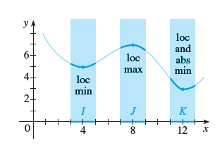
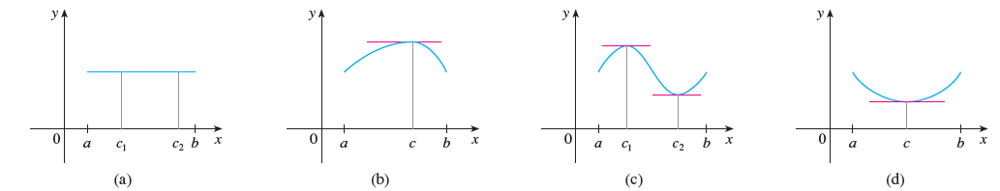
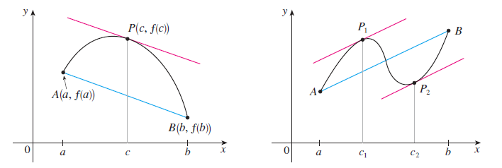
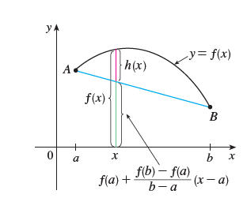
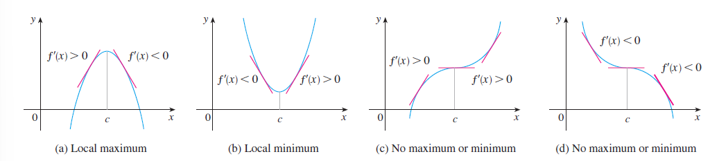
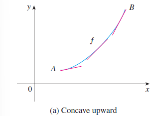
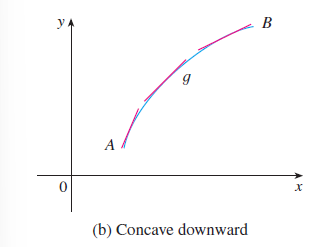
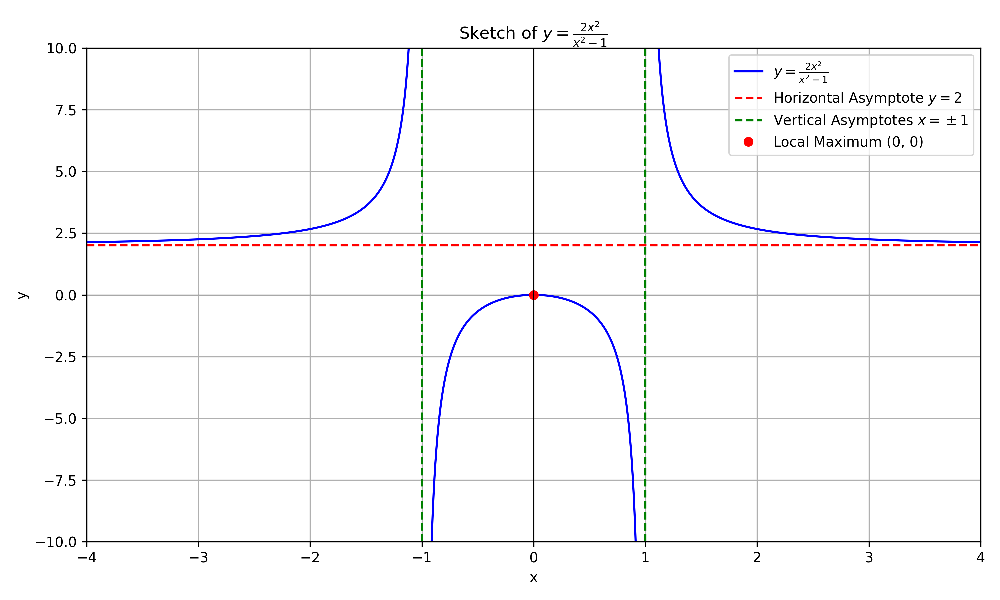
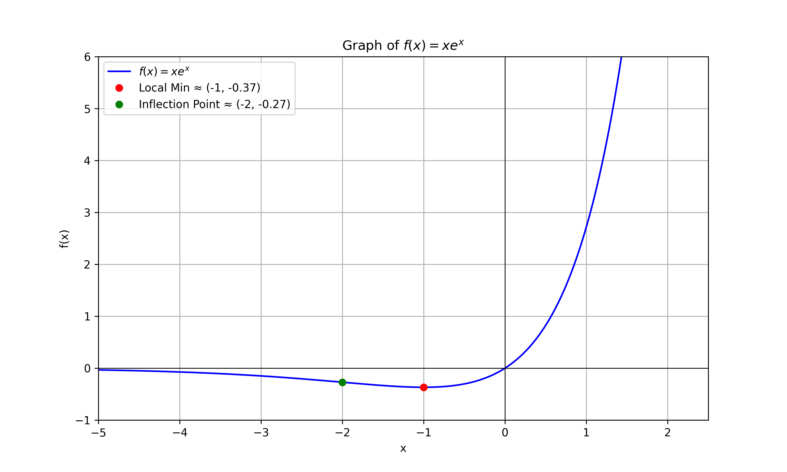

# Applications of Differentiation
## 4.1 Maximum and Minimum Values
### 4.1.1 Definition of Extrema
**Definition 1**:
- A function $f$ has an **absolute maximum** value at $c$ if $f(c) \geq f(x)$ for all $x$ in the domain of $f$.
- A function $f$ has an **absolute minimum** value at $c$ if $f(c) \leq f(x)$ for all $x$ in the domain of $f$.

**Definition 2**:
The number **f(c)** is a:  
- **local maximum value** of *f* if **f(c) > f(x)** when *x* is near *c*.  
- **local minimum value** of *f* if **f(c) < f(x)** when *x* is near *c*.  

#### The Extreme Value Theorem  
If *f* is **continuous** on a **closed interval** [*a, b*], then *f* attains:  
- an **absolute maximum value** *f(c)*,  
- an **absolute minimum value** *f(d)*,  
for some numbers *c* and *d* in [*a, b*].  

#### Fermat’s Theorem  
If *f* has a **local maximum** or **local minimum** at *c*, and if *f'*(*c*) exists, then:  

$$f'(c) = 0$$  

#### **Proof**  
If $f$ has a **local maximum** or **local minimum** at $c$, and if $f'(c)$ exists, then:  
$ f'(c) = 0 $  

#### **Proof**  
Suppose (without loss of generality) that $f$ has a **local maximum** at $c$. Then, by definition:  

$$ f(c) \geq f(x)\text{ for all } x \text{ sufficiently close to } c$$

For small $h$ (positive or negative):  
$ f(c) \geq f(c + h) \implies f(c + h) - f(c) \leq 0 $.  

1. **Right-hand limit ($h \to 0^+$)**:  

$$ \frac{f(c + h) - f(c)}{h} \leq 0 \text{ (since $h > 0$).}$$

Taking the limit: 

$$ f'(c) = \lim_{h \to 0^+} \frac{f(c + h) - f(c)}{h} \leq 0$$ 

2. **Left-hand limit ($h \to 0^-$)**:  
   
$$ \frac{f(c + h) - f(c)}{h} \geq 0 \text{ (since $h < 0$)}$$

   Taking the limit:  

$$ f'(c) = \lim_{h \to 0^-} \frac{f(c + h) - f(c)}{h} \geq 0 $$

Since $f'(c) \leq 0$ and $f'(c) \geq 0$, the only possibility is:  $ \boxed{f'(c) = 0} $.

#### Critical Number of a Function（临界点）

A **critical number** (or critical point) of a function $f$ is a value $x = c$ in the domain of $f$ where either:
1. **The derivative is zero**:  
   $f'(c) = 0$,  

2. **The derivative does not exist**:  
   $f'(c)$ is undefined.

#### Why Critical Numbers Matter:
- They identify potential locations of **local maxima/minima** (by Fermat’s Theorem).  
- They help analyze the function’s behavior (e.g., increasing/decreasing intervals).  

##### Example:
For $f(x) = x^3 - 3x^2$:  
1. Compute $f'(x) = 3x^2 - 6x$.  
2. Set $f'(x) = 0$:  
   $3x^2 - 6x = 0 \implies x = 0$ or $x = 2$.  
   These are critical numbers (both cases where $f'(c) = 0$).  

For $f(x) = |x|$, $x = 0$ is a critical number because $f'(0)$ **does not exist** (sharp corner).  

**If f has a local maximum or minimum at c, then c is a critical number of f.**

#### The Closed Interval Method

To find the **absolute maximum** and **absolute minimum** values of a continuous function $f$ on a closed interval $[a, b]$:

1. Find the values of $f$ at the **critical numbers** of $f$ in the open interval $(a, b)$.
2. Find the values of $f$ at the **endpoints** of the interval: $f(a)$ and $f(b)$.
3. The **largest** of the values from Steps 1 and 2 is the **absolute maximum value**;  
   the **smallest** is the **absolute minimum value**.

## 4.2 The Mean Value Theorem
### Rolle’s Theorem

Let $f$ be a function that satisfies the following three hypotheses:

1. $f$ is **continuous** on the closed interval $[a, b]$.
2. $f$ is **differentiable** on the open interval $(a, b)$.
3. $f(a) = f(b)$.

Then there exists a number $c$ in $(a, b)$ such that:

$$
f'(c) = 0
$$

### 📈 Mean Value Theorem (MVT)

Let $f$ be a function that satisfies the following hypotheses:

1. $f$ is **continuous** on the closed interval $[a, b]$.
2. $f$ is **differentiable** on the open interval $(a, b)$.

Then there exists a number $c$ in $(a, b)$ such that:

$$
f'(c) = \frac{f(b) - f(a)}{b - a}
$$

or, equivalently,

$$
f(b) - f(a) = f'(c)(b - a)
$$

#### Proof of the Mean Value Theorem

We apply **Rolle’s Theorem** to a new function $h$ defined as the difference between $f$ and the secant line joining the points $A = (a, f(a))$ and $B = (b, f(b))$.

Using the **point-slope form** of a line, the equation of the secant line AB is:

$$
y = f(a) + \frac{f(b) - f(a)}{b - a}(x - a)
$$

So, we define the new function:

$$
h(x) = f(x) - \left[ f(a) + \frac{f(b) - f(a)}{b - a}(x - a) \right]
$$

which simplifies to:

$$
h(x) = f(x) - f(a) - \frac{f(b) - f(a)}{b - a}(x - a)
$$

---

Now we check that $h$ satisfies the three conditions of Rolle’s Theorem:

1. **Continuity**: $h(x)$ is continuous on $[a, b]$ because it is the difference of two continuous functions ($f$ and a linear function).
2. **Differentiability**: $h(x)$ is differentiable on $(a, b)$ because both $f$ and the linear function are differentiable. In fact, the derivative is:

   $$
   h'(x) = f'(x) - \frac{f(b) - f(a)}{b - a}
   $$

3. **Equal endpoint values**:

   - At $x = a$:

     $$
     h(a) = f(a) - f(a) - \frac{f(b) - f(a)}{b - a}(a - a) = 0
     $$

   - At $x = b$:

     $$
     h(b) = f(b) - f(a) - \frac{f(b) - f(a)}{b - a}(b - a) = f(b) - f(a) - (f(b) - f(a)) = 0
     $$

---

Since $h(a) = h(b) = 0$, Rolle’s Theorem guarantees a number $c \in (a, b)$ such that:

$$
h'(c) = 0
$$

So:

$$
0 = h'(c) = f'(c) - \frac{f(b) - f(a)}{b - a}
$$

which implies:

$$
f'(c) = \frac{f(b) - f(a)}{b - a}
$$

#### Theorem
If $f'(x) = 0$ for all $x$ in an interval $(a, b)$, then $f$ is constant on $(a, b)$.

#####  *Corollary*

If $f'(x) = t'(x)$ for all $x$ in an interval $(a, b)$,  then $f - t$ is constant on $(a, b)$;  
that is,

$$
f(x) = t(x) + c  \quad \text{for some constant $c$.}
$$

## 4.3 How Derivatives Afect the Shape of a Graph

### 4.3.1 📈 Increasing/Decreasing Test

- (a) If $f'(x) > 0$ on an interval, then $f$ is **increasing** on that interval.  
- (b) If $f'(x) < 0$ on an interval, then $f$ is **decreasing** on that interval.

#### First Derivative Test

Suppose that $c$ is a **critical number** of a continuous function $f$:

- (a) If $f'$ changes from **positive to negative** at $c$, then $f$ has a **local maximum** at $c$.  
- (b) If $f'$ changes from **negative to positive** at $c$, then $f$ has a **local minimum** at $c$.  
- (c) If $f'$ is positive on both sides or negative on both sides of $c$, then $f$ has **no local extremum** at $c$.

### 4.3.2 ❓ What does $f''$ say about $f$?

**Definition:**  
- If the graph of $f$ lies **above all of its tangents** on an interval $I$, then it is called **concave upward** on $I$.  
- If the graph of $f$ lies **below all of its tangents**, it is called **concave downward** on $I$.

#### Concavity Test

Let $I$ be an interval:

- (a) If $f''(x) > 0$ for all $x$ in $I$, then the graph of $f$ is **concave upward** on $I$.  
- (b) If $f''(x) < 0$ for all $x$ in $I$, then the graph of $f$ is **concave downward** on $I$.

  
  

#### Second Derivative Test

Suppose $f''$ is continuous near $c$:

- (a) If $f'(c) = 0$ and $f''(c) > 0$, then $f$ has a **local minimum** at $c$.  
- (b) If $f'(c) = 0$ and $f''(c) < 0$, then $f$ has a **local maximum** at $c$.

## 4.4 Indeterminate Forms and L'Hôpital's Rule

### 4.4.1 L'Hôpital's Rule

Suppose $f$ and $t$ are differentiable and $t'(x) \ne 0$ on an open interval $I$ that contains $a$ (except possibly at $a$). Suppose that

$$
\lim_{x \to a} f(x) = 0 \quad \text{and} \quad \lim_{x \to a} t(x) = 0
$$

or

$$
\lim_{x \to a} f(x) = \pm\infty \quad \text{and} \quad \lim_{x \to a} t(x) = \pm\infty
$$

(In other words, we have an indeterminate form of type $\frac{0}{0}$ or $\frac{\infty}{\infty}$.)

Then:

$$
\lim_{x \to a} \frac{f(x)}{t(x)} = \lim_{x \to a} \frac{f'(x)}{t'(x)}
$$

provided that the limit on the right exists (or is $\infty$ or $-\infty$).

> 🔍 **Note:** L’Hôpital’s Rule can be applied repeatedly if the resulting limit remains in an indeterminate form.

#### Example

Calculate  
$$
\lim_{x \to \infty} \frac{e^x}{x^2}
$$

**Solution:**  
We have:  
- $\lim_{x \to \infty} e^x = \infty$  
- $\lim_{x \to \infty} x^2 = \infty$  

So the limit is an indeterminate form of type $\frac{\infty}{\infty}$, and L’Hôpital’s Rule gives:

$$
\lim_{x \to \infty} \frac{e^x}{x^2} = \lim_{x \to \infty} \frac{\frac{d}{dx} e^x}{\frac{d}{dx} x^2} = \lim_{x \to \infty} \frac{e^x}{2x}
$$

Since $e^x \to \infty$ and $2x \to \infty$ as $x \to \infty$, the limit is still indeterminate of type $\frac{\infty}{\infty}$.

Apply L’Hôpital’s Rule again:

$$
\lim_{x \to \infty} \frac{e^x}{2x} = \lim_{x \to \infty} \frac{\frac{d}{dx} e^x}{\frac{d}{dx} (2x)} = \lim_{x \to \infty} \frac{e^x}{2}
$$

Since $e^x \to \infty$, we have:

$$
\lim_{x \to \infty} \frac{e^x}{x^2} = \infty
$$

### 4.4.2 Indeterminate Forms

In calculus, an **indeterminate form** arises in limit problems when the limit cannot be directly determined from the form of the expression. These forms typically require algebraic manipulation, application of L'Hôpital’s Rule, or other techniques to resolve.

#### Common Indeterminate Forms

| Form                   | Example Expression                              | Notes                                          |
|------------------------|--------------------------------------------------|------------------------------------------------|
| $\frac{0}{0}$           | $\lim_{x \to 0} \frac{\sin x}{x}$               | Most common; often resolved via simplification or L'Hôpital’s Rule. |
| $\frac{\infty}{\infty}$ | $\lim_{x \to \infty} \frac{x^2 + 1}{x + 3}$     | Requires degree comparison or L’Hôpital’s Rule. |
| $0 \cdot \infty$        | $\lim_{x \to 0^+} x \cdot \ln x$                | Convert to a quotient form to evaluate.        |
| $\infty - \infty$       | $\lim_{x \to \infty} (\sqrt{x^2 + x} - x)$      | Needs algebraic manipulation (e.g., conjugates). |
| $0^0$                   | $\lim_{x \to 0^+} x^x$                          | Consider using logarithmic transformation.     |
| $1^\infty$              | $\lim_{x \to \infty} \left(1 + \frac{1}{x}\right)^x$ | Appears in exponential growth forms.       |
| $\infty^0$              | $\lim_{x \to 0^+} \left(\frac{1}{x}\right)^x$  | Often resolved by taking logs and re-expressing. |

> 📌 **Note:** These forms do not imply the limit does not exist—only that more analysis is needed to evaluate them.

#### Indeterminate Products

If $\lim_{x \to a} f(x) = 0$ and $\lim_{x \to a} t(x) = \infty$ (or $-\infty$),  
then the value of  

$$
\lim_{x \to a} f(x) \cdot t(x)
$$  

is unclear. This kind of limit is called an **indeterminate form of type** $0 \cdot \infty$.

To evaluate such a limit, we can rewrite the product $f(x)t(x)$ as a quotient:

- $f(x) \cdot t(x) = \dfrac{f(x)}{1/t(x)}$, or  
- $f(x) \cdot t(x) = \dfrac{t(x)}{1/f(x)}$

This converts the original limit into an indeterminate form of type $\frac{0}{0}$ or $\frac{\infty}{\infty}$,  
allowing us to apply **L’Hospital’s Rule**.

#### Example

Evaluate $\lim_{x \to 0^+} x \ln x.$

**Solution** 
The limit is indeterminate because as $x \to 0^+$:  
- $x \to 0$ (first factor)  
- $\ln x \to -\infty$ (second factor)  

Rewriting using $x = \frac{1}{1/x}$ where $\frac{1}{x} \to \infty$:

Applying l'Hôpital's Rule to the $\frac{-\infty}{\infty}$ form:

$$
\lim_{x \to 0^+} x \ln x = \lim_{x \to 0^+} \frac{\ln x}{1/x}
$$

$$
= \lim_{x \to 0^+} \frac{1/x}{-1/x^2} \quad \text{(differentiate numerator and denominator)}
$$

$$
= \lim_{x \to 0^+} (-x) = \boxed{0}
$$

#### Note

L’Hospital’s Rule is also valid for **one-sided limits** and for **limits at infinity** or **negative infinity**; that is,  
“$x \to a$” can be replaced by any of the symbols:

- $x \to a^+$
- $x \to a^-$
- $x \to \infty$
- $x \to -\infty$

#### Indeterminate Differences
If $\lim_{x \to a} f(x) = \infty$ and $\lim_{x \to a} g(x) = \infty$,  
then the value of  

$$
\lim_{x \to a} (f(x) - g(x))
$$  

is unclear. This kind of limit is called an **indeterminate form of type** $\infty - \infty$.

To evaluate such a limit, we can rewrite the difference $f(x) - g(x)$ as a quotient(for instance, by using a common denominator, or rationalization, or factoring out a common factor):

##### Example 1

Compute  

$$
\lim_{x \to 1^+} \left( \frac{1}{\ln x} - \frac{1}{x - 1} \right)
$$

**Solution:**  
First, observe:
- $\frac{1}{\ln x} \to \infty$ as $x \to 1^+$  
- $\frac{1}{x - 1} \to \infty$ as $x \to 1^+$  

So the limit is of **indeterminate form** $\infty - \infty$.  
We begin by finding a common denominator:

$$
\lim_{x \to 1^+} \left( \frac{1}{\ln x} - \frac{1}{x - 1} \right)
= \lim_{x \to 1^+} \frac{(x - 1) - \ln x}{(x - 1)\ln x}
$$

Both numerator and denominator $\to 0$, so apply **L’Hospital’s Rule**:

Numerator derivative: $1 - \frac{1}{x}$  
Denominator derivative:  
Apply the product rule:  
$(x - 1)\ln x \Rightarrow \frac{d}{dx}[(x - 1)\ln x] = \ln x + \frac{x - 1}{x}$

So:

$$
\lim_{x \to 1^+} \frac{1 - \frac{1}{x}}{\ln x + \frac{x - 1}{x}}
$$

Apply L’Hospital’s Rule again:

Numerator derivative: $\frac{1}{x^2}$  
Denominator derivative: $\frac{1}{x} + \frac{1}{x} - \frac{x - 1}{x^2}$

At $x \to 1^+$, this simplifies to:

$$
\frac{1}{1^2} \div \left(1 + 1 - 0\right) = \frac{1}{2}
$$

**Answer:**  

$$
\lim_{x \to 1^+} \left( \frac{1}{\ln x} - \frac{1}{x - 1} \right) = \frac{1}{2}
$$

---

##### Example 2

Compute  

$$
\lim_{x \to \infty} (e^x - x)
$$

**Solution:**  
This is an **indeterminate difference** of the form $\infty - \infty$.

We can factor out $x$ to simplify:

$$
e^x - x = x \left( \frac{e^x}{x} - 1 \right)
$$

As $x \to \infty$, $\frac{e^x}{x} \to \infty$ (by L’Hospital’s Rule),  
so the entire expression $\to \infty$.

**Answer:**

$$
\lim_{x \to \infty} (e^x - x) = \infty
$$

#### Indeterminate Powers
Several indeterminate forms arise from the limit:

$$\lim_{x \to a} f(x)^{g(x)}$$

1. $$\lim_{x \to a} f(x) \to 0 \quad \text{and} \quad \lim_{x \to a} g(x) \to 0 \quad \text{type } \frac{0}{0}$$

2. $$\lim_{x \to a} f(x) \to \infty \quad \text{and} \quad \lim_{x \to a} g(x) \to 0 \quad \text{type } \frac{\infty}{0}$$

3. $$\lim_{x \to a} f(x) \to 1 \quad \text{and} \quad \lim_{x \to a} g(x) \to \infty \quad \text{type } 1^{\infty}$$

Each of these three cases can be treated either by taking the natural logarithm:

Let $$y = f(x)^{g(x)}, \quad \text{then} \quad \ln y = g(x) \ln f(x)$$

or by writing the function as an exponential:

$$f(x)^{g(x)} = e^{g(x) \ln f(x)}$$

##### Example 1  
Calculate  

$$\lim_{x \to 0^+} (1 + \sin 4x)^{\cot x}.$$

**Solution:**  
First notice that as $x \to 0^+$, we have $1 + \sin 4x \to 1$ and $\cot x \to \infty$,  
so the given limit is an indeterminate form of type $1^{\infty}$.

Let  

$$y = (1 + \sin 4x)^{\cot x}.$$

Then  

$$\ln y = \ln\left[(1 + \sin 4x)^{\cot x}\right] = \cot x \cdot \ln(1 + \sin 4x).$$

Using the identity $\cot x = \frac{1}{\tan x}$:  

$$\ln y = \frac{\ln(1 + \sin 4x)}{\tan x}.$$

Now apply L’Hôpital’s Rule to the limit:  

$$\lim_{x \to 0^+} \ln y = \lim_{x \to 0^+} \frac{\ln(1 + \sin 4x)}{\tan x} = \lim_{x \to 0^+} \frac{4 \cos 4x}{1 + \sin 4x} \cdot \frac{1}{\sec^2 x} = 4.$$

So we have:  

$$\lim_{x \to 0^+} \ln y = 4.$$

To find the original limit, recall $y = e^{\ln y}$:  

$$\lim_{x \to 0^+} (1 + \sin 4x)^{\cot x} = \lim_{x \to 0^+} y = \lim_{x \to 0^+} e^{\ln y} = e^4.$$

##### Example 2  
Find  

$$\lim_{x \to 0^+} x^x.$$

**Solution:**  
This limit is indeterminate since:

- $0^x \to 0$ for any $x > 0$,
- $x^0 \to 1$ for any $x \ne 0$,  
so $0^0$ is an indeterminate form.

We rewrite the function using exponentials:  

$$x^x = e^{\ln(x^x)} = e^{x \ln x}.$$

We now compute the limit:  

$$\lim_{x \to 0^+} x \ln x.$$

This is a known limit and equals 0 (can be shown using L’Hôpital’s Rule).

Therefore:  

$$\lim_{x \to 0^+} x^x = \lim_{x \to 0^+} e^{x \ln x} = e^0 = 1.$$

## 4.5 Curve Sketching

### 4.5.1 Guidelines for Sketching a Curve $y = f(x)$

This checklist helps sketch a graph by hand. Not all steps apply to every function, but together they reveal key features of the curve.

**A. Domain**  
Determine where $f(x)$ is defined.

**B. Intercepts**  
- **Y-intercept:** Evaluate $f(0)$.
- **X-intercepts:** Solve $f(x) = 0$ (if possible).

**C. Symmetry**  
1. **Even Function:**  
   If $f(-x) = f(x)$, the graph is symmetric about the y-axis.  
   _Examples: $y = x^2$, $|x|$, $\cos x$_

2. **Odd Function:**  
   If $f(-x) = -f(x)$, the graph is symmetric about the origin.  
   _Examples: $y = x^3$, $x$, $\sin x$_

3. **Periodic Function:**  
   If $f(x + p) = f(x)$, the function has period $p$.  
   _Examples: $\sin x$ (period $2\pi$), $\tan x$ (period $\pi$)_

**D. Asymptotes**  
1. **Horizontal Asymptotes:**  
   If $\lim_{x \to \infty} f(x) = L$ or $\lim_{x \to -\infty} f(x) = L$, then $y = L$ is a horizontal asymptote.

2. **Vertical Asymptotes:**  
   If $\lim_{x \to a^+} f(x) = \pm\infty$ or $\lim_{x \to a^-} f(x) = \pm\infty$, then $x = a$ is a vertical asymptote.

**E. Intervals of Increase/Decrease**  
- Compute $f'(x)$.
- If $f'(x) > 0$, the function is increasing.
- If $f'(x) < 0$, the function is decreasing.

**F. Local Maximum/Minimum**  
- **Find critical numbers:** Points where $f'(x) = 0$ or $f'(x)$ is undefined.
- **First Derivative Test:**  
  - If $f'$ changes from $+$ to $-$: local max.  
  - If $f'$ changes from $-$ to $+$: local min.
- **Second Derivative Test : if $f'(c) = 0$ and $f''(c)\neq 0$.**  
  - If $f''(c) > 0$: local min at $x = c$.  
  - If $f''(c) < 0$: local max at $x = c$.

**G. Concavity and Inflection Points**  
- Compute $f''(x)$.
- If $f''(x) > 0$: concave up.
- If $f''(x) < 0$: concave down.
- Inflection points occur where concavity changes.

**Example 1**  
Use the guidelines to sketch the curve $y = \dfrac{2x^2}{x^2 - 1}$.

**A. Domain**  
We require $x^2 - 1 \ne 0$, so $x \ne \pm 1$.  
Domain: $\{x \mid x \ne \pm 1\} = (-\infty, -1) \cup (-1, 1) \cup (1, \infty)$

**B. Intercepts**  
- **Y-intercept:** $f(0) = \dfrac{0}{-1} = 0$  
- **X-intercept:** Solve $f(x) = 0 \Rightarrow \dfrac{2x^2}{x^2 - 1} = 0 \Rightarrow x = 0$  
The curve passes through the origin $(0, 0)$.

**C. Symmetry**  
Check $f(-x) = \dfrac{2(-x)^2}{(-x)^2 - 1} = \dfrac{2x^2}{x^2 - 1} = f(x)$  
So the function is even — the curve is symmetric about the y-axis.

**D. Asymptotes**  
- **Horizontal asymptote:**  
  $\lim\limits_{x \to \pm\infty} \dfrac{2x^2}{x^2 - 1} = \lim\limits_{x \to \pm\infty} \dfrac{2}{1 - \frac{1}{x^2}} = 2$  
  So the horizontal asymptote is $y = 2$

- **Vertical asymptotes:**  
  Since $x = \pm1$ makes the denominator zero, check the one-sided limits:  
  $\lim\limits_{x \to 1^-} \dfrac{2x^2}{x^2 - 1} = +\infty$  
  $\lim\limits_{x \to 1^+} \dfrac{2x^2}{x^2 - 1} = -\infty$  
  $\lim\limits_{x \to -1^-} \dfrac{2x^2}{x^2 - 1} = -\infty$  
  $\lim\limits_{x \to -1^+} \dfrac{2x^2}{x^2 - 1} = +\infty$  
  So vertical asymptotes are at $x = \pm 1$

**E. Intervals of Increase/Decrease**  
First derivative:  
$f'(x) = \dfrac{(x^2 - 1)(4x) - 2x^2(2x)}{(x^2 - 1)^2} = \dfrac{4x(x^2 - 1 - x^2)}{(x^2 - 1)^2} = \dfrac{-4x}{(x^2 - 1)^2}$

- $f'(x) > 0$ when $x < 0$, $x \ne -1$  
- $f'(x) < 0$ when $x > 0$, $x \ne 1$  

The function is increasing on $(-\infty, -1)$ and $(-1, 0)$, and decreasing on $(0, 1)$ and $(1, \infty)$

**F. Local Max/Min**  
Critical point: $x = 0$ because $f'(0) = 0$  
Since $f'(x)$ changes from positive to negative at $x = 0$, by the First Derivative Test, $f(0) = 0$ is a **local maximum**

**G. Concavity and Inflection Points**  
Second derivative:  
$f''(x) = \dfrac{12x^2 + 4}{(x^2 - 1)^3}$

- Numerator $12x^2 + 4 > 0$ always  
- Sign depends on denominator $(x^2 - 1)^3$

So:
- $f''(x) > 0$ when $|x| > 1$ → concave up on $(-\infty, -1)$ and $(1, \infty)$  
- $f''(x) < 0$ when $|x| < 1$ → concave down on $(-1, 1)$  
- No inflection points because $x = \pm 1$ are not in the domain

**Example: Sketch the graph of $f(x) = xe^x$**

**A. Domain**  
The domain of $f$ is $\mathbb{R}$ (all real numbers).

**B. Intercepts**  
- **x-intercept**: $f(x) = 0 \Rightarrow x = 0$  
- **y-intercept**: $f(0) = 0$

**C. Symmetry**  
No symmetry: $f(-x) \ne f(x)$ and $f(-x) \ne -f(x)$.

**D. Asymptotes**  
- As $x \to \infty$, $xe^x \to \infty$.
- As $x \to -\infty$, $xe^x$ is an indeterminate form ($0 \cdot -\infty$), so apply L'Hospital’s Rule:

$$
\lim_{x \to -\infty} xe^x = \lim_{x \to -\infty} \frac{x}{e^{-x}} = \lim_{x \to -\infty} \frac{1}{-e^{-x}} = 0
$$

  → Horizontal asymptote: **$y = 0$** (x-axis).

**E. Intervals of Increase/Decrease**  
First derivative:

$$
f'(x) = xe^x + e^x = (x + 1)e^x
$$

- $f'(x) < 0$ when $x < -1$ → decreasing on $(-\infty, -1)$  
- $f'(x) > 0$ when $x > -1$ → increasing on $(-1, \infty)$

**F. Local Extrema**  
- Critical point at $x = -1$
- $f(-1) = -\frac{1}{e} \approx -0.37$
- Since $f'(x)$ changes from negative to positive at $x = -1$, this is a **local (and absolute) minimum**.

**G. Concavity and Inflection Points**  
Second derivative:

$$
f''(x) = (x + 1)e^x + e^x = (x + 2)e^x
$$

- $f''(x) < 0$ when $x < -2$ → concave downward
- $f''(x) > 0$ when $x > -2$ → concave upward
- Inflection point at $x = -2$:  
  $f(-2) = -2e^{-2} = -\frac{2}{e^2} \approx -0.27$

→ Inflection point: **$(-2, -0.27)$**

