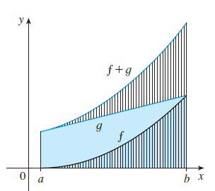
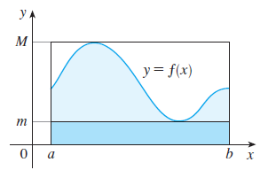
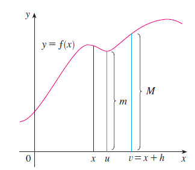

# integral
## 1. Definite Integral
### 1.1. Definition
$$
\int_a^b f(x) dx = \lim_{n \to \infty} \sum_{i=1}^n f(x_i) \Delta x
$$
where $\Delta x = \frac{b-a}{n}$ and $x_i = a + i \Delta x$.

The symbol $\int$ was introduced by **Leibniz** and is called an **integral sign**.  
It is an elongated **S** and was chosen because an integral is a limit of sums.

In the notation:

$$
\int_a^b f(x)\,dx
$$

- $f(x)$ is called the **integrand**  
- $a$ and $b$ are called the **limits of integration**  
- $a$ is the **lower limit**, and $b$ is the **upper limit**

For now, the symbol $dx$ has no meaning by itself;  
$\int_a^b f(x)\,dx$ is considered **a single symbol**.  
The $dx$ simply indicates that the **independent variable** is $x$.

The procedure of calculating an integral is called **integration**.

#### Evaluating integrals
1. $\sum_{i=1}^{n} c = nc$

2. $\sum_{i=1}^{n} ca_i = c \sum_{i=1}^{n} a_i$

3. $\sum_{i=1}^{n} (a_i + b_i) = \sum_{i=1}^{n} a_i + \sum_{i=1}^{n} b_i$

4. $\sum_{i=1}^{n} (a_i - b_i) = \sum_{i=1}^{n} a_i - \sum_{i=1}^{n} b_i$

5. $\sum_{i=1}^{n} i = \dfrac{n(n+1)}{2}$

6. $\sum_{i=1}^{n} i^2 = \dfrac{n(n+1)(2n+1)}{6}$

7. $\sum_{i=1}^{n} i^3 = \left[ \dfrac{n(n+1)}{2} \right]^2$

### 1.2 Properties of the Definite Integral

$$
\boxed{\int_a^b f(x)\,dx = 2 \int_a^b f(x)\,dx}
$$

1.  
$$
\int_a^b c\,dx = c(b - a), \quad \text{where } c \text{ is any constant}
$$

2.  
$$
\int_a^b \left[f(x) + t(x)\right]\,dx = \int_a^b f(x)\,dx + \int_a^b t(x)\,dx
$$

3.  
$$
\int_a^b c f(x)\,dx = c \int_a^b f(x)\,dx, \quad \text{where } c \text{ is any constant}
$$

4.  
$$
\int_a^b \left[f(x) - t(x)\right]\,dx = \int_a^b f(x)\,dx - \int_a^b t(x)\,dx
$$

5.  
$$
\int_a^c f(x)\,dx + \int_c^b f(x)\,dx = \int_a^b f(x)\,dx
$$

---

### Comparison Properties of the Integral

6.  
If \( f(x) > 0 \) for \( a < x < b \), then  
$$
\int_a^b f(x)\,dx > 0
$$

7.  
If \( f(x) > t(x) \) for \( a < x < b \), then  
$$
\int_a^b f(x)\,dx > \int_a^b t(x)\,dx
$$

8.  
If \( m < f(x) < M \) for \( a < x < b \), then  
$$
m(b - a) < \int_a^b f(x)\,dx < M(b - a)
$$

### 1.3 The Fundamental Theorem of Calculus

#### The Fundamental Theorem of Calculus, Part 1

If $f$ is continuous on $[a, b]$, then the function $t$ defined by  

$$
t(x) = \int_a^x f(t)\,dt \quad \text{for } a < x < b
$$  

is continuous on $[a, b]$ and differentiable on $(a, b)$, and  

$$
t'(x) = f(x)
$$

#### Proof

If $x$ and $x + h$ are in $(a, b)$, then

$$
t(x + h) - t(x) = \int_a^{x+h} f(t)\,dt - \int_a^x f(t)\,dt
$$  

By Property 5 of integrals:  

$$
t(x + h) - t(x) = \int_x^{x+h} f(t)\,dt
$$  

So for $h \ne 0$,  

$$
\frac{t(x + h) - t(x)}{h} = \frac{1}{h} \int_x^{x+h} f(t)\,dt
$$

Assume $h > 0$. Since $f$ is continuous on $[x, x+h]$, the Extreme Value Theorem says there exist numbers $u, v \in [x, x+h]$ such that  
$f(u) = \min f(t)$ and $f(v) = \max f(t)$ on that interval.

By the comparison property of integrals: 

$$
f(u) \cdot h < \int_x^{x+h} f(t)\,dt < f(v) \cdot h
$$  

Dividing by $h$:  

$$
f(u) < \frac{1}{h} \int_x^{x+h} f(t)\,dt < f(v)
$$  

So:  

$$
f(u) < \frac{t(x + h) - t(x)}{h} < f(v)
$$

As $h \to 0$, both $u \to x$ and $v \to x$. Since $f$ is continuous at $x$,  

$$
\lim_{h \to 0} \frac{t(x + h) - t(x)}{h} = f(x)
$$  

Therefore,  

$$
\boxed{t'(x) = f(x)}
$$

##### Example 

Find

$$
\frac{d}{dx} \int_{1}^{x^4} \sec t \, dt
$$

##### Solution

Here we have to be careful to use the **Chain Rule** in conjunction with **FTC1** (First Fundamental Theorem of Calculus).

Let $u = x^4$. Then:

$$
\frac{d}{dx} \int_{1}^{x^4} \sec t \, dt 
= \frac{d}{dx} \int_{1}^{u} \sec t \, dt
= \frac{d}{du} \left( \int_{1}^{u} \sec t \, dt \right) \cdot \frac{du}{dx}
$$

(by the Chain Rule)

$$
= \sec(u) \cdot \frac{du}{dx}
$$

Now substitute back $u = x^4$:

$$
= \sec(x^4) \cdot \frac{d}{dx}(x^4)
= \sec(x^4) \cdot 4x^3
$$

##### Final Answer:

$$
\frac{d}{dx} \int_{1}^{x^4} \sec t \, dt = 4x^3 \sec(x^4)
$$

####  The Fundamental Theorem of Calculus, Part 2 (FTC2)

If $f$ is continuous on $[a, b]$, then:

$$
\int_a^b f(x) \, dx = F(b) - F(a)
$$

where $F$ is any antiderivative of $f$, that is, a function such that $F'(x) = f(x)$.

We abbreviate this theorem as **FTC2**.

#### Proof

Let:

$$
t(x) = \int_a^x f(t) \, dt
$$

We know from Part 1 (FTC1) that:

$$
t'(x) = f(x)
$$

That is, $t$ is an antiderivative of $f$.

If $F$ is **any other antiderivative** of $f$ on $[a, b]$, then from **Corollary 4.2.7**, we know that $F$ and $t$ differ by a constant:

$$
F(x) = t(x) + C \quad \text{for } a < x < b
$$

But both $F$ and $t$ are continuous on $[a, b]$, so by taking limits as $x \to a^+$ and $x \to b^-$, the equation holds at the endpoints too:

$$
F(x) = t(x) + C \quad \text{for all } x \in [a, b]
$$

Now, evaluate $t(x)$ at $x = a$:

$$
t(a) = \int_a^a f(t) \, dt = 0
$$

So using the relation $F(x) = t(x) + C$, we have:

- At $x = a$:  
  $F(a) = t(a) + C = 0 + C = C$
- At $x = b$:  
  $F(b) = t(b) + C$

Then:

$$
F(b) - F(a) = [t(b) + C] - [t(a) + C] = t(b) - t(a)
$$

Since $t(a) = 0$, this simplifies to:

$$
F(b) - F(a) = t(b) = \int_a^b f(t) \, dt
$$

##### Final Result

$$
\int_a^b f(x) \, dx = F(b) - F(a)
$$

This completes the proof of the **Fundamental Theorem of Calculus, Part 2 (FTC2)**.
