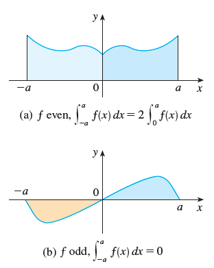
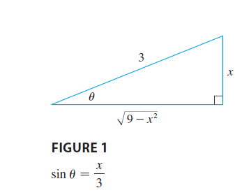
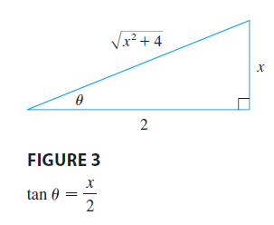

# integral
## 1. Definite Integral
### 1.1. Definition

$$
\int_a^b f(x) dx = \lim_{n \to \infty} \sum_{i=1}^n f(x_i) \Delta x
$$

where $\Delta x = \frac{b-a}{n}$ and $x_i = a + i \Delta x$.

The symbol $\int$ was introduced by **Leibniz** and is called an **integral sign**.  
It is an elongated **S** and was chosen because an integral is a limit of sums.

In the notation:

$$
\int_a^b f(x)\,dx
$$

- $f(x)$ is called the **integrand**  
- $a$ and $b$ are called the **limits of integration**  
- $a$ is the **lower limit**, and $b$ is the **upper limit**

For now, the symbol $dx$ has no meaning by itself;  
$\int_a^b f(x)\,dx$ is considered **a single symbol**.  
The $dx$ simply indicates that the **independent variable** is $x$.

The procedure of calculating an integral is called **integration**.

#### Evaluating integrals
1. $\sum_{i=1}^{n} c = nc$

2. $\sum_{i=1}^{n} ca_i = c \sum_{i=1}^{n} a_i$

3. $\sum_{i=1}^{n} (a_i + b_i) = \sum_{i=1}^{n} a_i + \sum_{i=1}^{n} b_i$

4. $\sum_{i=1}^{n} (a_i - b_i) = \sum_{i=1}^{n} a_i - \sum_{i=1}^{n} b_i$

5. $\sum_{i=1}^{n} i = \dfrac{n(n+1)}{2}$

6. $\sum_{i=1}^{n} i^2 = \dfrac{n(n+1)(2n+1)}{6}$

7. $\sum_{i=1}^{n} i^3 = \left[ \dfrac{n(n+1)}{2} \right]^2$

### 1.2 Properties of the Definite Integral

$$
\boxed{\int_a^b f(x)\,dx = 2 \int_a^b f(x)\,dx}
$$

1.  
$$
\int_a^b c\,dx = c(b - a), \quad \text{where } c \text{ is any constant}
$$

2.  
$$
\int_a^b \left[f(x) + t(x)\right]\,dx = \int_a^b f(x)\,dx + \int_a^b t(x)\,dx
$$

3.  
$$
\int_a^b c f(x)\,dx = c \int_a^b f(x)\,dx, \quad \text{where } c \text{ is any constant}
$$

4.  
$$
\int_a^b \left[f(x) - t(x)\right]\,dx = \int_a^b f(x)\,dx - \int_a^b t(x)\,dx
$$

5.  
$$
\int_a^c f(x)\,dx + \int_c^b f(x)\,dx = \int_a^b f(x)\,dx
$$

---

### Comparison Properties of the Integral

6.  
If \( f(x) > 0 \) for \( a < x < b \), then  

$$
\int_a^b f(x)\,dx > 0
$$

7.  
If \( f(x) > t(x) \) for \( a < x < b \), then  

$$
\int_a^b f(x)\,dx > \int_a^b t(x)\,dx
$$

8.  
If \( m < f(x) < M \) for \( a < x < b \), then  

$$
m(b - a) < \int_a^b f(x)\,dx < M(b - a)
$$

### 1.3 The Fundamental Theorem of Calculus

#### The Fundamental Theorem of Calculus, Part 1

If $f$ is continuous on $[a, b]$, then the function $t$ defined by  

$$
t(x) = \int_a^x f(t)\,dt \quad \text{for } a < x < b
$$  

is continuous on $[a, b]$ and differentiable on $(a, b)$, and  

$$
t'(x) = f(x)
$$

#### Proof

If $x$ and $x + h$ are in $(a, b)$, then

$$
t(x + h) - t(x) = \int_a^{x+h} f(t)\,dt - \int_a^x f(t)\,dt
$$  

By Property 5 of integrals:  

$$
t(x + h) - t(x) = \int_x^{x+h} f(t)\,dt
$$  

So for $h \ne 0$,  

$$
\frac{t(x + h) - t(x)}{h} = \frac{1}{h} \int_x^{x+h} f(t)\,dt
$$

Assume $h > 0$. Since $f$ is continuous on $[x, x+h]$, the Extreme Value Theorem says there exist numbers $u, v \in [x, x+h]$ such that  
$f(u) = \min f(t)$ and $f(v) = \max f(t)$ on that interval.

By the comparison property of integrals: 

$$
f(u) \cdot h < \int_x^{x+h} f(t)\,dt < f(v) \cdot h
$$  

Dividing by $h$:  

$$
f(u) < \frac{1}{h} \int_x^{x+h} f(t)\,dt < f(v)
$$  

So:  

$$
f(u) < \frac{t(x + h) - t(x)}{h} < f(v)
$$

As $h \to 0$, both $u \to x$ and $v \to x$. Since $f$ is continuous at $x$,  

$$
\lim_{h \to 0} \frac{t(x + h) - t(x)}{h} = f(x)
$$  

Therefore,  

$$
\boxed{t'(x) = f(x)}
$$

##### Example 

Find

$$
\frac{d}{dx} \int_{1}^{x^4} \sec t \, dt
$$

##### Solution

Here we have to be careful to use the **Chain Rule** in conjunction with **FTC1** (First Fundamental Theorem of Calculus).

Let $u = x^4$. Then:

$$
\frac{d}{dx} \int_{1}^{x^4} \sec t \, dt 
= \frac{d}{dx} \int_{1}^{u} \sec t \, dt
= \frac{d}{du} \left( \int_{1}^{u} \sec t \, dt \right) \cdot \frac{du}{dx}
$$

(by the Chain Rule)

$$
= \sec(u) \cdot \frac{du}{dx}
$$

Now substitute back $u = x^4$:

$$
= \sec(x^4) \cdot \frac{d}{dx}(x^4)
= \sec(x^4) \cdot 4x^3
$$

##### Final Answer:

$$
\frac{d}{dx} \int_{1}^{x^4} \sec t \, dt = 4x^3 \sec(x^4)
$$

####  The Fundamental Theorem of Calculus, Part 2 (FTC2)

If $f$ is continuous on $[a, b]$, then:

$$
\int_a^b f(x) \, dx = F(b) - F(a)
$$

where $F$ is any antiderivative of $f$, that is, a function such that $F'(x) = f(x)$.

We abbreviate this theorem as **FTC2**.

#### Proof

Let:

$$
t(x) = \int_a^x f(t) \, dt
$$

We know from Part 1 (FTC1) that:

$$
t'(x) = f(x)
$$

That is, $t$ is an antiderivative of $f$.

If $F$ is **any other antiderivative** of $f$ on $[a, b]$, then from **Corollary 4.2.7**, we know that $F$ and $t$ differ by a constant:

$$
F(x) = t(x) + C \quad \text{for } a < x < b
$$

But both $F$ and $t$ are continuous on $[a, b]$, so by taking limits as $x \to a^+$ and $x \to b^-$, the equation holds at the endpoints too:

$$
F(x) = t(x) + C \quad \text{for all } x \in [a, b]
$$

Now, evaluate $t(x)$ at $x = a$:

$$
t(a) = \int_a^a f(t) \, dt = 0
$$

So using the relation $F(x) = t(x) + C$, we have:

- At $x = a$:  
  $F(a) = t(a) + C = 0 + C = C$
- At $x = b$:  
  $F(b) = t(b) + C$

Then:

$$
F(b) - F(a) = [t(b) + C] - [t(a) + C] = t(b) - t(a)
$$

Since $t(a) = 0$, this simplifies to:

$$
F(b) - F(a) = t(b) = \int_a^b f(t) \, dt
$$

##### Final Result

$$
\int_a^b f(x) \, dx = F(b) - F(a)
$$

This completes the proof of the **Fundamental Theorem of Calculus, Part 2 (FTC2)**.

##### Example 

Evaluate the integral:

$$
\int_1^3 e^x \, dx
$$

##### Solution

The function $f(x) = e^x$ is continuous everywhere, and we know that an antiderivative of $f$ is:

$$
F(x) = e^x
$$

So by **Part 2 of the Fundamental Theorem of Calculus (FTC2)**:

$$
\int_1^3 e^x \, dx = F(3) - F(1) = e^3 - e
$$

Notice that FTC2 allows us to use **any** antiderivative $F$ of $f$. So we may as well use the simplest one, namely $F(x) = e^x$, instead of $e^x + 7$ or $e^x + C$.

##### 📝 Notation Reminder

We often write:

$$
F(x)\bigg|_a^b = F(b) - F(a)
$$

So the FTC2 equation can be written as:

$$
\int_a^b f(x)\,dx = F(x)\bigg|_a^b \quad \text{where } F'(x) = f(x)
$$

## 2. Indefinite Integrals and Common Integral Rules
### Definition

An **indefinite integral** of a function $f$ is a function $F$ such that $F'(x) = f(x)$.

We write:

$$
\boxed{\int f(x) \, dx = F(x) + C}
$$

where $C$ is an arbitrary constant.

#### 💡 Linearity of the Integral

$$
\int c \cdot f(x) \, dx = c \int f(x) \, dx
$$

$$
\int [f(x) + t(x)] \, dx = \int f(x) \, dx + \int t(x) \, dx
$$

#### 📐 Basic Integration Rules

$$
\int k \, dx = kx + C
$$

$$
\int x^n \, dx = \frac{x^{n+1}}{n+1} + C \quad (n \ne -1)
$$

$$
\int \frac{1}{x} \, dx = \ln|x| + C
$$

#### 🔢 Exponential and Logarithmic Functions

$$
\int e^x \, dx = e^x + C
$$

$$
\int b^x \, dx = \frac{b^x}{\ln b} + C \quad (b > 0,\ b \ne 1)
$$

#### 🔁 Trigonometric Functions

$$
\int \sin x \, dx = -\cos x + C
$$

$$
\int \cos x \, dx = \sin x + C
$$

$$
\int \sec^2 x \, dx = \tan x + C
$$

$$
\int \csc^2 x \, dx = -\cot x + C
$$

$$
\int \sec x \tan x \, dx = \sec x + C
$$

$$
\int \csc x \cot x \, dx = -\csc x + C
$$

#### 🧠 Inverse Trig Integrals

$$
\int \frac{1}{x^2 + 1} \, dx = \tan^{-1}(x) + C
$$

$$
\int \frac{1}{\sqrt{1 - x^2}} \, dx = \sin^{-1}(x) + C
$$

#### 🌐 Hyperbolic Functions

$$
\int \sinh x \, dx = \cosh x + C
$$

$$
\int \cosh x \, dx = \sinh x + C
$$

## 3. Substitution Rule

### 3.1 Definition

If $u = g(x)$ is a differentiable function with a continuous derivative, then:

$$
\int f(g(x)) \cdot g'(x) \, dx = \int f(u) \, du
$$

where $u = g(x)$ and $du = g'(x) \, dx$.

#### Example

Evaluate the integral:

$$
\int x \sqrt{1 - 4x^2} \, dx
$$

#### ✅ Solution

Let:

$$
u = 1 - 4x^2
$$

Then:

$$
\frac{du}{dx} = -8x \quad \Rightarrow \quad du = -8x \, dx \quad \Rightarrow \quad x \, dx = -\frac{1}{8} \, du
$$

Now substitute into the original integral:

$$
\int x \sqrt{1 - 4x^2} \, dx = \int x \sqrt{u} \, dx = \int \sqrt{u} \cdot \left(-\frac{1}{8} \, du\right)
= -\frac{1}{8} \int u^{1/2} \, du
$$

Now integrate:

$$
-\frac{1}{8} \cdot \frac{u^{3/2}}{3/2} + C = -\frac{1}{8} \cdot \frac{2}{3} u^{3/2} + C = -\frac{1}{12} u^{3/2} + C
$$

Now substitute back $u = 1 - 4x^2$:

$$
= -\frac{1}{12} (1 - 4x^2)^{3/2} + C
$$

##### Final Answer:

$$
\int x \sqrt{1 - 4x^2} \, dx = -\frac{1}{12} (1 - 4x^2)^{3/2} + C
$$

**Example 2**  Find $\int \sqrt{1 + x^2} \cdot x^5 \, dx$.

**Solution** An appropriate substitution becomes more obvious if we factor $x^5$ as $x^4 \cdot x$.

Let $u = 1 + x^2$. Then $du = 2x \, dx$, so $x \, dx = \frac{1}{2} du$. Also $x^2 = u - 1$, so $x^4 = (u - 1)^2$:

$$
\begin{aligned}
\int \sqrt{1 + x^2} \cdot x^5 \, dx &= \int \sqrt{1 + x^2} \cdot x^4 \cdot x \, dx \\
&= \int \sqrt{u} \cdot (u - 1)^2 \cdot \frac{1}{2} du \\
&= \frac{1}{2} \int \sqrt{u} \cdot (u^2 - 2u + 1) \, du \\
&= \frac{1}{2} \int \left( u^{5/2} - 2u^{3/2} + u^{1/2} \right) \, du \\
&= \frac{1}{2} \left( \frac{2}{7} u^{7/2} - 2 \cdot \frac{2}{5} u^{5/2} + \frac{2}{3} u^{3/2} \right) + C \\
&= \frac{1}{7} (1 + x^2)^{7/2} - \frac{2}{5} (1 + x^2)^{5/2} + \frac{1}{3} (1 + x^2)^{3/2} + C
\end{aligned}
$$

**Example 3** Calculate $\int \tan x \, dx$.

**Solution** First we write tangent in terms of sine and cosine:

$$
\int \tan x \, dx = \int \frac{\sin x}{\cos x} \, dx
$$

This suggests that we should substitute $u = \cos x$, since then $du = -\sin x \, dx$ and so $\sin x \, dx = -du$:

$$
\begin{aligned}
\int \tan x \, dx &= \int \frac{\sin x}{\cos x} \, dx \\
&= -\int \frac{1}{u} \, du \\
&= -\ln |u| + C \\
&= -\ln |\cos x| + C
\end{aligned}
$$

Since $-\ln |\cos x| = \ln(|\cos x|^{-1}) = \ln\left(\frac{1}{|\cos x|}\right) = \ln |\sec x|$, the result of Example 6 can also be written as:

$$
\text{(Theorem)}\quad \boxed{\int \tan x \, dx = \ln |\sec x| + C}
$$

### 3.2 The Substitution Rule for Definite Integrals

If $t'$ is continuous on $[a, b]$ and $f$ is continuous on the range of $u = t(x)$, then:

$$
\int_a^b f(t(x)) \cdot t'(x) \, dx = \int_{t(a)}^{t(b)} f(u) \, du
$$

##### Proof

Let $F$ be an antiderivative of $f$, that is:

$$
F'(u) = f(u)
$$

Then, by the **Chain Rule**:

$$
\frac{d}{dx} F(t(x)) = F'(t(x)) \cdot t'(x) = f(t(x)) \cdot t'(x)
$$

So $F(t(x))$ is an antiderivative of $f(t(x)) \cdot t'(x)$.  
Then by the **Fundamental Theorem of Calculus, Part 2**:

$$
\int_a^b f(t(x)) \cdot t'(x) \, dx = F(t(x)) \bigg|_a^b = F(t(b)) - F(t(a))
$$

But from the definition of a definite integral and applying FTC2 again:

$$
\int_{t(a)}^{t(b)} f(u) \, du = F(u) \bigg|_{t(a)}^{t(b)} = F(t(b)) - F(t(a))
$$

Thus:

$$
\int_a^b f(t(x)) \cdot t'(x) \, dx = \int_{t(a)}^{t(b)} f(u) \, du
$$

**Example 1** Evaluate $\int_0^4 \sqrt{2x + 1} \, dx$ using substitution.

**Solution** Using the substitution from Solution 1 of Example 2, we have:

$$
u = 2x + 1 \quad \text{and} \quad dx = \frac{1}{2} du
$$

To find the new limits of integration:

$$
\begin{aligned}
\text{When } x &= 0, \quad u = 2(0) + 1 = 1 \\
\text{When } x &= 4, \quad u = 2(4) + 1 = 9
\end{aligned}
$$

Therefore:

$$
\begin{aligned}
\int_0^4 \sqrt{2x + 1} \, dx &= \int_1^9 \frac{1}{2} \sqrt{u} \, du \\
&= \frac{1}{2} \cdot \frac{2}{3} u^{3/2} \Bigg|_1^9 \\
&= \frac{1}{3} \left(9^{3/2} - 1^{3/2}\right) \\
&= \frac{1}{3} (27 - 1) \\
&= \frac{26}{3}
\end{aligned}
$$

## 4. Symmetry
### 📘 Integrals of Symmetric Functions

Suppose $f$ is continuous on $[-a, a]$.

#### (a) If $f$ is **even** (i.e., $f(-x) = f(x)$), then:

$$
\int_{-a}^{a} f(x) \, dx = 2 \int_{0}^{a} f(x) \, dx
$$

#### (b) If $f$ is **odd** (i.e., $f(-x) = -f(x)$), then:

$$
\int_{-a}^{a} f(x) \, dx = 0
$$

### 🧠 Proof (for both cases)

We begin by splitting the integral:

$$
\int_{-a}^{a} f(x) \, dx = \int_{-a}^{0} f(x) \, dx + \int_{0}^{a} f(x) \, dx
$$

Now make the substitution:

- Let $u = -x$ in the first integral.
- Then $du = -dx$
- When $x = -a$, $u = a$
- When $x = 0$, $u = 0$

So:

$$
\int_{-a}^{0} f(x) \, dx = \int_{a}^{0} f(-u)(-du) = \int_{0}^{a} f(-u) \, du
$$

Thus:

$$
\int_{-a}^{a} f(x) \, dx = \int_{0}^{a} f(-u) \, du + \int_{0}^{a} f(u) \, du
$$

Now consider two cases:

#### Case (a): $f$ is even

Then $f(-u) = f(u)$, so:

$$
\int_{-a}^{a} f(x) \, dx = \int_{0}^{a} f(u) \, du + \int_{0}^{a} f(u) \, du = 2 \int_{0}^{a} f(x) \, dx
$$

#### Case (b): $f$ is odd

Then $f(-u) = -f(u)$, so:

$$
\int_{-a}^{a} f(x) \, dx = \int_{0}^{a} (-f(u)) \, du + \int_{0}^{a} f(u) \, du = -\int_{0}^{a} f(u) \, du + \int_{0}^{a} f(u) \, du = 0
$$

## 5. Integration by Parts

### 5.1 The Product Rule and Integration by Parts

#### Formula 1
Suppose $u$ and $v$ are differentiable functions on an interval $I$. Then:

$$
(uv)' = u'v + uv'
$$

By **Integration by Parts**:

$$
\int u \, dv = uv - \int v \, du
$$

or

$$
\int f(x) g'(x) \, dx = f(x) g(x) - \int g(x) f'(x) \, dx
$$

**Example 1** Find $\int x \sin x \, dx$.

##### Solution Using Formula 1  
Suppose we choose $f(x) = x$ and $g'(x) = \sin x$. Then:

$$
f'(x) = 1 \quad \text{and} \quad g(x) = -\cos x
$$

(For $g(x)$, we can choose any antiderivative of $g'(x)$.)  

Using integration by parts:

$$
\begin{aligned}
\int x \sin x \, dx &= f(x)g(x) - \int g(x)f'(x) \, dx \\
&= x(-\cos x) - \int (-\cos x)(1) \, dx \\
&= -x \cos x + \int \cos x \, dx \\
&= -x \cos x + \sin x + C
\end{aligned}
$$

**Verification**:  
Differentiating the answer gives:

$$
\frac{d}{dx}\left(-x \cos x + \sin x + C\right) = -\cos x + x \sin x + \cos x = x \sin x
$$

which matches the integrand, confirming correctness.

##### Solution Using Formula 2 (u-substitution)  
Let:

$$
u = x \quad \Rightarrow \quad du = dx \\
dv = \sin x \, dx \quad \Rightarrow \quad v = -\cos x
$$

Then:

$$
\begin{aligned}
\int x \sin x , dx &= uv - \int v \, du \\
&= x(-\cos x) - \int (-\cos x) \, dx \\
&= -x \cos x + \int \cos x \, dx \\
&= -x \cos x + \sin x + C
\end{aligned}
$$

**Final Answer**:  

$$
\boxed{-x \cos x + \sin x + C}
$$

#### Formula 2
Suppose $f$ and $g$ are continuous functions on $[a, b]$. Then:

$$
\int_a^b f(x) g'(x) \, dx = \left. f(x) g(x) \right|_{a}^{b} - \int_a^b g(x) f'(x) \, dx
$$

**Example** Calculate $\int_0^1 \tan^{-1} x \, dx$.

**Solution**  
Let:

$$
u = \tan^{-1} x \quad \Rightarrow \quad du = \frac{dx}{1 + x^2} \\
dv = dx \quad \Rightarrow \quad v = x
$$

Using integration by parts:

$$
\begin{aligned}
\int_0^1 \tan^{-1} x \, dx &= \left. x \tan^{-1} x \right|_0^1 - \int_0^1 \frac{x}{1 + x^2} \, dx \\
&= \left(1 \cdot \tan^{-1} 1 - 0 \cdot \tan^{-1} 0\right) - \int_0^1 \frac{x}{1 + x^2} \, dx \\
&= \frac{\pi}{4} - \int_0^1 \frac{x}{1 + x^2} \, dx
\end{aligned}
$$

To evaluate the remaining integral, substitute:

$$
t = 1 + x^2 \quad \Rightarrow \quad dt = 2x \, dx \quad \Rightarrow \quad x \, dx = \frac{1}{2} dt
$$

When $x = 0$, $t = 1$; when $x = 1$, $t = 2$. Thus:

$$
\begin{aligned}
\int_0^1 \frac{x}{1 + x^2} \, dx &= \frac{1}{2} \int_1^2 \frac{dt}{t} \\
&= \frac{1}{2} \left. \ln |t| \right|_1^2 \\
&= \frac{1}{2} (\ln 2 - \ln 1) \\
&= \frac{1}{2} \ln 2
\end{aligned}
$$

**Final Result**:

$$
\int_0^1 \tan^{-1} x \, dx = \boxed{\frac{\pi}{4} - \frac{\ln 2}{2}}
$$

## 6. Trigonometric Integrals

### 6.1
**Example 1** Find $\int \sin^5 x \cos^2 x \, dx$.

**Solution**  
We could convert $\cos^2 x$ to $1 - \sin^2 x$, but we would be left with an expression in terms of $\sin x$ with no extra $\cos x$ factor. Instead, we separate a single sine factor and rewrite the remaining $\sin^4 x$ factor in terms of $\cos x$:

$$
\sin^5 x \cos^2 x = (\sin^2 x)^2 \cos^2 x \sin x = (1 - \cos^2 x)^2 \cos^2 x \sin x
$$

Substituting $u = \cos x$, we have $du = -\sin x \, dx$ and so:

$$
\begin{aligned}
\int \sin^5 x \cos^2 x \, dx &= \int (\sin^2 x)^2 \cos^2 x \sin x \, dx \\
&= \int (1 - \cos^2 x)^2 \cos^2 x \sin x \, dx \\
&= \int (1 - u^2)^2 u^2 (-du) \\
&= -\int (u^2 - 2u^4 + u^6) \, du \\
&= -\left( \frac{u^3}{3} - \frac{2u^5}{5} + \frac{u^7}{7} \right) + C \\
&= -\frac{1}{3} \cos^3 x + \frac{2}{5} \cos^5 x - \frac{1}{7} \cos^7 x + C
\end{aligned}
$$

**Final Answer**:

$$
\boxed{ -\frac{1}{3} \cos^3 x + \frac{2}{5} \cos^5 x - \frac{1}{7} \cos^7 x + C }
$$

**Example 2** Evaluate $\int_0^\pi \sin^2 x \, dx$.

**Solution**  
If we write $\sin^2 x = 1 - \cos^2 x$, the integral is no simpler to evaluate. Using the half-angle formula for $\sin^2 x$, however, we have:

$$
\sin^2 x = \frac{1}{2}(1 - \cos 2x)
$$

Thus:

$$
\begin{aligned}
\int_0^\pi \sin^2 x \, dx &= \frac{1}{2} \int_0^\pi (1 - \cos 2x) \, dx \\
&= \frac{1}{2} \left[ x - \frac{1}{2} \sin 2x \right]_0^\pi \\
&= \frac{1}{2} \left( \pi - \frac{1}{2} \sin 2\pi \right) - \frac{1}{2} \left( 0 - \frac{1}{2} \sin 0 \right) \\
&= \frac{1}{2} \pi
\end{aligned}
$$

**Final Answer**:

$$
\boxed{ \frac{\pi}{2} }
$$

### Strategy for Evaluating $\int \sin^m x \cos^n x \, dx$

#### Case (a): Odd Power of Cosine ($n = 2k + 1$)
1. **Save one cosine factor** and express the remaining factors in terms of sine:

$$
\int \sin^m x \cos^{2k+1} x \, dx = \int \sin^m x (\cos^2 x)^k \cos x \, dx = \int \sin^m x (1 - \sin^2 x)^k \cos x \, dx
$$

2. **Substitute**:

$$
u = \sin x \quad \Rightarrow \quad du = \cos x \, dx
$$

#### Case (b): Odd Power of Sine ($m = 2k + 1$)
1. **Save one sine factor** and express the remaining factors in terms of cosine:

$$
\int \sin^{2k+1} x \cos^n x \, dx = \int (\sin^2 x)^k \cos^n x \sin x \, dx = \int (1 - \cos^2 x)^k \cos^n x \sin x \, dx
$$

2. **Substitute**:

$$
u = \cos x \quad \Rightarrow \quad du = -\sin x \, dx
$$

   *(Note: If both powers are odd, either (a) or (b) may be used.)*

#### Case (c): Even Powers of Both Sine and Cosine
Use **half-angle identities**:

$$
\begin{aligned}
\sin^2 x &= \frac{1}{2}(1 - \cos 2x) \\
\cos^2 x &= \frac{1}{2}(1 + \cos 2x) \\
\sin x \cos x &= \frac{1}{2} \sin 2x
\end{aligned}
$$

#### Key Points:
- **Odd Power Priority**: Always check for odd exponents first (Cases a/b).
- **Half-Angle for Evens**: When both exponents are even (Case c), use identities to reduce powers.
- **Mixed Strategies**: For combinations like $\sin^{2k} x \cos^{2l+1} x$, apply Case (a) first.

### 6.2

**Example 3** Evaluate $\int \tan^6 x \sec^4 x \, dx$.

**Solution**  
If we separate one $\sec^2 x$ factor, we can express the remaining $\sec^2 x$ factor in terms of tangent using the identity $\sec^2 x = 1 + \tan^2 x$. We then substitute $u = \tan x$ with $du = \sec^2 x \, dx$:

We compute:

$$
\int \tan^6 x \cdot \sec^4 x \, dx
$$

First, split one $\sec^2 x$ off:

$$
= \int \tan^6 x \cdot \sec^2 x \cdot \sec^2 x \, dx
$$

Now use the identity $\sec^2 x = 1 + \tan^2 x$:

$$
= \int \tan^6 x (1 + \tan^2 x) \cdot \sec^2 x \, dx
$$

Let $u = \tan x$, so $du = \sec^2 x \, dx$:

$$
= \int u^6 (1 + u^2) \, du
= \int (u^6 + u^8) \, du
$$

Now integrate:

$$
= \frac{u^7}{7} + \frac{u^9}{9} + C
$$

Substitute back $u = \tan x$:

$$
= \frac{1}{7} \tan^7 x + \frac{1}{9} \tan^9 x + C
$$

**Final Answer**:  

$$
\boxed{ \frac{1}{7} \tan^7 x + \frac{1}{9} \tan^9 x + C }
$$

**Example 4** Find $\int \tan^5 \theta \sec^7 \theta \, d\theta$.

**Solution**  
If we separate a $\sec^2 \theta$ factor (as in Example 5), we're left with an odd power of $\sec \theta$ that's hard to convert. Instead, we separate $\sec \theta \tan \theta$ and use $\tan^2 \theta = \sec^2 \theta - 1$:

1. **Factor and Substitute**:

$$
\begin{aligned}
\int \tan^5 \theta \sec^7 \theta \, d\theta &= \int \tan^4 \theta \sec^6 \theta \cdot (\sec \theta \tan \theta \, d\theta) \\
&= \int (\sec^2 \theta - 1)^2 \sec^6 \theta \cdot (\sec \theta \tan \theta \, d\theta)
\end{aligned}
$$

   Let $u = \sec \theta$ $\Rightarrow$ $du = \sec \theta \tan \theta \, d\theta$.

2. **Expand and Integrate**:

$$
\begin{aligned}
&= \int (u^2 - 1)^2 u^6 \, du \\
&= \int (u^{10} - 2u^8 + u^6) \, du \\
&= \frac{u^{11}}{11} - \frac{2u^9}{9} + \frac{u^7}{7} + C
\end{aligned}
$$

3. **Back-Substitute**:

$$
= \boxed{\frac{1}{11} \sec^{11} \theta - \frac{2}{9} \sec^9 \theta + \frac{1}{7} \sec^7 \theta + C}
$$

### Strategy for Evaluating $\int \tan^m x \sec^n x \, dx$

#### **Case (a): Even Power of Secant** ($n = 2k$, $k \geq 1$)
1. **Save** $\sec^2 x$ and convert remaining $\sec^{2k-2} x$ using:

$$
\sec^2 x = 1 + \tan^2 x
$$

2. **Substitute**:

$$
u = \tan x \quad \Rightarrow \quad du = \sec^2 x \, dx
$$

3. **General Form**:

$$
\int \tan^m x \sec^{2k} x \, dx = \int \tan^m x (1 + \tan^2 x)^{k-1} \sec^2 x \, dx \xrightarrow{u=\tan x} \int u^m (1 + u^2)^{k-1} \, du
$$

#### **Case (b): Odd Power of Tangent** ($m = 2k + 1$)
1. **Save** $\sec x \tan x$ and convert remaining $\tan^{2k} x$ using:

$$
\tan^2 x = \sec^2 x - 1
$$

2. **Substitute**:

$$
u = \sec x \quad \Rightarrow \quad du = \sec x \tan x \, dx
$$

3. **General Form**:

$$
\int \tan^{2k+1} x \sec^n x \, dx = \int (\sec^2 x - 1)^k \sec^{n-1} x \cdot (\sec x \tan x \, dx) \xrightarrow{u=\sec x} \int (u^2 - 1)^k u^{n-1} \, du
$$

#### **Examples**
##### Example 3 (Case a): $\int \tan^6 x \sec^4 x \, dx$
- $n=4$ (even), so save $\sec^2 x$:

$$
\int \tan^6 x (1 + \tan^2 x) \sec^2 x \, dx \xrightarrow{u=\tan x} \int u^6 (1 + u^2) \, du
$$

##### Example 4 (Case b): $\int \tan^5 \theta \sec^7 \theta \, d\theta$
- $m=5$ (odd), so save $\sec \theta \tan \theta$:

$$
\int (\sec^2 \theta - 1)^2 \sec^6 \theta \cdot (\sec \theta \tan \theta \, d\theta) \xrightarrow{u=\sec \theta} \int (u^2 - 1)^2 u^6 \, du
$$

#### **Key Notes**
1. **Priority**:
   - **Even secant** (Case a) takes precedence over odd tangent (Case b).
   - If both conditions apply (e.g., $\tan^3 x \sec^4 x$), use **Case (a)** first.
   
2. **Special Cases**:
   - For $\int \sec^n x \, dx$ ($m=0$), use integration by parts or reduction formulas.
   - For $\int \tan^m x \, dx$ ($n=0$), use $u=\tan x$ or $\tan^2 x = \sec^2 x - 1$.

3. **Identities**:
   - Always keep $\sec^2 x = 1 + \tan^2 x$ and $\tan^2 x = \sec^2 x - 1$ handy.

**Summary**:

$$
\boxed{
\begin{aligned}
&\text{Even } \sec^n x \rightarrow \text{Save } \sec^2 x, \, u = \tan x \\
&\text{Odd } \tan^m x \rightarrow \text{Save } \sec x \tan x, \, u = \sec x
\end{aligned}
}
$$

### 6.3 Integral Formulas and Derivations

#### 1. Integral of Tangent

$$
\int \tan x \, dx = -\ln |\cos x| + C = \ln |\sec x| + C
$$

**Derivation**:

$$
\begin{aligned}
\int \tan x \, dx &= \int \frac{\sin x}{\cos x} \, dx \\
&= -\int \frac{1}{u} \, du \quad \text{(where } u = \cos x, \, du = -\sin x \, dx\text{)} \\
&= -\ln |u| + C \\
&= -\ln |\cos x| + C \\
&= \ln |\sec x| + C \quad \text{(since } -\ln z = \ln z^{-1}\text{)}
\end{aligned}
$$

#### 2. Integral of Secant

$$
\int \sec x \, dx = \ln |\sec x + \tan x| + C
$$

**Derivation** (multiplying by conjugate):
1. **Multiply numerator and denominator** by $\sec x + \tan x$:

$$
\int \sec x \, dx = \int \sec x \cdot \frac{\sec x + \tan x}{\sec x + \tan x} \, dx = \int \frac{\sec^2 x + \sec x \tan x}{\sec x + \tan x} \, dx
$$

2. **Substitute**:
   Let $u = \sec x + \tan x$, then:

$$
du = (\sec x \tan x + \sec^2 x) \, dx
$$

   The numerator matches $du$ exactly:

$$
\int \frac{du}{u} = \ln |u| + C = \ln |\sec x + \tan x| + C
$$

**Results**:
$$
\boxed{
\begin{aligned}
\int \tan x \, dx &= \ln |\sec x| + C \\
\int \sec x \, dx &= \ln |\sec x + \tan x| + C
\end{aligned}
}
$$

##### Example 5: Find $\int \tan^3 x \, dx$

**Solution**  
We rewrite $\tan^2 x$ using the identity $\tan^2 x = \sec^2 x - 1$:

$$
\begin{aligned}
\int \tan^3 x \, dx &= \int \tan x \cdot \tan^2 x \, dx \\
&= \int \tan x (\sec^2 x - 1) \, dx \\
&= \int \tan x \sec^2 x \, dx - \int \tan x \, dx
\end{aligned}
$$

Now evaluate each integral separately:
1. For $\int \tan x \sec^2 x \, dx$, let $u = \tan x \Rightarrow du = \sec^2 x \, dx$:

$$
\int \tan x \sec^2 x \, dx = \int u \, du = \frac{u^2}{2} + C_1 = \frac{\tan^2 x}{2} + C_1
$$

2. For $\int \tan x \, dx$, recall the standard result:

$$
\int \tan x \, dx = -\ln |\cos x| + C_2 = \ln |\sec x| + C_2
$$

**Final Answer**:

$$
\boxed{\frac{\tan^2 x}{2} - \ln |\sec x| + C}
$$

##### Example 6: Find $\int \sec^3 x \, dx$

**Solution**  
We use integration by parts with:

$$
u = \sec x \quad \Rightarrow \quad du = \sec x \tan x \, dx \\
dv = \sec^2 x \, dx \quad \Rightarrow \quad v = \tan x
$$

Applying integration by parts:

$$
\begin{aligned}
\int \sec^3 x \, dx &= \sec x \tan x - \int \sec x \tan^2 x \, dx \\
&= \sec x \tan x - \int \sec x (\sec^2 x - 1) \, dx \\
&= \sec x \tan x - \int \sec^3 x \, dx + \int \sec x \, dx
\end{aligned}
$$

Now solve for $\int \sec^3 x \, dx$:

$$
2 \int \sec^3 x \, dx = \sec x \tan x + \int \sec x \, dx \\
\int \sec^3 x \, dx = \frac{1}{2} \left( \sec x \tan x + \ln |\sec x + \tan x| \right) + C
$$

**Final Answer**:

$$
\boxed{\frac{1}{2} \left( \sec x \tan x + \ln |\sec x + \tan x| \right) + C}
$$

##### Key Steps Summary
1. **For $\tan^3 x$**:
   - Used $\tan^2 x = \sec^2 x - 1$ to split the integral.
   - Applied substitution for $\tan x \sec^2 x$ term.
   - Recognized standard integral for $\tan x$.

2. **For $\sec^3 x$**:
   - Chose integration by parts with $u = \sec x$, $dv = \sec^2 x \, dx$.
   - Used $\tan^2 x = \sec^2 x - 1$ to rewrite the remaining integral.
   - Recognized the original integral $\int \sec^3 x \, dx$ appears on both sides.
   - Solved algebraically for the final result.

### 6.4 Strategy for Evaluating Products of Trigonometric Functions

To evaluate integrals of the form:
1. **(a)** $\int \sin mx \cos nx \, dx$
2. **(b)** $\int \sin mx \sin nx \, dx$
3. **(c)** $\int \cos mx \cos nx \, dx$

use the following **product-to-sum identities**:

$$
\begin{aligned}
\text{(a)} \quad \sin A \cos B &= \frac{1}{2} \left[ \sin(A - B) + \sin(A + B) \right] \\
\text{(b)} \quad \sin A \sin B &= \frac{1}{2} \left[ \cos(A - B) - \cos(A + B) \right] \\
\text{(c)} \quad \cos A \cos B &= \frac{1}{2} \left[ \cos(A - B) + \cos(A + B) \right]
\end{aligned}
$$

##### Example 7: Evaluate $\int \sin 4x \cos 5x \, dx$

**Solution**  
Using identity (a) with $A = 4x$ and $B = 5x$:

$$
\begin{aligned}
\int \sin 4x \cos 5x \, dx &= \int \frac{1}{2} \left[ \sin(-x) + \sin 9x \right] \, dx \\
&= \frac{1}{2} \int \left( -\sin x + \sin 9x \right) \, dx \quad \text{(since } \sin(-x) = -\sin x\text{)} \\
&= \frac{1}{2} \left( \cos x - \frac{1}{9} \cos 9x \right) + C
\end{aligned}
$$

**Final Answer**:

$$
\boxed{\frac{1}{2} \left( \cos x - \frac{1}{9} \cos 9x \right) + C}
$$

#### When to Use This Method:
- **Products of sine and cosine**: Always start with these identities when the integrand is a product of trigonometric functions with different arguments.
- **Avoid integration by parts**: These identities simplify the problem significantly compared to other techniques.

### 6.5 Trigonometry Substitution

#### Trigonometric Substitution for Integrals Involving Radicals（涉及根式积分的三角代换）

When evaluating integrals containing expressions like $\sqrt{a^2 - x^2}$, $\sqrt{a^2 + x^2}$, or $\sqrt{x^2 - a^2}$, **trigonometric substitutions** simplify the integrand using Pythagorean identities.

#### Key Substitutions and Identities:
| Expression          | Substitution         | Identity Used               | Interval for $\theta$       |
|---------------------|---------------------|----------------------------|----------------------------|
| $\sqrt{a^2 - x^2}$  | $x = a \sin \theta$ | $1 - \sin^2 \theta = \cos^2 \theta$ | $-\frac{\pi}{2} \leq \theta \leq \frac{\pi}{2}$ |
| $\sqrt{a^2 + x^2}$  | $x = a \tan \theta$ | $1 + \tan^2 \theta = \sec^2 \theta$ | $-\frac{\pi}{2} < \theta < \frac{\pi}{2}$ |
| $\sqrt{x^2 - a^2}$  | $x = a \sec \theta$ | $\sec^2 \theta - 1 = \tan^2 \theta$ | $0 \leq \theta < \frac{\pi}{2}$ or $\pi \leq \theta < \frac{3\pi}{2}$ |

##### Example 1: Evaluate $\int \frac{\sqrt{9 - x^2}}{x^2} \, dx$

**Solution**  
1. **Substitute**:  
   Let $x = 3 \sin \theta$ where $-\frac{\pi}{2} \leq \theta \leq \frac{\pi}{2}$. Then:

$$
dx = 3 \cos \theta \, d\theta \quad \text{and} \quad \sqrt{9 - x^2} = \sqrt{9 \cos^2 \theta} = 3 |\cos \theta| = 3 \cos \theta \quad (\text{since } \cos \theta \geq 0)
$$

2. **Rewrite the Integral**:

$$
\int \frac{\sqrt{9 - x^2}}{x^2} \, dx = \int \frac{3 \cos \theta}{9 \sin^2 \theta} \cdot 3 \cos \theta \, d\theta = \int \frac{\cos^2 \theta}{\sin^2 \theta} \, d\theta = \int \cot^2 \theta \, d\theta
$$

3. **Simplify Using Identity**:

$$
\cot^2 \theta = \csc^2 \theta - 1 \quad \Rightarrow \quad \int (\csc^2 \theta - 1) \, d\theta = -\cot \theta - \theta + C
$$

4. **Convert Back to $x$**:
   - From the substitution $x = 3 \sin \theta$, draw a right triangle:
     - Hypotenuse = 3, Opposite = $x$, Adjacent = $\sqrt{9 - x^2}$.
     - Thus, $\cot \theta = \frac{\sqrt{9 - x^2}}{x}$ and $\theta = \sin^{-1}\left(\frac{x}{3}\right)$.

   **Final Answer**:

$$
\boxed{ -\frac{\sqrt{9 - x^2}}{x} - \sin^{-1}\left(\frac{x}{3}\right) + C }
$$

##### Why This Works:
- **Radical Simplification**: Substitutions like $x = a \sin \theta$ exploit Pythagorean identities to eliminate square roots.
- **One-to-One Requirement**: Restricting $\theta$ ensures the substitution is invertible.
- **Geometric Interpretation**: Right triangles help revert to the original variable.

**Verification**:  
Differentiate the result to confirm:

$$
\frac{d}{dx}\left(-\frac{\sqrt{9 - x^2}}{x} - \sin^{-1}\left(\frac{x}{3}\right)\right) = \frac{\sqrt{9 - x^2}}{x^2} - \frac{1}{\sqrt{9 - x^2}} + \frac{1}{\sqrt{9 - x^2}} = \frac{\sqrt{9 - x^2}}{x^2}
$$

#### General Workflow:
1. **Choose Substitution**: Match the radical form to the table.
2. **Compute $dx$ and Simplify**: Express everything in terms of $\theta$.
3. **Integrate**: Use trigonometric identities to simplify.
4. **Back-Substitute**: Use triangles or identities to return to $x$.

##### Example 2: Find $\int \frac{1}{x^2 \sqrt{x^2 + 4}} \, dx$

**Solution**  
1. **Trigonometric Substitution**:  
   Let $x = 2 \tan \theta$, where $-\frac{\pi}{2} < \theta < \frac{\pi}{2}$. Then:

$$
dx = 2 \sec^2 \theta \, d\theta \quad \text{and} \quad \sqrt{x^2 + 4} = \sqrt{4(\tan^2 \theta + 1)} = 2 \sec \theta
$$

2. **Rewrite the Integral**:

$$
\int \frac{1}{x^2 \sqrt{x^2 + 4}} \, dx = \int \frac{2 \sec^2 \theta \, d\theta}{4 \tan^2 \theta \cdot 2 \sec \theta} = \frac{1}{4} \int \frac{\sec \theta}{\tan^2 \theta} \, d\theta
$$

3. **Simplify the Integrand**:
   Convert to sine and cosine:

$$
\frac{\sec \theta}{\tan^2 \theta} = \frac{1/\cos \theta}{\sin^2 \theta / \cos^2 \theta} = \frac{\cos \theta}{\sin^2 \theta}
$$

Let $u = \sin \theta \Rightarrow du = \cos \theta \, d\theta$:

$$
\frac{1}{4} \int \frac{\cos \theta}{\sin^2 \theta} \, d\theta = \frac{1}{4} \int \frac{du}{u^2} = \frac{1}{4} \left( -\frac{1}{u} \right) + C = -\frac{1}{4 \sin \theta} + C
$$

4. **Back-Substitute**:
   - From $x = 2 \tan \theta$, draw a right triangle:
     - Opposite = $x$, Adjacent = $2$, Hypotenuse = $\sqrt{x^2 + 4}$.
     - Thus, $\sin \theta = \frac{x}{\sqrt{x^2 + 4}}$.

   **Final Answer**:

$$
\boxed{ -\frac{\sqrt{x^2 + 4}}{4x} + C }
$$

### Key Steps:
1. **Substitution**: Chose $x = 2 \tan \theta$ to simplify $\sqrt{x^2 + 4}$ via $1 + \tan^2 \theta = \sec^2 \theta$.
2. **Simplification**: Expressed the integrand in terms of $\sin \theta$ and $\cos \theta$ for easier integration.
3. **Geometric Interpretation**: Used a right triangle to revert to the original variable $x$.

##### Example 3: Evaluate $\int \frac{dx}{\sqrt{x^2 - a^2}}$, where $a > 0$

**Solution**  
1. **Trigonometric Substitution**:  
   Let $x = a \sec \theta$, where $0 < \theta < \frac{\pi}{2}$ or $\pi < \theta < \frac{3\pi}{2}$. Then:

$$
dx = a \sec \theta \tan \theta \, d\theta \quad \text{and} \quad \sqrt{x^2 - a^2} = \sqrt{a^2 (\sec^2 \theta - 1)} = a |\tan \theta| = a \tan \theta
$$

   *(Note: $\tan \theta \geq 0$ in the chosen intervals)*

2. **Simplify the Integral**:

$$
\int \frac{dx}{\sqrt{x^2 - a^2}} = \int \frac{a \sec \theta \tan \theta}{a \tan \theta} \, d\theta = \int \sec \theta \, d\theta = \ln |\sec \theta + \tan \theta| + C
$$

3. **Back-Substitute**:
   - From $x = a \sec \theta$, draw a right triangle:
     - Hypotenuse = $x$, Adjacent = $a$, Opposite = $\sqrt{x^2 - a^2}$.
     - Thus, $\sec \theta = \frac{x}{a}$ and $\tan \theta = \frac{\sqrt{x^2 - a^2}}{a}$.

   Substitute these into the result:

$$
\ln \left| \frac{x}{a} + \frac{\sqrt{x^2 - a^2}}{a} \right| + C = \ln \left| x + \sqrt{x^2 - a^2} \right| - \ln a + C
$$

4. **Simplify the Constant**:
   Let $C_1 = C - \ln a$ (since $-\ln a$ is absorbed into the constant):

$$
\boxed{ \ln \left| x + \sqrt{x^2 - a^2} \right| + C_1 }
$$

### Key Steps:
- **Substitution**: $x = a \sec \theta$ converts $\sqrt{x^2 - a^2}$ to $a \tan \theta$ via $\sec^2 \theta - 1 = \tan^2 \theta$.
- **Integral of Secant**: Recall that $\int \sec \theta \, d\theta = \ln |\sec \theta + \tan \theta| + C$.
- **Triangle Geometry**: Used to express $\sec \theta$ and $\tan \theta$ in terms of $x$.

#### General Formula:
For $a > 0$,

$$
\boxed{ \int \frac{dx}{\sqrt{x^2 - a^2}} = \ln \left| x + \sqrt{x^2 - a^2} \right| + C }
$$

This result is useful for integrals arising in physics and engineering, particularly in problems involving hyperbolic functions or inverse trigonometric substitutions.

## 7. Integration of Rational Functions by Partial Fractions

### 7.1. **When to Use Partial Fractions**
- **Applicable to**: Integrals of the form $\int \frac{P(x)}{Q(x)} \, dx$ where:
  - $P(x)$ and $Q(x)$ are polynomials.
  - Degree of $P(x) <$ Degree of $Q(x)$ *(if not, perform polynomial long division first)*.

### 7.2. **General Method**
1. **Factor the Denominator** $Q(x)$ into irreducible polynomials:
   - Linear factors: $(ax + b)$
   - Quadratic factors: $(ax^2 + bx + c)$ (irreducible if $b^2 - 4ac < 0$)
   - Repeated factors: $(ax + b)^n$ or $(ax^2 + bx + c)^n$

2. **Decompose into Partial Fractions**:
   - For **each factor**, assign terms as follows:

   | Factor Type               | Partial Fraction Term(s)                     |
   |---------------------------|---------------------------------------------|
   | **Linear** $(ax + b)$     | $\frac{A}{ax + b}$                          |
   | **Repeated Linear** $(ax + b)^n$ | $\frac{A_1}{ax + b} + \frac{A_2}{(ax + b)^2} + \dots + \frac{A_n}{(ax + b)^n}$ |
   | **Quadratic** $(ax^2 + bx + c)$ | $\frac{Ax + B}{ax^2 + bx + c}$           |
   | **Repeated Quadratic** $(ax^2 + bx + c)^n$ | $\frac{A_1x + B_1}{ax^2 + bx + c} + \dots + \frac{A_nx + B_n}{(ax^2 + bx + c)^n}$ |

3. **Solve for Constants** ($A, B, A_i, B_i$):
   - Multiply both sides by $Q(x)$ to clear denominators.
   - Substitute strategic values of $x$ (usually roots of $Q(x)$).
   - Equate coefficients of like terms if needed.

4. **Integrate Each Term**:
   - Linear terms: $\int \frac{A}{ax + b} \, dx = \frac{A}{a} \ln |ax + b| + C$
   - Quadratic terms: Complete the square or use substitution.

### 7.3. **Example Workflow**
#### Example 1: $\int \frac{3x + 5}{(x-1)(x^2 + 1)} \, dx$
1. **Decompose**:

$$
\frac{3x + 5}{(x-1)(x^2 + 1)} = \frac{A}{x-1} + \frac{Bx + C}{x^2 + 1}
$$

2. **Clear Denominators**:

$$
3x + 5 = A(x^2 + 1) + (Bx + C)(x - 1)
$$

3. **Solve for Constants**:
   - Let $x = 1 \Rightarrow 8 = 2A \Rightarrow A = 4$.
   - Compare coefficients:
     - $x^2$ terms: $0 = A + B \Rightarrow B = -4$.
     - $x$ terms: $3 = -B + C \Rightarrow C = -1$.
4. **Integrate**:

$$
\int \left( \frac{4}{x-1} + \frac{-4x - 1}{x^2 + 1} \right) dx = 4 \ln |x-1| - 2 \ln (x^2 + 1) - \tan^{-1} x + C
$$

### 7.4. **Special Cases**
- **Repeated Factors**:  
  For $(x-2)^3$, use $\frac{A}{x-2} + \frac{B}{(x-2)^2} + \frac{C}{(x-2)^3}$.
- **Improper Fractions**:  
  If $\deg(P) \geq \deg(Q)$, perform polynomial long division first:

$$
\frac{x^3}{x^2 + 1} = x - \frac{x}{x^2 + 1}
$$

#### Example 2: Find $\int \frac{x^4 - 2x^2 + 4x + 1}{x^3 - x^2 - x + 1} \, dx$

**Step 1: Polynomial Long Division**  
Since the degree of the numerator (4) > denominator (3), we divide:

$$
\frac{x^4 - 2x^2 + 4x + 1}{x^3 - x^2 - x + 1} = x + 1 + \frac{4x}{x^3 - x^2 - x + 1}
$$

**Step 2: Factor the Denominator**  
Test $x=1$: $Q(1) = 0$ ⇒ $(x-1)$ is a factor:

$$
x^3 - x^2 - x + 1 = (x-1)(x^2-1) = (x-1)^2(x+1)
$$

**Step 3: Partial Fraction Decomposition**  
For the remaining fraction $\frac{4x}{(x-1)^2(x+1)}$:

$$
\frac{4x}{(x-1)^2(x+1)} = \frac{A}{x-1} + \frac{B}{(x-1)^2} + \frac{C}{x+1}
$$

Multiply through by the denominator:

$$
4x = A(x-1)(x+1) + B(x+1) + C(x-1)^2
$$

**Step 4: Solve for Constants**  
*Method 1: Equate coefficients*  
Expand and match terms:

$$
4x = (A+C)x^2 + (B-2C)x + (-A+B+C)
$$

Solve the system:

$$
\begin{cases}
A + C = 0 \\
B - 2C = 4 \\
-A + B + C = 0
\end{cases}
\Rightarrow A=1,\ B=2,\ C=-1
$$

*Method 2: Strategic substitution*  
- Set $x=1$: $4(1) = B(2) ⇒ B=2$  
- Set $x=-1$: $4(-1) = C(4) ⇒ C=-1$  
- Set $x=0$: $0 = -A + B + C ⇒ A=1$

**Step 5: Integrate**  
Combine all parts:

$$
\int \left[ x + 1 + \frac{1}{x-1} + \frac{2}{(x-1)^2} - \frac{1}{x+1} \right] dx
$$

Compute term-by-term:

$$
= \frac{x^2}{2} + x + \ln|x-1| - \frac{2}{x-1} - \ln|x+1| + K
$$

**Final Answer**:

$$
\boxed{ \frac{x^2}{2} + x - \frac{2}{x-1} + \ln\left| \frac{x-1}{x+1} \right| + K }
$$

#### Example 3: Evaluate $\int \frac{2x^2 - x + 4}{x^3 + 4x} \, dx$

**Solution**  
Since $x^3 + 4x = x(x^2 + 4)$ cannot be factored further, we write:

$$
\frac{2x^2 - x + 4}{x(x^2 + 4)} = \frac{A}{x} + \frac{Bx + C}{x^2 + 4}
$$

Multiply through by $x(x^2 + 4)$:

$$
2x^2 - x + 4 = A(x^2 + 4) + (Bx + C)x = (A + B)x^2 + Cx + 4A
$$

Equate coefficients:

$$
\begin{cases}
A + B = 2 \\
C = -1 \\
4A = 4
\end{cases}
\Rightarrow A = 1,\ B = 1,\ C = -1
$$

Thus:

$$
\int \frac{2x^2 - x + 4}{x^3 + 4x} \, dx = \int \left( \frac{1}{x} + \frac{x - 1}{x^2 + 4} \right) dx
$$

Split the second term:

$$
\int \frac{x - 1}{x^2 + 4} dx = \int \frac{x}{x^2 + 4} dx - \int \frac{1}{x^2 + 4} dx
$$

Compute each part:
1. For $\int \frac{x}{x^2 + 4} dx$, let $u = x^2 + 4 \Rightarrow du = 2x \, dx$:

$$
\frac{1}{2} \ln|x^2 + 4| + C_1
$$

2. For $\int \frac{1}{x^2 + 4} dx$, use $\int \frac{1}{x^2 + a^2} dx = \frac{1}{a} \tan^{-1}\left(\frac{x}{a}\right)$:

$$
\frac{1}{2} \tan^{-1}\left(\frac{x}{2}\right) + C_2
$$

**Final Answer**:

$$
\boxed{ \ln|x| + \frac{1}{2} \ln(x^2 + 4) - \frac{1}{2} \tan^{-1}\left(\frac{x}{2}\right) + K }
$$

#### Example 4: Evaluate $\int \frac{4x^2 - 3x + 2}{4x^2 - 4x + 3} \, dx$

**Solution**  
Since the numerator's degree $\geq$ denominator's degree, perform polynomial division:

$$
\frac{4x^2 - 3x + 2}{4x^2 - 4x + 3} = 1 + \frac{x - 1}{4x^2 - 4x + 3}
$$

The denominator is irreducible ($b^2 - 4ac = -32 < 0$). Complete the square:

$$
4x^2 - 4x + 3 = (2x - 1)^2 + 2
$$

Let $u = 2x - 1 \Rightarrow du = 2dx$, and $x = \frac{1}{2}(u + 1)$. Then:

$$
\int \frac{x - 1}{4x^2 - 4x + 3} dx = \frac{1}{2} \int \frac{\frac{1}{2}(u + 1) - 1}{u^2 + 2} du = \frac{1}{4} \int \frac{u - 1}{u^2 + 2} du
$$

Split the integral:

$$
\frac{1}{4} \left( \int \frac{u}{u^2 + 2} du - \int \frac{1}{u^2 + 2} du \right) = \frac{1}{8} \ln(u^2 + 2) - \frac{1}{4\sqrt{2}} \tan^{-1}\left(\frac{u}{\sqrt{2}}\right) + C
$$

Substitute back $u = 2x - 1$:

$$
\int \frac{4x^2 - 3x + 2}{4x^2 - 4x + 3} dx = x + \frac{1}{8} \ln(4x^2 - 4x + 3) - \frac{1}{4\sqrt{2}} \tan^{-1}\left(\frac{2x - 1}{\sqrt{2}}\right) + C
$$

**Final Answer**:

$$
\boxed{ x + \frac{1}{8} \ln(4x^2 - 4x + 3) - \frac{\sqrt{2}}{8} \tan^{-1}\left(\frac{2x - 1}{\sqrt{2}}\right) + C }
$$

### Key Takeaways:
1. **Partial Fractions**:
   - For $\frac{P(x)}{Q(x)}$, factor $Q(x)$ completely.
   - Use linear numerators for irreducible quadratics (e.g., $\frac{Bx + C}{x^2 + 4}$).

2. **Irreducible Quadratics**:
   - Complete the square to integrate terms like $\frac{Ax + B}{ax^2 + bx + c}$.
   - Results often combine logarithms and $\tan^{-1}$.

3. **Polynomial Division**:
   - Required when $\deg(P) \geq \deg(Q)$.

### 7.5. **Key Tips**
- Always check if the denominator can be factored further.
- For quadratic terms, complete the square if needed:

$$
x^2 + bx + c = \left(x + \frac{b}{2}\right)^2 + \left(c - \frac{b^2}{4}\right)
$$
- Remember:

$$
\int \frac{1}{x^2 + a^2} \, dx = \frac{1}{a} \tan^{-1} \left( \frac{x}{a} \right) + C
$$

### 7.6. **Common Integrals After Decomposition**
| Partial Fraction Term      | Integral Result                          |
|----------------------------|------------------------------------------|
| $\frac{A}{ax + b}$         |   $\frac{A}{a} \ln\|ax + b\| + C$ |
| $\frac{A}{(ax + b)^n}$     | $\frac{-A}{a(n-1)(ax + b)^{n-1}} + C$   |
| $\frac{Ax + B}{x^2 + a^2}$ | $\frac{A}{2} \ln (x^2 + a^2) + \frac{B}{a} \tan^{-1} \left( \frac{x}{a} \right) + C$ |