# Limits and derivatives

## 1. the Limit of a function

### 1.1 Intuitive definition of a limit
Suppose $f(x)$ is defined when $x$ is near the number $a$. (This means that $f$ is defined on some open interval that contains $a$, except possibly at $a$ itself.) Then we write

$$
\lim_{x \to a} f(x) = L
$$

and say “the limit of $f(x)$, as $x$ approaches $a$, equals $L$”  
if we can make the values of $f(x)$ arbitrarily close to $L$ (as close to $L$ as we like) by restricting $x$ to be sufficiently close to $a$ (on either side of $a$) but **not equal** to $a$.

#### Example : Investigating $\displaystyle \lim_{x \to 0} \sin\left(\frac{1}{x}\right)$

The function $f(x) = \sin\left(\frac{1}{x}\right)$ is undefined at $x = 0$.

Evaluating the function for some small values of $x$:

$$
\begin{align*}
f(1) &= \sin(1) \approx 0.84 \\
f\left(\frac{1}{2}\right) &= \sin(2) \approx 0.91 \\
f\left(\frac{1}{3}\right) &= \sin(3) \approx 0.14 \\
f\left(\frac{1}{4}\right) &= \sin(4) \approx -0.76 \\
f(0.1) &= \sin(10) \approx -0.54 \\
f(0.01) &= \sin(100) \approx -0.50 \\
f(0.001) &= \sin(1000) \approx 0.83 \\
f(0.0001) &= \sin(10000) \approx -0.31
\end{align*}
$$

**Initial Observation:**  
The values oscillate between approximately -1 and 1 without settling to a particular value.

**Incorrect Guess:**  
One might think $\displaystyle \lim_{x \to 0} \sin\left(\frac{1}{x}\right) = 0$, but this is wrong.

**Actual Behavior:**  
- As $x \to 0$, $\frac{1}{x}$ oscillates infinitely between $-\infty$ and $\infty$
- $\sin$ function keeps oscillating between -1 and 1 with increasing frequency
- No single value is approached

**Conclusion:**  
The limit does not exist.

$$
\nexists \lim_{x \to 0} \sin\left(\frac{1}{x}\right)
$$

#### Graph of $f(x) = \sin\left(\frac{1}{x}\right)$ near $x = 0$

This function oscillates infinitely fast as $x \to 0$ , so the limit does **not exist**.

### 1.2 One-sided limits

#### i. Left-Hand Limit
We write

$$
\lim_{x \to a^-} f(x) = L
$$

and say:
- *"The left-hand limit of f(x) as x approaches a"*  
  or  
- *"The limit of f(x) as x approaches a from the left is equal to L"*

**Definition:**  
This means we can make the values of f(x) arbitrarily close to L by taking x sufficiently close to a **with x less than a**.

#### ii. Right-Hand Limit
Similarly, for the right-hand limit we write:

$$
\lim_{x \to a^+} f(x) = L
$$

and say:
- *"The right-hand limit of f(x) as x approaches a"*  
  or  
- *"The limit of f(x) as x approaches a from the right is equal to L"*

**Definition:**  
This means we can make the values of f(x) arbitrarily close to L by taking x sufficiently close to a **with x greater than a**.

**NOTE: One-sided limits are particularly important:**
   - At endpoints of domains
   - For piecewise functions
   - When different behavior occurs on either side of a point

### iii. Two-Sided Limit and One-Sided Limits Relationship

The two-sided limit exists if and only if both one-sided limits exist and are equal. Mathematically:

$$
\lim_{x \to a} f(x) = L \quad \text{if and only if} \quad \lim_{x \to a^-} f(x) = L \quad \text{and} \quad \lim_{x \to a^+} f(x) = L
$$

#### Explanation:
1. **Two-sided limit ($\lim_{x \to a} f(x) = L$)** exists only when:
   - The left-hand limit exists
   - The right-hand limit exists
   - Both limits have the same value L

2. **Implications**:
   - If either one-sided limit doesn't exist, the two-sided limit doesn't exist
   - If the one-sided limits exist but are unequal, the two-sided limit doesn't exist
   - The two-sided limit equals the common value of the one-sided limits when they agree

#### Visual Interpretation:

### 1.3 infinite Limits
We write

$$
\lim_{x \to a} f(x) = \infty
$$

and say:
- *"The limit of f(x) as x approaches a is infinity"*

**Definition:**  
This means that we can make the values of f(x) arbitrarily large (positive or negative) by taking x sufficiently close to a (on either side of a) but **not equal** to a.

#### Example graph visualizing infinite limits

**similarly,** Let $f$ be a function defined on both sides of $a$, except possibly at $a$ itself. Then:

$$
\lim_{x \to a} f(x) = -\infty
$$

means that the values of $f(x)$ can be made arbitrarily large negative by taking $x$ sufficiently close to $a$, but not equal to $a$.

#### Mathematical Explanation

For the example function:

$$
f(x) = -\frac{1}{(x-1)^2}
$$

We observe:
- As $x \to 1^-$ (from the left), $f(x) \to -\infty$
- As $x \to 1^+$ (from the right), $f(x) \to -\infty$
- Therefore, $\lim_{x \to 1} f(x) = -\infty$

#### Technical Notes
- The limit "exists" in the extended real number system
- This is different from saying the limit doesn't exist

## 2. Limit Laws in Calculus
### 2.1 Fundamental Limit Laws

Let $c$ be a constant and assume the limits $\lim_{x \to a} f(x)$ and $\lim_{x \to a} g(x)$ exist. Then:

##### 1. Sum Law

$$
\lim_{x \to a} [f(x) + g(x)] = \lim_{x \to a} f(x) + \lim_{x \to a} g(x)
$$

**Verbal statement:** The limit of a sum equals the sum of the limits.

##### 2. Difference Law

$$
\lim_{x \to a} [f(x) - g(x)] = \lim_{x \to a} f(x) - \lim_{x \to a} g(x)
$$

**Verbal statement:** The limit of a difference equals the difference of the limits.

##### 3. Constant Multiple Law

$$
\lim_{x \to a} [c \cdot f(x)] = c \cdot \lim_{x \to a} f(x)
$$

**Verbal statement:** The limit of a constant times a function equals the constant times the limit.

##### 4. Product Law

$$
\lim_{x \to a} [f(x) \cdot g(x)] = \lim_{x \to a} f(x) \cdot \lim_{x \to a} g(x)
$$

**Verbal statement:** The limit of a product equals the product of the limits.

##### 5. Quotient Law

$$
\lim_{x \to a} \left[\frac{f(x)}{g(x)}\right] = \frac{\lim_{x \to a} f(x)}{\lim_{x \to a} g(x)} \quad \text{(if } \lim_{x \to a} g(x) \neq 0\text{)}
$$

**Verbal statement:** The limit of a quotient equals the quotient of the limits (when denominator limit $\neq$ 0).

#### Power and Root Limit Laws

##### 1. Power Law (Extended from Product Law)

By applying the Product Law repeatedly with $g(x) = f(x)$, we obtain:

##### Positive Integer Powers

$$
\lim_{x \to a} [f(x)]^n = \left[\lim_{x \to a} f(x)\right]^n
$$

where $n$ is a positive integer.

##### 2. Root Law

For roots of functions, we have:

$$
\lim_{x \to a} \sqrt[n]{f(x)} = \sqrt[n]{\lim_{x \to a} f(x)}
$$

where $n$ is a positive integer.

**Important restriction:** If $n$ is even, we must have $\lim_{x \to a} f(x) > 0$.

#### Example 1: Finding a Limit by Factoring

**Problem Statement**
Find:

$$
\lim_{x \to 1} \frac{x^2 - 1}{x - 1}
$$

**Solution**

 - **Step 1: Identify the Problem**
Let $f(x) = \frac{x^2 - 1}{x - 1}$. We cannot:
    1. Substitute $x = 1$ directly (undefined, 0/0 form)
    2. Apply the Quotient Law (denominator limit is 0)

 - **Step 2: Algebraic Manipulation**
Factor the numerator (difference of squares):

$$
\frac{x^2 - 1}{x - 1} = \frac{(x - 1)(x + 1)}{x - 1} ={x+1}
$$

 - **Step 3: Compute the Limit**
Now evaluate the simplified expression:

$$
\lim_{x \to 1} \frac{x^2 - 1}{x - 1} = \lim_{x \to 1} (x + 1) = 1 + 1 = 2
$$

#### Example 2: Limit Calculation with Rationalization
Find:

$$
\lim_{t \to 0} \frac{\sqrt{t^2 + 9} - 3}{t^2}
$$

**Solution**

Multiply numerator and denominator by the conjugate:

$$
\lim_{t \to 0} \frac{\sqrt{t^2 + 9} - 3}{t^2} \cdot \frac{\sqrt{t^2 + 9} + 3}{\sqrt{t^2 + 9} + 3}
$$

$$
= \lim_{t \to 0} \frac{(\sqrt{t^2 + 9})^2 - 3^2}{t^2(\sqrt{t^2 + 9} + 3)} = \lim_{t \to 0} \frac{t^2 + 9 - 9}{t^2(\sqrt{t^2 + 9} + 3)}
$$

$$
= \lim_{t \to 0} \frac{t^2}{t^2(\sqrt{t^2 + 9} + 3)} = \lim_{t \to 0} \frac{1}{\sqrt{t^2 + 9} + 3}
$$

$$
= \frac{1}{\sqrt{\lim_{t \to 0} t^2 + 9} + 3} = \frac{1}{\sqrt{9} + 3}
$$

$$
= \frac{1}{3 + 3} = \boxed{\frac{1}{6}}
$$

### 2.2 Limit Comparison Theorems

#### i. Inequality Preservation Theorem

**Statement:**
If $f(x) \leq g(x)$ when $x$ is near $a$ (except possibly at $a$) and the limits of $f$ and $g$ both exist as $x$ approaches $a$, then:

$$
\lim_{x \to a} f(x) \leq \lim_{x \to a} g(x)
$$

**Key Points:**
- The inequality between functions is preserved in their limits
- Applies even at points where the functions are undefined
- Only requires the inequality to hold "near" $a$, not necessarily at $a$

#### ii. Squeeze (Sandwich) Theorem

**Statement:**
If $f(x) \leq g(x) \leq h(x)$ when $x$ is near $a$ (except possibly at $a$) and:

$$
\lim_{x \to a} f(x) = \lim_{x \to a} h(x) = L
$$

then:

$$
\lim_{x \to a} g(x) = L
$$

**Visualization:**

#### Example: Applying the Squeeze Theorem

##### Problem Statement
Show that:

$$
\lim_{x \to 0} x^2 \sin\left(\frac{1}{x}\right) = 0
$$

We **cannot** use the Product Law because:

$$
\lim_{x \to 0} \sin\left(\frac{1}{x}\right) \text{ does not exist}
$$

We know that for all real numbers:

$$
-1 \leq \sin\left(\frac{1}{x}\right) \leq 1
$$

Multiply by $x^2$ (which is always non-negative):

$$
-x^2 \leq x^2 \sin\left(\frac{1}{x}\right) \leq x^2
$$

Both bounding functions approach 0:

$$
\lim_{x \to 0} (-x^2) = 0 \quad \text{and} \quad \lim_{x \to 0} x^2 = 0
$$

By the Squeeze Theorem:

$$
\lim_{x \to 0} x^2 \sin\left(\frac{1}{x}\right) = 0
$$

**Visual Demonstration**

### 2.3 the Precise definition of a Limit
#### 2.3.1 ε-δ Definition of a Limit: Formal Statement
Let $f$ be a function defined on some open interval containing $a$ (except possibly at $a$ itself). We say:

$$
\lim_{x \to a} f(x) = L
$$

if for every $\epsilon > 0$, there exists a $\delta > 0$ such that:

$$
\text{If } 0 < |x - a| < \delta \text{, then } |f(x) - L| < \epsilon
$$

#### Components Explained

1. **$\epsilon$ (epsilon)**:
   - Represents how close we want $f(x)$ to be to $L$
   - Arbitrarily small positive number
   - "Tolerance" in the output

2. **$\delta$ (delta)**:
   - Determines how close $x$ must be to $a$
   - Depends on $\epsilon$
   - "Neighborhood size" in the input

3. **Implication**:
   - Whenever $x$ is within $\delta$ of $a$ (but $x \neq a$)
   - Then $f(x)$ is guaranteed to be within $\epsilon$ of $L$

#### Visual Representation

#### Example: Proving a Limit Using the ε-δ Definition

##### Problem Statement
Prove that:

$$
\lim_{x \to 3} (4x - 5) = 7
$$

**Part 1: Preliminary Analysis (Finding δ)**

Given an arbitrary $\epsilon > 0$, we need to find $\delta > 0$ such that:

$$
\text{If } 0 < |x - 3| < \delta \text{, then } |(4x - 5) - 7| < \epsilon
$$

**Step-by-step derivation:**
1. Simplify the expression: $|(4x - 5) - 7| = |4x - 12| = 4|x - 3|$

2. We want: $4|x - 3| < \epsilon \implies |x - 3| < \frac{\epsilon}{4}$

3. This suggests choosing: $\delta = \frac{\epsilon}{4}$

**Part 2: Formal Proof**

**Given** any $\epsilon > 0$, **choose** $\boxed{\delta = \frac{\epsilon}{4}}$. **Then** for all $x$ satisfying $0 < |x - 3| < \delta$:
1. Start with the distance to $x=3$:

$$
|x - 3| < \delta = \frac{\epsilon}{4}
$$

2. Multiply both sides by 4:

$$
4|x - 3| < \epsilon
$$

3. Which is equivalent to:

$$
|(4x - 5) - 7| < \epsilon
$$

**Conclusion:**
By the ε-δ definition of a limit, we have proved:

$$
\lim_{x \to 3} (4x - 5) = 7
$$

#### 2.3.2 Left-Hand Limit

$$
\lim_{x \to a^-} f(x) = L
$$

**Definition:**  
For every $\epsilon > 0$, there exists $\delta > 0$ such that:

$$
\text{If } a - \delta < x < a \text{, then } |f(x) - L| < \epsilon
$$

#### 2.3.3 Right-Hand Limit

$$
\lim_{x \to a^+} f(x) = L
$$

**Definition:**  
For every $\epsilon > 0$, there exists $\delta > 0$ such that:

$$
\text{If } a < x < a + \delta \text{, then } |f(x) - L| < \epsilon
$$

#### 2.3.4 Presice definition of an infinite limit
##### i. Positive Infinity Limit

$$
\lim_{x \to a} f(x) = \infty
$$

**Definition:**  
For every $M > 0$, there exists $\delta > 0$ such that:  

$$
\text{If } 0 < |x - a| < \delta \text{, then } f(x) > M
$$

##### ii. Negative Infinity Limit
$$
\lim_{x \to a} f(x) = -\infty
$$

**Definition:**  
For every $N < 0$, there exists $\delta > 0$ such that:  

$$
\text{If } 0 < |x - a| < \delta \text{, then } f(x) < N
$$

## 3. Continuity
### 3.1 Definition of Continuity
#### **Definition 1**
A function $f$ is continuous at $a$ if:

$$
\lim_{x \to a} f(x) = f(a)
$$

Notice that ***Definition 1*** implicitly requires three things if $f$ is continuous at $a$:

1. $f(a)$ is defined (that is, $a$ is in the domain of $f$)
2. $\lim_{x \to a} f(x)$ exists
3. $\lim_{x \to a} f(x) = f(a)$

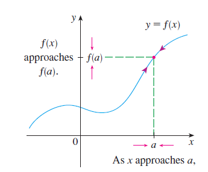

##### Example: Where are each of the following functions discontinuous?

**(a)** 

$$ f(x) = \frac{x^2 - x - 2}{x - 2} $$

**Solution:**  
Notice that $f(2)$ is not defined, so $f$ is discontinuous at $x = 2$. Later we'll see why $f$ is continuous at all other numbers.

---

**(b)** 

$$ f(x) = \begin{cases} 
\frac{1}{x^2} & \text{if } x \neq 0, \\
1 & \text{if } x = 0 
\end{cases} $$

**Solution:**  
Here $f(0) = 1$ is defined, but  

$$ \lim_{x \to 0} f(x) = \lim_{x \to 0} \frac{1}{x^2} $$

does not exist (it tends to $+\infty$). Thus, $f$ is discontinuous at $x = 0$.

---

**(c)** 

$$ f(x) = \begin{cases} 
\frac{x^2 - x - 2}{x - 2} & \text{if } x \neq 2, \\
1 & \text{if } x = 2 
\end{cases} $$

**Solution:**  
Here $f(2) = 1$ is defined, and  
$$ \lim_{x \to 2} f(x) = \lim_{x \to 2} \frac{x^2 - x - 2}{x - 2} = \lim_{x \to 2} \frac{(x - 2)(x + 1)}{x - 2} = \lim_{x \to 2} (x + 1) = 3 $$  
exists. However,  

$$ \lim_{x \to 2} f(x) \neq f(2) $$  

so $f$ is not continuous at $x = 2$.

---

**(d)** 
$$ f(x) = \lfloor x \rfloor $$  
(the greatest integer function)

**Solution:**  
The greatest integer function $f(x) = \lfloor x \rfloor$ has discontinuities at all integers because $\lim_{x \to n} \lfloor x \rfloor$ does not exist when $n$ is an integer.

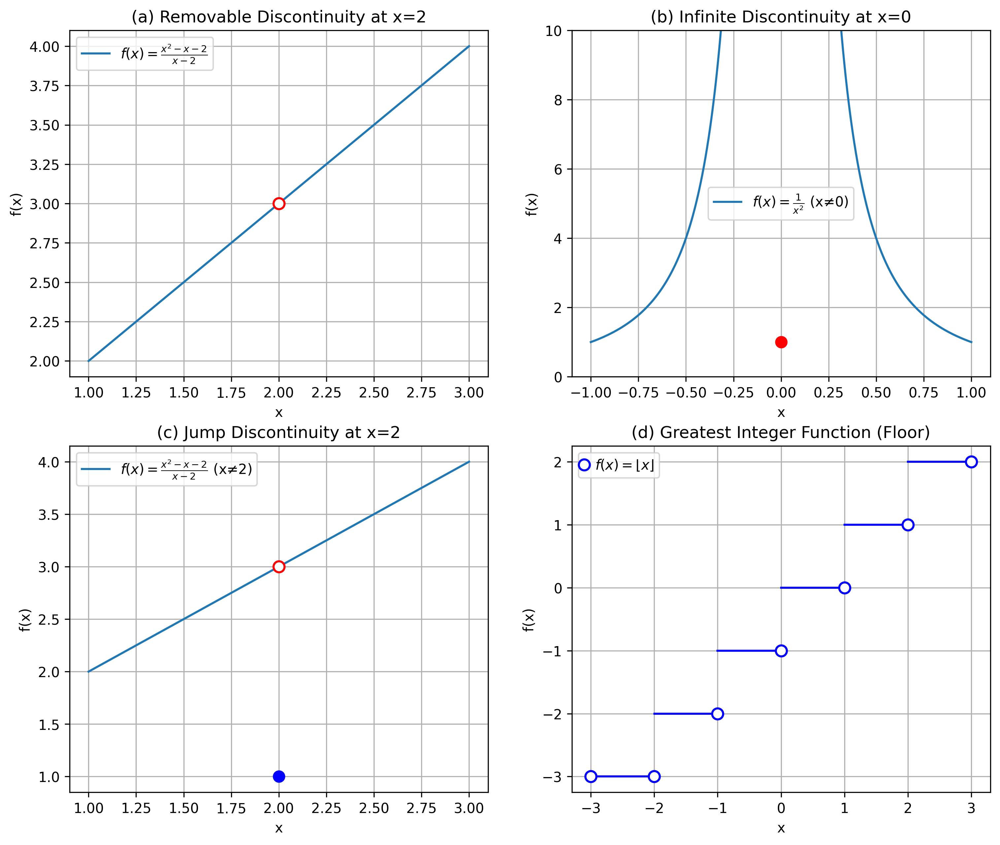

#### **Definition 2** 
A function $f$ is *continuous from the right* at a number $a$ if

$$
\lim_{x \to a^+} f(x) = f(a)
$$

and $f$ is *continuous from the left* at $a$ if

$$
\lim_{x \to a^-} f(x) = f(a)
$$

#### **Deinition 3**
 A function f is **continuous on an interval** if it is continuous at **every number** in the interval. 
 
 If f is deined only on one side of an endpoint of the interval, we understand ***continuous at the endpoint*** to mean ***continuous from the right or continuous from the left***.

 **Example** Show that the function $f(x) = 1 - \sqrt{1 - x^2}$ is continuous on the interval $[-1, 1]$.

**Solution** If $-1 < a < 1$, then using the Limit Laws, we have:
$$
\begin{align*}
\lim_{x \to a} f(x) &= \lim_{x \to a} \left(1 - \sqrt{1 - x^2}\right) \\
&= 1 - \lim_{x \to a} \sqrt{1 - x^2} \quad \\
&= 1 - \sqrt{\lim_{x \to a} (1 - x^2)} \quad  \\
&= 1 - \sqrt{1 - a^2} \quad \\
&= f(a)
\end{align*}
$$

Thus, by Definition 1, $f$ is continuous at $a$ if $-1 < a < 1$. Similar calculations show that:
$$
\lim_{x \to -1^+} f(x) = 1 = f(-1) \quad \text{and} \quad \lim_{x \to 1^-} f(x) = 1 = f(1)
$$
so $f$ is continuous from the right at $-1$ and continuous from the left at $1$. Therefore, according to Definition 3, $f$ is continuous on $[-1, 1]$.

***The graph of $f$ is the lower half of the circle***  $x^2 + (y - 1)^2 = 1$.

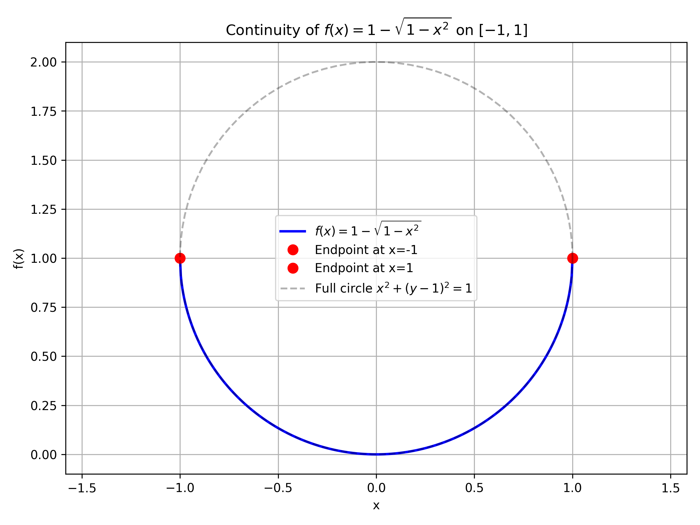

#### **Theorem 4** 
If $f$ and $g$ are continuous at $a$ and $c$ is a constant, then the following functions are also continuous at $a$:  
1. $f + g$  
2. $f - g$  
3. $cf$  
4. $fg$  
5. $\frac{f}{g}$ if $g(a) \neq 0$

#### **Theorem 5**  
**(a)** **Any polynomial** is continuous everywhere; that is, it is continuous on $\mathbb{R} = (-\infty, \infty)$.  

**(b)** Any **rational function** is continuous wherever it is defined; that is, it is continuous on its domain.  

**Proof**  
**(a)** A polynomial is a function of the form  

$$
P(x) = c_nx^n + c_{n-1}x^{n-1} + \cdots + c_1x + c_0
$$  

where $c_0, c_1, \ldots, c_n$ are constants. We know that  

$$
\lim_{x \to a} c_0 = c_0 \quad 
$$  

and  

$$
\lim_{x \to a} x^m = a^m \quad (m = 1, 2, \ldots, n) \quad
$$  

This equation is precisely the statement that the function $f(x) = x^m$ is continuous. Thus, by part 3 of Theorem 4, the function $g(x) = cx^m$ is continuous. Since $P$ is a sum of functions of this form and a constant function, it follows from part 1 of Theorem 4 that $P$ is continuous.  

**(b)** A rational function is a function of the form  

$$
f(x) = \frac{P(x)}{Q(x)}
$$  

where $P$ and $Q$ are polynomials. The domain of $f$ is $D = \{x \in \mathbb{R} \mid Q(x) \neq 0\}$. We know from part (a) that $P$ and $Q$ are continuous everywhere. Thus, by part 5 of Theorem 4, $f$ is continuous at every number in $D$.

#### **Theorem 6** 
The following types of functions are continuous at every number in their domains:
- **Polynomials**
- **Rational functions**
- **Root functions**
- **Trigonometric functions**
- **Inverse trigonometric functions** 
- **Exponential functions**
- **Logarithmic functions**

In symbols:
- If $P(x)$ is a polynomial, then $P$ is continuous on $\mathbb{R}$
- If $f(x) = \frac{P(x)}{Q(x)}$ is rational, then $f$ is continuous on $\{x \mid Q(x) \neq 0\}$
- If $f(x) = x^{1/n}$ ($n \in \mathbb{N}$), then $f$ is continuous on:
  - $[0, \infty)$ if $n$ is even
  - $\mathbb{R}$ if $n$ is odd
- Trigonometric functions ($\sin x$, $\cos x$, etc.) are continuous on their domains
- Inverse trig functions ($\sin^{-1} x$, $\tan^{-1} x$, etc.) are continuous on their domains
- Exponential functions ($a^x$) are continuous on $\mathbb{R}$
- Logarithmic functions ($\log_a x$) are continuous on $(0, \infty)$

**Example 1** Where is the function 

$$
f(x) = \frac{\ln x + \tan^{-1}x}{x^2 - 1}
$$ 

continuous?

**Solution** We know from Theorem 6 that:
- $y = \ln x$ is continuous for $x > 0$
- $y = \tan^{-1}x$ is continuous on $\mathbb{R}$

Thus, by part 1 of Theorem 4, $y = \ln x + \tan^{-1}x$ is continuous on $(0, \infty)$. 

The denominator $y = x^2 - 1$ is a polynomial, so it's continuous everywhere. Therefore, by part 5 of Theorem 4($\frac{f}{g}$ if $g(a) \neq 0$), $f$ is continuous at all positive numbers $x$ except where:

$$
x^2 - 1 = 0 \iff x = \pm 1
$$

Since $\ln x$ requires $x > 0$, $f$ is continuous on $(0, 1)$ and $(1, \infty)$. 

**Example 2** Evaluate 
$$
\lim_{x \to \pi} \frac{\sin x}{2 + \cos x}
$$

**Solution** Theorem 6 tells us:
- $y = \sin x$ is continuous everywhere
- $y = 2 + \cos x$ is continuous (sum of constant and cosine functions)

Since $\cos x \geq -1$ for all $x$, the denominator satisfies:

$$
2 + \cos x \geq 1 > 0 \quad \text{for all } x
$$

Thus the ratio 

$$
f(x) = \frac{\sin x}{2 + \cos x}
$$ 

is continuous everywhere. By definition of continuity:

$$
\lim_{x \to \pi} f(x) = f(\pi) = \frac{\sin \pi}{2 + \cos \pi} = \frac{0}{2 - 1} = 0
$$

#### **Theorem 7** (Continuity of Composite Functions)  
If $g$ is continuous at $a$ and $f$ is continuous at $g(a)$, then the composite function $f \circ g$ defined by $(f \circ g)(x) = f(g(x))$ is continuous at $a$.

**Proof**  
Since $\lim_{x \to a} g(x) = g(a)$ (by continuity of $g$ at $a$) and $f$ is continuous at $g(a)$, we can apply the ***limit composition rule***:

$$
\lim_{x \to a} f(g(x)) = f\left(\lim_{x \to a} g(x)\right) = f(g(a)) = (f \circ g)(a)
$$

Thus, $f \circ g$ satisfies the definition of continuity at $x = a$.

**Key Implications**:
1. The composition preserves continuity at the point of evaluation
2. If $g$ is continuous on its domain and $f$ is continuous on the range of $g$, then $f \circ g$ is continuous everywhere in $g$'s domain
3. This justifies the continuity of functions like:
   - $e^{x^2}$ (exponential composed with polynomial)
   - $\sin(\ln x)$ (trigonometric composed with logarithmic)
   - $\sqrt{\tan x}$ (root composed with trigonometric)

**Example**:  Evaluate 

$$
\lim_{x \to 1} \arcsin\left(\frac{1 - \sqrt{x}}{1 - x}\right)
$$

**Solution**: Because $\arcsin$ is continuous (by Theorem 7), we can apply Theorem 8 (continuity of composite functions):

$$
\begin{align*}
\lim_{x \to 1} \arcsin\left(\frac{1 - \sqrt{x}}{1 - x}\right) &= \arcsin\left(\lim_{x \to 1} \frac{1 - \sqrt{x}}{1 - x}\right) \\
&= \arcsin\left(\lim_{x \to 1} \frac{1 - \sqrt{x}}{(1 - \sqrt{x})(1 + \sqrt{x})}\right) \quad \text{[Factoring difference of squares]} \\
&= \arcsin\left(\lim_{x \to 1} \frac{1}{1 + \sqrt{x}}\right) \\
&= \arcsin\left(\frac{1}{2}\right) \\
&= \boxed{\dfrac{\pi}{6}}
\end{align*}
$$

#### **Theorem 8： Intermediate Value Theorem**  
Suppose that $f$ is continuous on the closed interval $[a, b]$ and let $N$ be any number between $f(a)$ and $f(b)$, where $f(a) \neq f(b)$. Then there exists a number $c$ in $(a, b)$ such that:

$$
f(c) = N
$$

**Key Conditions:**
1. **Continuity**: $f$ must be continuous on the *closed* interval $[a, b]$.
2. **Intermediate Value**: $N$ must satisfy either:
   - $f(a) < N < f(b)$ (if $f(a) < f(b)$), or
   - $f(b) < N < f(a)$ (if $f(b) < f(a)$).

**Implications:**
- Guarantees at least one solution $c$ exists in $(a, b)$ for $f(c) = N$.
- Explains why continuous functions have "no jumps" (their graphs pass through all intermediate $y$-values).
- Foundation for numerical root-finding methods (e.g., bisection method).

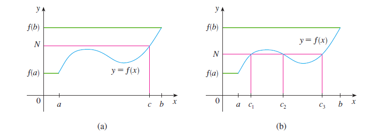

## 4. Limits at Infinity & Horizontal Asymptotes
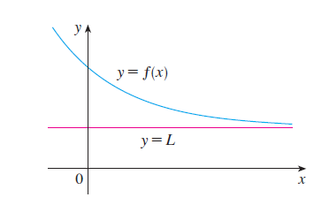
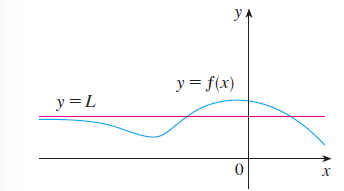

#### **Definition 1**  
The limit of $f(x)$ as $x$ approaches infinity is $L$, denoted by:

$$
\lim_{x \to \infty} f(x) = L
$$

if for every $\epsilon > 0$, there exists a number $N$ such that:

$$\forall x > N, \quad |f(x) - L| < \epsilon$$

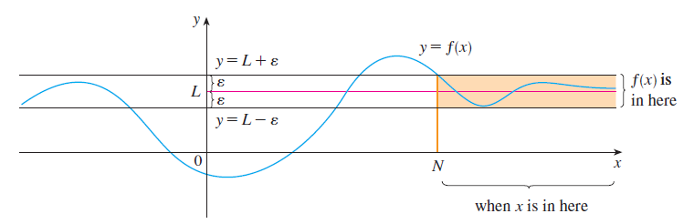

#### **Definition 2**  
The limit of $f(x)$ as $x$ approaches negative infinity is $L$, denoted by:

$$
\lim_{x \to -\infty} f(x) = L
$$

if for every $\epsilon > 0$, there exists a number $N$ such that:

$$\forall x < N, \quad |f(x) - L| < \epsilon$$

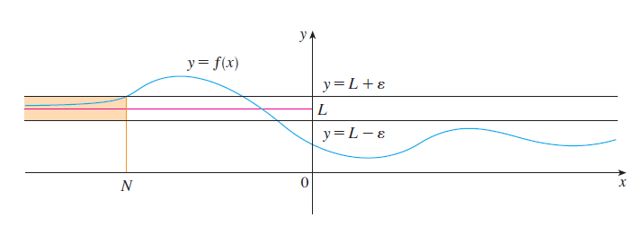

#### **Definition 3**
The line $y = L$ is called a **horizontal asymptote** of the curve $y = f(x)$ if either:

$$
\lim_{x \to \infty} f(x) = L \quad \text{or} \quad \lim_{x \to -\infty} f(x) = L
$$

**Possible Cases**:  
A function can have:  
- No horizontal asymptotes  
- One horizontal asymptote (same limit at both $\infty$ and $-\infty$)  
- Two different horizontal asymptotes (different limits at $\infty$ and $-\infty$)

**Examples:**
1. $f(x) = \frac{1}{x}$ has $y=0$ as horizontal asymptote for both $\pm\infty$
2. $f(x) = \tan^{-1}x$ has:  
   - $y=\frac{\pi}{2}$ as $x\to\infty$  
   - $y=-\frac{\pi}{2}$ as $x\to-\infty$

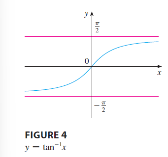

**Example 1** 
Find the horizontal and vertical asymptotes of the graph of the function:

$$
f(x) = \frac{\sqrt{2x^2 + 1}}{3x - 5}
$$

**Solution**  

**Horizontal Asymptotes:**
1. **As $x \to \infty$**:
   Dividing numerator and denominator by $x$:

   $$
   \lim_{x\to\infty} \frac{\sqrt{2x^2 + 1}}{3x - 5} = \lim_{x\to\infty} \frac{\frac{\sqrt{2x^2 + 1}}{x}}{\frac{3x - 5}{x}} = \lim_{x\to\infty} \frac{\sqrt{\frac{2x^2 + 1}{x^2}}}{3 - \frac{5}{x}}
   $$

   Since $\sqrt{x^2} = x$ for $x > 0$:

   $$
   = \frac{\sqrt{\lim_{x\to\infty}2 + \lim_{x\to\infty}\frac{1}{x^2}}}{\lim_{x\to\infty}3 - 5\lim_{x\to\infty}\frac{1}{x}} = \frac{\sqrt{2 + 0}}{3 - 0} = \frac{\sqrt{2}}{3}
   $$

   Thus, $y = \frac{\sqrt{2}}{3}$ is a horizontal asymptote.

2. **As $x \to -\infty$**:
   For $x < 0$, $\sqrt{x^2} = |x| = -x$:

   $$
   \lim_{x\to-\infty} \frac{\sqrt{2x^2 + 1}}{3x - 5} = \lim_{x\to-\infty} \frac{-\sqrt{2 + \frac{1}{x^2}}}{3 - \frac{5}{x}} = \frac{-\sqrt{2}}{3}
   $$

   Thus, $y = -\frac{\sqrt{2}}{3}$ is another horizontal asymptote.

**Vertical Asymptote:**
- Occurs where denominator equals zero:

  $$
  3x - 5 = 0 \implies x = \frac{5}{3}
  $$

- Behavior near $x = \frac{5}{3}$:
  - **Right-hand limit** ($x \to \frac{5}{3}^+$):

    $$
    \lim_{x\to(\frac{5}{3})^+} f(x) = +\infty
    $$

  - **Left-hand limit** ($x \to \frac{5}{3}^-$):

    $$
    \lim_{x\to(\frac{5}{3})^-} f(x) = -\infty
    $$

**Conclusion**:
- **Horizontal asymptotes**: $y = \frac{\sqrt{2}}{3}$ and $y = -\frac{\sqrt{2}}{3}$
- **Vertical asymptote**: $x = \frac{5}{3}$

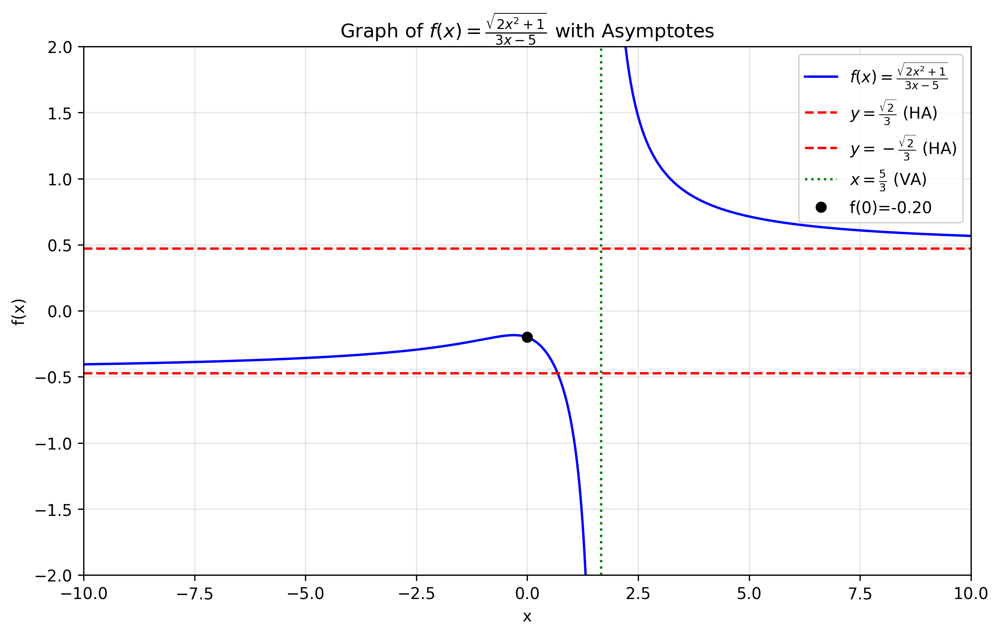

**Example 2**: Evaluate 
$$
\lim_{x \to 0^-} e^{1/x}
$$

**Solution**:  
Let $t = \frac{1}{x}$. As $x \to 0^-$, we have:
$$
t \to -\infty
$$

Using the known limit property:
$$
\lim_{t \to -\infty} e^t = 0
$$

Therefore:
$$
\lim_{x \to 0^-} e^{1/x} = \lim_{t \to -\infty} e^t = \boxed{0}
$$

## 5. Derivatives and Rates of Change
### 5.1 **Definition of the Derivative at a Point**:
The derivative of a function $f$ at a point $a$, denoted by $f'(a)$, is defined as:

$$
f'(a) = \lim_{x \to a} \frac{f(x) - f(a)}{x - a}
$$

**Key Components:**
1. **Difference Quotient**:  
   $\frac{f(x) - f(a)}{x - a}$ represents the average rate of change of $f$ between $x$ and $a$.

2. **Limit Interpretation**:  
   The derivative $f'(a)$ is the instantaneous rate of change as $x$ approaches $a$.

3. **Geometric Meaning**:  
   This limit gives the slope of the tangent line to the curve $y = f(x)$ at the point $(a, f(a))$.

**Alternative Notations:**
- Leibniz notation: $\left.\frac{df}{dx}\right|_{x=a}$
- Lagrange notation: $f'(a)$
- Newtonian notation: $\dot{f}(a)$

#### **Instantaneous Rate of Change**  
The instantaneous rate of change of a function $f$ at a point is given by:

$$
\text{Instantaneous rate of change} = \lim_{\Delta x \to 0} \frac{\Delta y}{\Delta x} = \lim_{x_2 \to x_1} \frac{f(x_2) - f(x_1)}{x_2 - x_1}
$$

**Key Components:**
1. **Difference Quotient**:  
   $\frac{\Delta y}{\Delta x} = \frac{f(x_2) - f(x_1)}{x_2 - x_1}$ represents the average rate of change over the interval $[x_1, x_2]$.

2. **Limit Process**:  
   Taking the limit as $x_2 \to x_1$ ($\Delta x \to 0$) gives the instantaneous rate at $x = x_1$.

3. **Geometric Interpretation**:  
   This equals the slope of the tangent line to $y = f(x)$ at $x = x_1$.

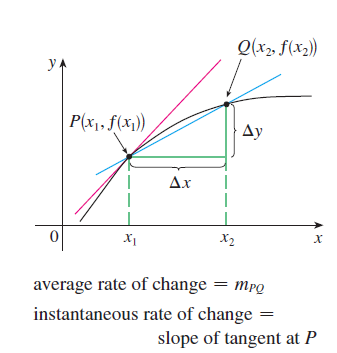

### **5.2 The Derivative as a Function**
#### **5.2.1 Definition of the Derivative**:

$$
\boxed{f'(x) = \lim_{h \to 0} \frac{f(x+h) - f(x)}{h}}
$$

**Example**: Find $f'(x)$ if 

$$
f(x) = \frac{1 - x}{2 + x}
$$

**Solution**:

$$
\begin{align*}
f'(x) &= \lim_{h \to 0} \frac{f(x+h) - f(x)}{h} \\
&= \lim_{h \to 0} \frac{\frac{1 - (x+h)}{2 + (x+h)} - \frac{1 - x}{2 + x}}{h} \\
&= \lim_{h \to 0} \frac{(1 - x - h)(2 + x) - (1 - x)(2 + x + h)}{h(2 + x + h)(2 + x)} \\
&= \lim_{h \to 0} \frac{(2 - x - 2h - x^2 - xh) - (2 - x + h - x^2 - xh)}{h(2 + x + h)(2 + x)} \\
&= \lim_{h \to 0} \frac{-3h}{h(2 + x + h)(2 + x)} \\
&= \lim_{h \to 0} \frac{-3}{(2 + x + h)(2 + x)} \\
&= -\frac{3}{(2 + x)^2}
\end{align*}
$$

**Final Answer**:

$$
f'(x) = \boxed{-\dfrac{3}{(2 + x)^2}}
$$

#### 5.2.2 Derivative Notations
The derivative of $f$ can be represented in multiple equivalent ways:

$$
f'(x) = y' = \frac{dy}{dx} = \frac{df}{dx} = \frac{d}{dx}f(x) = Df(x) = D_x f(x)
$$

#### 5.2.3 Definition of Differentiability
A function $f$ is:
- **Differentiable at a point $a$** if $f'(a)$ exists
- **Differentiable on an interval** if it is differentiable at every point in:
  - Open intervals: $(a, b)$, $(a, \infty)$, or $(-\infty, a)$
  - The entire real line: $(-\infty, \infty)$

**Example 5**: Where is the function $f(x) = |x|$ differentiable?

**Solution**:

**Case 1: $x > 0$ ($f(x) = x$)**
For $x > 0$, we can choose $h$ small enough that $x + h > 0$, so $|x+h| = x+h$:

$$
f'(x) = \lim_{h \to 0} \frac{|x+h| - |x|}{h} = \lim_{h \to 0} \frac{(x+h) - x}{h} = \lim_{h \to 0} \frac{h}{h} = 1
$$

Thus, $f$ is differentiable for all $x > 0$ with $f'(x) = 1$.

**Case 2: $x < 0$ ($f(x) = -x$)**
For $x < 0$, choose $h$ so $x + h < 0$, giving $|x+h| = -(x+h)$:

$$
f'(x) = \lim_{h \to 0} \frac{-(x+h) - (-x)}{h} = \lim_{h \to 0} \frac{-h}{h} = -1
$$

Thus, $f$ is differentiable for all $x < 0$ with $f'(x) = -1$.

**Case 3: $x = 0$**
At $x = 0$, we examine:

$$
f'(0) = \lim_{h \to 0} \frac{|h| - 0}{h} = \lim_{h \to 0} \frac{|h|}{h}
$$

- **Right-hand limit** ($h \to 0^+$):
  $$
  \lim_{h \to 0^+} \frac{h}{h} = 1
  $$

- **Left-hand limit** ($h \to 0^-$):
  $$
  \lim_{h \to 0^-} \frac{-h}{h} = -1
  $$

Since the left and right limits disagree, $f'(0)$ **does not exist**.

### Conclusion:
- **Differentiable**: For all $x \neq 0$
- **Not differentiable**: At $x = 0$ (sharp "corner")

The derivative function is:

$$
f'(x) = \begin{cases}
1 & \text{if } x > 0 \\
-1 & \text{if } x < 0
\end{cases}
$$

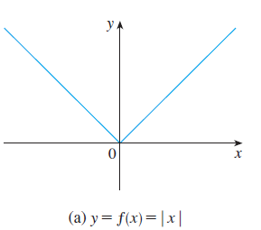

#### 5.2.4 Differentiability Implies Continuity
**Theorem**: If $f$ is differentiable at $a$, then $f$ is continuous at $a$.

**Proof Outline:**
1. Differentiability requires:
   $$ \lim_{h \to 0} \frac{f(a+h)-f(a)}{h} = f'(a) \text{ exists} $$
2. Rewrite the difference quotient:
   $$ f(a+h)-f(a) = h \cdot \frac{f(a+h)-f(a)}{h} $$
3. Take limits as $h \to 0$:
   $$ \lim_{h \to 0} [f(a+h)-f(a)] = 0 \cdot f'(a) = 0 $$
4. Thus:
   $$ \lim_{h \to 0} f(a+h) = f(a) $$
   which is exactly the definition of continuity.

#### Important Notes:
- The converse is false: continuity does not imply differentiability (e.g., $f(x)=|x|$ at $x=0$)
- Differentiability requires "smoothness" without sharp corners or vertical tangents