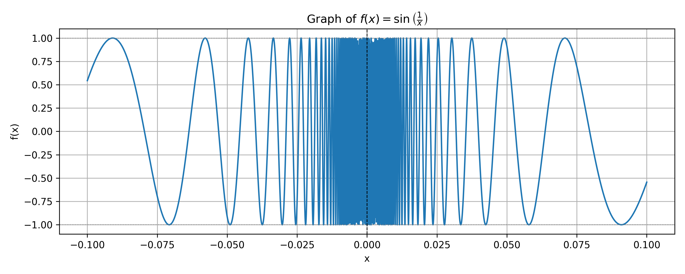
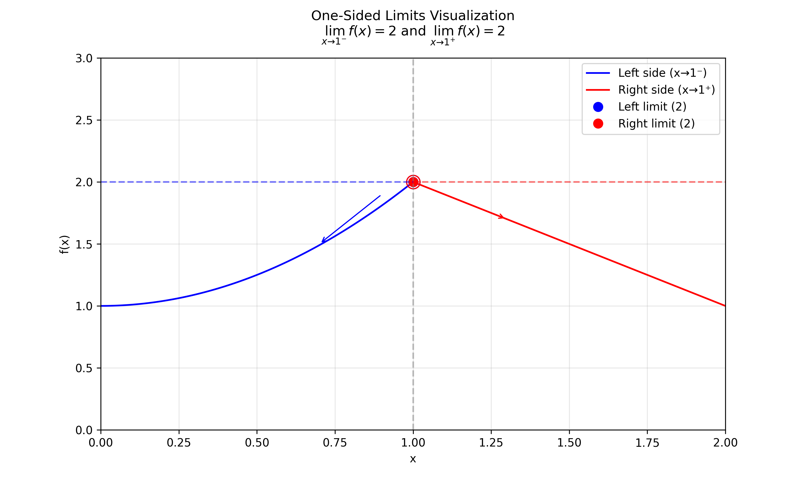
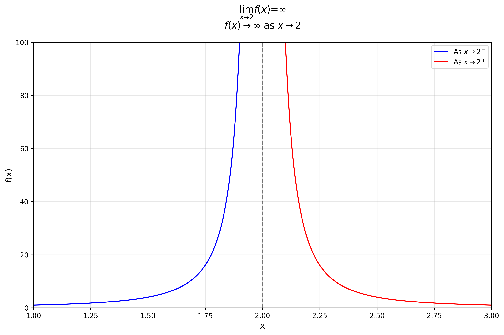
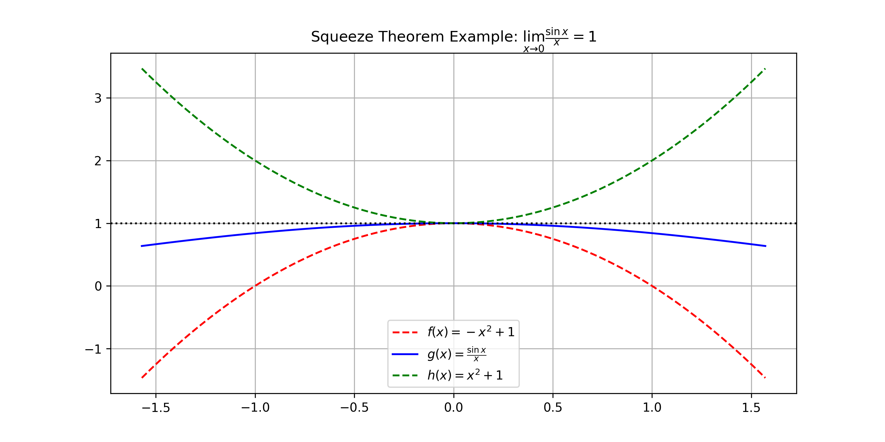
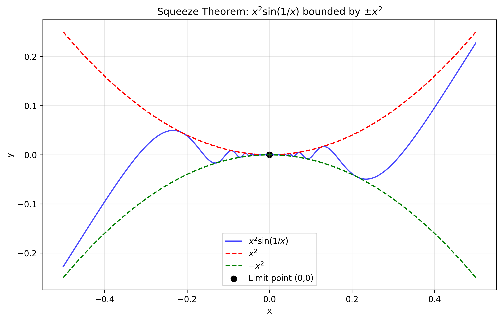
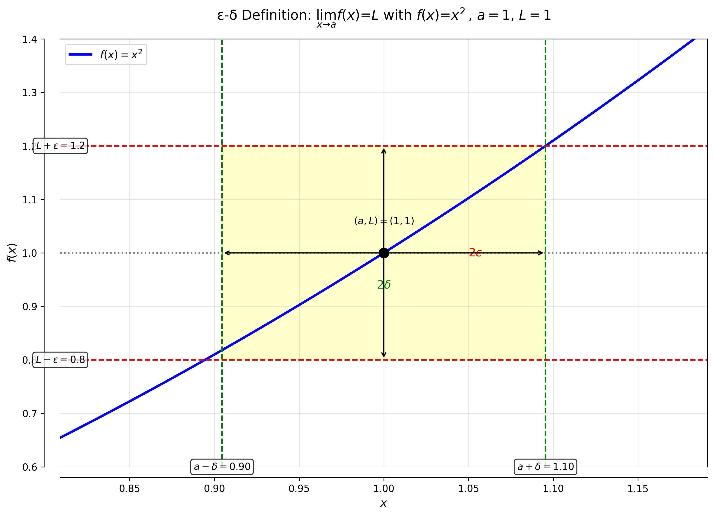
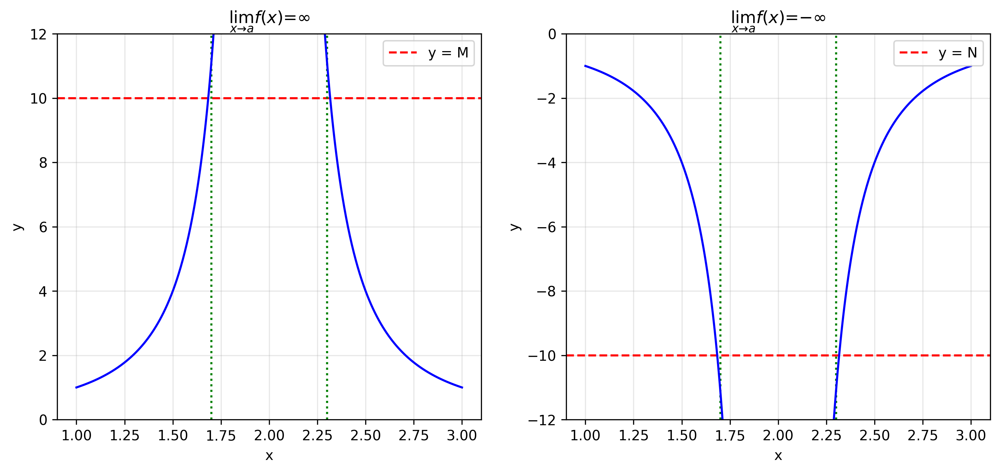

# Limits and derivatives

## 1. the Limit of a function

### 1.1 Intuitive definition of a limit
Suppose $f(x)$ is defined when $x$ is near the number $a$. (This means that $f$ is defined on some open interval that contains $a$, except possibly at $a$ itself.) Then we write

$$
\lim_{x \to a} f(x) = L
$$

and say “the limit of $f(x)$, as $x$ approaches $a$, equals $L$”  
if we can make the values of $f(x)$ arbitrarily close to $L$ (as close to $L$ as we like) by restricting $x$ to be sufficiently close to $a$ (on either side of $a$) but **not equal** to $a$.

#### Example : Investigating $\displaystyle \lim_{x \to 0} \sin\left(\frac{1}{x}\right)$

The function $f(x) = \sin\left(\frac{1}{x}\right)$ is undefined at $x = 0$.

Evaluating the function for some small values of $x$:

$$
\begin{align*}
f(1) &= \sin(1) \approx 0.84 \\
f\left(\frac{1}{2}\right) &= \sin(2) \approx 0.91 \\
f\left(\frac{1}{3}\right) &= \sin(3) \approx 0.14 \\
f\left(\frac{1}{4}\right) &= \sin(4) \approx -0.76 \\
f(0.1) &= \sin(10) \approx -0.54 \\
f(0.01) &= \sin(100) \approx -0.50 \\
f(0.001) &= \sin(1000) \approx 0.83 \\
f(0.0001) &= \sin(10000) \approx -0.31
\end{align*}
$$

**Initial Observation:**  
The values oscillate between approximately -1 and 1 without settling to a particular value.

**Incorrect Guess:**  
One might think $\displaystyle \lim_{x \to 0} \sin\left(\frac{1}{x}\right) = 0$, but this is wrong.

**Actual Behavior:**  
- As $x \to 0$, $\frac{1}{x}$ oscillates infinitely between $-\infty$ and $\infty$
- $\sin$ function keeps oscillating between -1 and 1 with increasing frequency
- No single value is approached

**Conclusion:**  
The limit does not exist.

$$
\nexists \lim_{x \to 0} \sin\left(\frac{1}{x}\right)
$$

#### Graph of $f(x) = \sin\left(\frac{1}{x}\right)$ near $x = 0$

This function oscillates infinitely fast as $x \to 0$ , so the limit does **not exist**.

### 1.2 One-sided limits

#### i. Left-Hand Limit
We write

$$
\lim_{x \to a^-} f(x) = L
$$

and say:
- *"The left-hand limit of f(x) as x approaches a"*  
  or  
- *"The limit of f(x) as x approaches a from the left is equal to L"*

**Definition:**  
This means we can make the values of f(x) arbitrarily close to L by taking x sufficiently close to a **with x less than a**.

#### ii. Right-Hand Limit
Similarly, for the right-hand limit we write:

$$
\lim_{x \to a^+} f(x) = L
$$

and say:
- *"The right-hand limit of f(x) as x approaches a"*  
  or  
- *"The limit of f(x) as x approaches a from the right is equal to L"*

**Definition:**  
This means we can make the values of f(x) arbitrarily close to L by taking x sufficiently close to a **with x greater than a**.

**NOTE: One-sided limits are particularly important:**
   - At endpoints of domains
   - For piecewise functions
   - When different behavior occurs on either side of a point

### iii. Two-Sided Limit and One-Sided Limits Relationship

The two-sided limit exists if and only if both one-sided limits exist and are equal. Mathematically:

$$
\lim_{x \to a} f(x) = L \quad \text{if and only if} \quad \lim_{x \to a^-} f(x) = L \quad \text{and} \quad \lim_{x \to a^+} f(x) = L
$$

#### Explanation:
1. **Two-sided limit ($\lim_{x \to a} f(x) = L$)** exists only when:
   - The left-hand limit exists
   - The right-hand limit exists
   - Both limits have the same value L

2. **Implications**:
   - If either one-sided limit doesn't exist, the two-sided limit doesn't exist
   - If the one-sided limits exist but are unequal, the two-sided limit doesn't exist
   - The two-sided limit equals the common value of the one-sided limits when they agree

#### Visual Interpretation:

### 1.3 infinite Limits
We write

$$
\lim_{x \to a} f(x) = \infty
$$

and say:
- *"The limit of f(x) as x approaches a is infinity"*

**Definition:**  
This means that we can make the values of f(x) arbitrarily large (positive or negative) by taking x sufficiently close to a (on either side of a) but **not equal** to a.

#### Example graph visualizing infinite limits

**similarly,** Let $f$ be a function defined on both sides of $a$, except possibly at $a$ itself. Then:

$$
\lim_{x \to a} f(x) = -\infty
$$

means that the values of $f(x)$ can be made arbitrarily large negative by taking $x$ sufficiently close to $a$, but not equal to $a$.

#### Mathematical Explanation

For the example function:

$$
f(x) = -\frac{1}{(x-1)^2}
$$

We observe:
- As $x \to 1^-$ (from the left), $f(x) \to -\infty$
- As $x \to 1^+$ (from the right), $f(x) \to -\infty$
- Therefore, $\lim_{x \to 1} f(x) = -\infty$

#### Technical Notes
- The limit "exists" in the extended real number system
- This is different from saying the limit doesn't exist

## 2. Limit Laws in Calculus
### 2.1 Fundamental Limit Laws

Let $c$ be a constant and assume the limits $\lim_{x \to a} f(x)$ and $\lim_{x \to a} g(x)$ exist. Then:

##### 1. Sum Law

$$
\lim_{x \to a} [f(x) + g(x)] = \lim_{x \to a} f(x) + \lim_{x \to a} g(x)
$$

**Verbal statement:** The limit of a sum equals the sum of the limits.

##### 2. Difference Law

$$
\lim_{x \to a} [f(x) - g(x)] = \lim_{x \to a} f(x) - \lim_{x \to a} g(x)
$$

**Verbal statement:** The limit of a difference equals the difference of the limits.

##### 3. Constant Multiple Law

$$
\lim_{x \to a} [c \cdot f(x)] = c \cdot \lim_{x \to a} f(x)
$$

**Verbal statement:** The limit of a constant times a function equals the constant times the limit.

##### 4. Product Law

$$
\lim_{x \to a} [f(x) \cdot g(x)] = \lim_{x \to a} f(x) \cdot \lim_{x \to a} g(x)
$$

**Verbal statement:** The limit of a product equals the product of the limits.

##### 5. Quotient Law

$$
\lim_{x \to a} \left[\frac{f(x)}{g(x)}\right] = \frac{\lim_{x \to a} f(x)}{\lim_{x \to a} g(x)} \quad \text{(if } \lim_{x \to a} g(x) \neq 0\text{)}
$$

**Verbal statement:** The limit of a quotient equals the quotient of the limits (when denominator limit $\neq$ 0).

#### Power and Root Limit Laws

##### 1. Power Law (Extended from Product Law)

By applying the Product Law repeatedly with $g(x) = f(x)$, we obtain:

##### Positive Integer Powers

$$
\lim_{x \to a} [f(x)]^n = \left[\lim_{x \to a} f(x)\right]^n
$$

where $n$ is a positive integer.

##### 2. Root Law

For roots of functions, we have:

$$
\lim_{x \to a} \sqrt[n]{f(x)} = \sqrt[n]{\lim_{x \to a} f(x)}
$$

where $n$ is a positive integer.

**Important restriction:** If $n$ is even, we must have $\lim_{x \to a} f(x) > 0$.

#### Example 1: Finding a Limit by Factoring

**Problem Statement**
Find:

$$
\lim_{x \to 1} \frac{x^2 - 1}{x - 1}
$$

**Solution**

 - **Step 1: Identify the Problem**
Let $f(x) = \frac{x^2 - 1}{x - 1}$. We cannot:
    1. Substitute $x = 1$ directly (undefined, 0/0 form)
    2. Apply the Quotient Law (denominator limit is 0)

 - **Step 2: Algebraic Manipulation**
Factor the numerator (difference of squares):

$$
\frac{x^2 - 1}{x - 1} = \frac{(x - 1)(x + 1)}{x - 1} ={x+1}
$$

 - **Step 3: Compute the Limit**
Now evaluate the simplified expression:

$$
\lim_{x \to 1} \frac{x^2 - 1}{x - 1} = \lim_{x \to 1} (x + 1) = 1 + 1 = 2
$$

#### Example 2: Limit Calculation with Rationalization
Find:

$$
\lim_{t \to 0} \frac{\sqrt{t^2 + 9} - 3}{t^2}
$$

**Solution**

Multiply numerator and denominator by the conjugate:

$$
\lim_{t \to 0} \frac{\sqrt{t^2 + 9} - 3}{t^2} \cdot \frac{\sqrt{t^2 + 9} + 3}{\sqrt{t^2 + 9} + 3}
$$

$$
= \lim_{t \to 0} \frac{(\sqrt{t^2 + 9})^2 - 3^2}{t^2(\sqrt{t^2 + 9} + 3)} = \lim_{t \to 0} \frac{t^2 + 9 - 9}{t^2(\sqrt{t^2 + 9} + 3)}
$$

$$
= \lim_{t \to 0} \frac{t^2}{t^2(\sqrt{t^2 + 9} + 3)} = \lim_{t \to 0} \frac{1}{\sqrt{t^2 + 9} + 3}
$$

$$
= \frac{1}{\sqrt{\lim_{t \to 0} t^2 + 9} + 3} = \frac{1}{\sqrt{9} + 3}
$$

$$
= \frac{1}{3 + 3} = \boxed{\frac{1}{6}}
$$

### 2.2 Limit Comparison Theorems

#### i. Inequality Preservation Theorem

**Statement:**
If $f(x) \leq g(x)$ when $x$ is near $a$ (except possibly at $a$) and the limits of $f$ and $g$ both exist as $x$ approaches $a$, then:

$$
\lim_{x \to a} f(x) \leq \lim_{x \to a} g(x)
$$

**Key Points:**
- The inequality between functions is preserved in their limits
- Applies even at points where the functions are undefined
- Only requires the inequality to hold "near" $a$, not necessarily at $a$

#### ii. Squeeze (Sandwich) Theorem

**Statement:**
If $f(x) \leq g(x) \leq h(x)$ when $x$ is near $a$ (except possibly at $a$) and:

$$
\lim_{x \to a} f(x) = \lim_{x \to a} h(x) = L
$$

then:

$$
\lim_{x \to a} g(x) = L
$$

**Visualization:**

#### Example: Applying the Squeeze Theorem

##### Problem Statement
Show that:

$$
\lim_{x \to 0} x^2 \sin\left(\frac{1}{x}\right) = 0
$$

We **cannot** use the Product Law because:

$$
\lim_{x \to 0} \sin\left(\frac{1}{x}\right) \text{ does not exist}
$$

We know that for all real numbers:

$$
-1 \leq \sin\left(\frac{1}{x}\right) \leq 1
$$

Multiply by $x^2$ (which is always non-negative):

$$
-x^2 \leq x^2 \sin\left(\frac{1}{x}\right) \leq x^2
$$

Both bounding functions approach 0:

$$
\lim_{x \to 0} (-x^2) = 0 \quad \text{and} \quad \lim_{x \to 0} x^2 = 0
$$

By the Squeeze Theorem:

$$
\lim_{x \to 0} x^2 \sin\left(\frac{1}{x}\right) = 0
$$

**Visual Demonstration**

### 2.3 the Precise definition of a Limit
#### 2.3.1 ε-δ Definition of a Limit: Formal Statement
Let $f$ be a function defined on some open interval containing $a$ (except possibly at $a$ itself). We say:

$$
\lim_{x \to a} f(x) = L
$$

if for every $\epsilon > 0$, there exists a $\delta > 0$ such that:

$$
\text{If } 0 < |x - a| < \delta \text{, then } |f(x) - L| < \epsilon
$$

#### Components Explained

1. **$\epsilon$ (epsilon)**:
   - Represents how close we want $f(x)$ to be to $L$
   - Arbitrarily small positive number
   - "Tolerance" in the output

2. **$\delta$ (delta)**:
   - Determines how close $x$ must be to $a$
   - Depends on $\epsilon$
   - "Neighborhood size" in the input

3. **Implication**:
   - Whenever $x$ is within $\delta$ of $a$ (but $x \neq a$)
   - Then $f(x)$ is guaranteed to be within $\epsilon$ of $L$

#### Visual Representation

#### Example: Proving a Limit Using the ε-δ Definition

##### Problem Statement
Prove that:

$$
\lim_{x \to 3} (4x - 5) = 7
$$

**Part 1: Preliminary Analysis (Finding δ)**

Given an arbitrary $\epsilon > 0$, we need to find $\delta > 0$ such that:

$$
\text{If } 0 < |x - 3| < \delta \text{, then } |(4x - 5) - 7| < \epsilon
$$

**Step-by-step derivation:**
1. Simplify the expression: $|(4x - 5) - 7| = |4x - 12| = 4|x - 3|$

2. We want: $4|x - 3| < \epsilon \implies |x - 3| < \frac{\epsilon}{4}$

3. This suggests choosing: $\delta = \frac{\epsilon}{4}$

**Part 2: Formal Proof**

**Given** any $\epsilon > 0$, **choose** $\boxed{\delta = \frac{\epsilon}{4}}$. **Then** for all $x$ satisfying $0 < |x - 3| < \delta$:
1. Start with the distance to $x=3$:

$$
|x - 3| < \delta = \frac{\epsilon}{4}
$$

2. Multiply both sides by 4:

$$
4|x - 3| < \epsilon
$$

3. Which is equivalent to:

$$
|(4x - 5) - 7| < \epsilon
$$

**Conclusion:**
By the ε-δ definition of a limit, we have proved:

$$
\lim_{x \to 3} (4x - 5) = 7
$$

#### 2.3.2 Left-Hand Limit

$$
\lim_{x \to a^-} f(x) = L
$$

**Definition:**  
For every $\epsilon > 0$, there exists $\delta > 0$ such that:

$$
\text{If } a - \delta < x < a \text{, then } |f(x) - L| < \epsilon
$$

#### 2.3.3 Right-Hand Limit

$$
\lim_{x \to a^+} f(x) = L
$$

**Definition:**  
For every $\epsilon > 0$, there exists $\delta > 0$ such that:

$$
\text{If } a < x < a + \delta \text{, then } |f(x) - L| < \epsilon
$$

#### 2.3.4 Presice definition of an infinite limit
##### i. Positive Infinity Limit

$$
\lim_{x \to a} f(x) = \infty
$$

**Definition:**  
For every $M > 0$, there exists $\delta > 0$ such that:  

$$
\text{If } 0 < |x - a| < \delta \text{, then } f(x) > M
$$

##### ii. Negative Infinity Limit
$$
\lim_{x \to a} f(x) = -\infty
$$

**Definition:**  
For every $N < 0$, there exists $\delta > 0$ such that:  

$$
\text{If } 0 < |x - a| < \delta \text{, then } f(x) < N
$$

