# Algebra review

## 1. Trigonometry
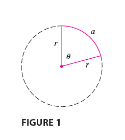

### 1.1  Angles
$$
\theta = \frac{a}{r}
$$
$$
a = \theta{r}
$$

### 1.2 The Trigonometric functions
$$
\sin \theta = \frac{y}{r}, \quad
\csc \theta = \frac{r}{y}, \quad
$$
$$
\cos \theta = \frac{x}{r}, \quad
\sec \theta = \frac{r}{x}, \quad
$$
$$
\tan \theta = \frac{y}{x}, \quad
\cot \theta = \frac{x}{y}
$$
### 1.3 Trigonometric identities
$$
\begin{array}{|c|c|}
\hline
\textbf{Function} & \textbf{Identity} \\
\hline
\csc \theta & \displaystyle \frac{1}{\sin \theta} \\
\sec \theta & \displaystyle \frac{1}{\cos \theta} \\
\cot \theta & \displaystyle \frac{1}{\tan \theta} \\
\tan \theta & \displaystyle \frac{\sin \theta}{\cos \theta} \\
\cot \theta & \displaystyle \frac{\cos \theta}{\sin \theta} \\
\hline
\end{array}
$$

$$
\begin{array}{|c|c|}
\hline
\textbf{Identity} & \textbf{Equation} \\
\hline
\text{Pythagorean Identity 1} & \sin^2 \theta + \cos^2 \theta = 1 \\
\text{Pythagorean Identity 2} & \tan^2 \theta + 1 = \sec^2 \theta \\
\text{Pythagorean Identity 3} & 1 + \cot^2 \theta = \csc^2 \theta \\
\hline
\end{array}
$$
 - **Sum and Difference Formulas**

$$
\begin{aligned}
\sin(x + y) &= \sin x \cos y + \cos x \sin y \\
\sin(x - y) &= \sin x \cos y - \cos x \sin y \\
\cos(x + y) &= \cos x \cos y - \sin x \sin y \\
\cos(x - y) &= \cos x \cos y + \sin x \sin y \\
\tan(x + y) &= \frac{\tan x + \tan y}{1 - \tan x \tan y} \\
\tan(x - y) &= \frac{\tan x - \tan y}{1 + \tan x \tan y}
\end{aligned}
$$
 - **Double-Angle Identities**

$$
\begin{aligned}
\sin(2\theta) &= 2\sin\theta\cos\theta \\
\cos(2\theta) &= \cos^2\theta - \sin^2\theta \\
              &= 2\cos^2\theta - 1 \\
              &= 1 - 2\sin^2\theta \\
\tan(2\theta) &= \frac{2\tan\theta}{1 - \tan^2\theta}
\end{aligned}
$$

 - **Half-Angle Identities**

$$
\begin{aligned}
\sin\left(\frac{\theta}{2}\right) &= \pm \sqrt{\frac{1 - \cos\theta}{2}} \\
\cos\left(\frac{\theta}{2}\right) &= \pm \sqrt{\frac{1 + \cos\theta}{2}} \\
\tan\left(\frac{\theta}{2}\right) &= \pm \sqrt{\frac{1 - \cos\theta}{1 + \cos\theta}} \\
                                  &= \frac{\sin\theta}{1 + \cos\theta} \\
                                  &= \frac{1 - \cos\theta}{\sin\theta}
\end{aligned}
$$

 -  **product formulas**
 $$
\begin{aligned}
\sin x \sin y &= \frac{1}{2}[\cos(x - y) - \cos(x + y)] \\
\cos x \cos y &= \frac{1}{2}[\cos(x - y) + \cos(x + y)] \\
\sin x \cos y &= \frac{1}{2}[\sin(x + y) + \sin(x - y)] \\
\cos x \sin y &= \frac{1}{2}[\sin(x + y) - \sin(x - y)] \\
\sin x + \sin y &= 2 \sin\left(\frac{x + y}{2}\right) \cos\left(\frac{x - y}{2}\right) \\
\sin x - \sin y &= 2 \cos\left(\frac{x + y}{2}\right) \sin\left(\frac{x - y}{2}\right) \\
\cos x + \cos y &= 2 \cos\left(\frac{x + y}{2}\right) \cos\left(\frac{x - y}{2}\right) \\
\cos x - \cos y &= -2 \sin\left(\frac{x + y}{2}\right) \sin\left(\frac{x - y}{2}\right)
\end{aligned}
$$
*Hint:
$$
\sin x = \sin\left(\frac{x+y}{2} + \frac{x-y}{2}\right), \quad
\sin y = \sin\left(\frac{x+y}{2} - \frac{x-y}{2}\right)
$$

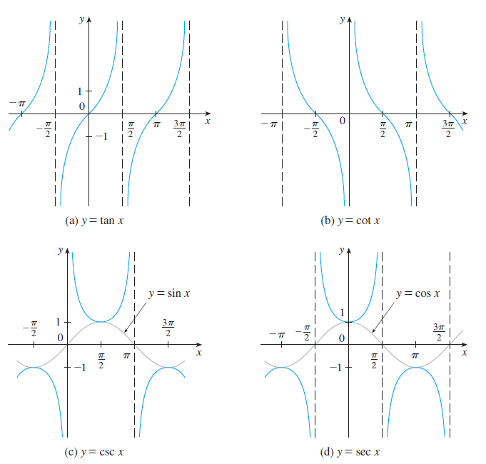

## 2. Sigma Notations

### Theorem: Properties of Summation

**Let $c$ be a constant. Then:**

$$
\sum_{i = m}^{n} c a_i = c \sum_{i = m}^{n} a_i
$$

$$
\sum_{i = m}^{n} (a_i + b_i) = \sum_{i = m}^{n} a_i + \sum_{i = m}^{n} b_i
$$

$$
\sum_{i = m}^{n} (a_i - b_i) = \sum_{i = m}^{n} a_i - \sum_{i = m}^{n} b_i
$$
#### Theorem: Common Summation Formulas
Let  $c$  be a constant and $n$  a positive integer. Then:

$$
\begin{aligned}
\sum_{i=1}^{n} 1 = n \\
\sum_{i=1}^{n} c = nc \\
\sum_{i=1}^{n} i = \frac{n(n + 1)}{2} \\
\sum_{i=1}^{n} i^2 = \frac{n(n + 1)(2n + 1)}{6} \\
\sum_{i=1}^{n} i^3 = \left( \frac{n(n + 1)}{2} \right)^2
\end{aligned}
$$

#### *Proof by Mathematical Induction*

We want to prove: $\sum_{i=1}^{n} i^3 = \left( \frac{n(n + 1)}{2} \right)^2$

  **Step 1: Base Case** (n = 1)

Left-hand side (LHS):  $\sum_{i=1}^{1} i^3 = 1^3 = 1$

Right-hand side (RHS):  $\left( \frac{1(1 + 1)}{2} \right)^2 = \left( \frac{2}{2} \right)^2 = 1$

✅ LHS = RHS, so the base case holds.

 **Step 2: Inductive Hypothesis**

Assume that the formula holds for \( n = k \), i.e.,

$$
\sum_{i=1}^{k} i^3 = \left( \frac{k(k + 1)}{2} \right)^2
$$

We need to prove that it also holds for \( n = k + 1 \), i.e.,

$$
\sum_{i=1}^{k+1} i^3 = \left( \frac{(k+1)(k+2)}{2} \right)^2
$$

 **Step 3: Inductive Step**

Start with the left-hand side for $n = k + 1$ :  $\sum_{i=1}^{k+1} i^3 = \left( \sum_{i=1}^{k} i^3 \right) + (k+1)^3$

Use the inductive hypothesis:

$$
= \left( \frac{k(k + 1)}{2} \right)^2 + (k + 1)^3 
= (k + 1)^2 \left[ \left( \frac{k}{2} \right)^2 + (k + 1) \right]
$$

Simplify inside the brackets:

$$
= (k + 1)^2 \left[ \frac{k^2}{4} + (k + 1) \right]
= (k + 1)^2 \left[ \frac{k^2 + 4k + 4}{4} \right]
= (k + 1)^2 \cdot \frac{(k + 2)^2}{4}
$$

So we have:

$$
\sum_{i=1}^{k+1} i^3 = \left( \frac{(k + 1)(k + 2)}{2} \right)^2
$$

✅ This matches the desired formula for \( n = k + 1 \).

**By the principle of mathematical induction, the identity**

$$
\sum_{i=1}^{n} i^3 = \left( \frac{n(n + 1)}{2} \right)^2
$$

**holds for all positive integers $n$.**

---
## 3. Equations, Inequalities, and Polynomials

### 3.1 Key Topics  
##### 3.1.1  Polynomial Equations
   - **Forms**:  
     - Linear: $ax + b = 0$  
     - Quadratic: $ax^2 + bx + c = 0$  
     - Higher-degree: $ax^n + \cdots + k = 0$  
   - **Solving Methods**:  
     - Factoring (common factors, difference of squares, trinomial patterns)  
     - Quadratic Formula:  
       $$x = \frac{-b \pm \sqrt{b^2 - 4ac}}{2a}$$ 
     - Completing the Square  
     - Polynomial Division (Long Division or Synthetic Division) 
     - Rational Root Theorem: test rational values $\pm \frac{p}{q}$  
     - Descartes’ Rule of Signs: estimate number of positive/negative real roots  
     - Graphical methods 

---
#### *Rational Root Theorem (Rational Zero Test)*

Let the polynomial be:  
$$P(x) = a_nx^n + \cdots + a_1x + a_0$$

> **Theorem:**
> If a rational number $\frac{p}{q}$  (in lowest terms) is a root of the polynomial, then:
> 
> - $p$ must divide the **constant term** $a_0$  
> - $q$ must divide the **leading coefficient** $a_n$

**Steps to Use the Rational Root Theorem:**

1. **List all possible rational root candidates**:  
   $$\text{Candidates} = \pm \frac{\text{factors of } a_0}{\text{factors of } a_n}$$

2. **Test each candidate**

**Example:**

Let:  
$$P(x) = 2x^3 - 3x^2 - 11x + 6$$

- Constant term: $a_0 = 6$  → factors: $\pm1, \pm2, \pm3, \pm6$
- Leading coefficient: $a_n = 2$→ factors: $\pm1, \pm2$
- Possible rational roots:  
  $$\pm1, \pm2, \pm3, \pm6, \pm\frac{1}{2}, \pm\frac{3}{2}$$

**Test roots:**
Assume we find \( x = 2 \) is a root.  
Then use **polynomial division** to factor:  
\(P(x) = (x - 2)(2x^2 + x - 3)\)

#### *Descartes’ Rule of Signs — Explanation*
**Descartes’ Rule of Signs** is a method to estimate the number of **positive** and **negative** real roots of a polynomial equation by examining the signs of its coefficients.

Consider a polynomial:  
\(
P(x) = a_n x^n + a_{n-1} x^{n-1} + \cdots + a_1 x + a_0
\)

##### i. Positive Real Roots

1. Count the number of **sign changes** in the coefficients of  $P(x)$  
(A sign change occurs when consecutive coefficients have opposite signs, e.g., from + to − or − to +.)  

2. The number of **positive real roots** is **equal to the number of sign changes or less than that by an even number** (i.e., number of sign changes − 2k, where  $k \geq 0$).

##### ii. Negative Real Roots

1. Substitute   $\boxed{x \to -x}$   to get  $\boxed{P(-x)}$

2. Count the number of **sign changes** in the coefficients of  $P(-x)$

3. The number of **negative real roots** is equal to the number of sign changes in  $P(-x)$  
or less by an even number.

#### Example

Let:  
\(
P(x) = x^3 - 4x^2 + 5x - 2
\)

- Coefficients of  $P(x)$  are  $[+1, -4, +5, -2]$  
	- Number of sign changes: 3  
	- Possible positive roots: 3 or 1 (3 minus an even number)

Compute  
\(
P(-x) = -x^3 - 4x^2 - 5x - 2
\)

- Coefficients of  $P(-x)$  are  $[-1, -4, -5, -2]$  
	- Number of sign changes: 0  
	- Possible negative roots: 0

#### Summary

- Sign changes in  $P(x)$  give possible positive roots.  
- Sign changes in  $P(-x)$  give possible negative roots.  
- The actual number of roots is the count or less by an even number.

---

##### 3.1.2  Fundamental Theorem of Algebra
   - Every non-zero single-variable polynomial of degree $n$ has exactly $n$ complex roots (counting multiplicity).  
   - **Corollary**: A real polynomial can be factored into linear and/or irreducible quadratic factors over the reals.

##### 3.1.3 Inequalities 
   - **Linear/Quadratic Inequalities**:  
     - Solve like equations and test intervals (sign charts)  
     - Use parabola shape and x-intercepts to determine sign regions  
   - **Polynomial/Rational Inequalities**:  
     - Identify critical points (roots and undefined points)  
     - Use sign charts or test points to determine solution intervals  
     - Always consider open vs closed intervals based on inequality symbols  
     - Write solution sets in interval notation  

##### 3.1.4  Special Polynomial Types
   - **Even and Odd degree**: affects end behavior  
   - **Symmetric Polynomials**: e.g., palindromic or reciprocal polynomials  
   - **Monic Polynomials**: leading coefficient is 1  
   - **Factored Form**: Useful for analyzing roots and graphing  

---

### 3.2 Connections to Calculus  

- **Graphing**:  
  - Roots are x-intercepts  
  - Multiplicity affects whether graph crosses or touches x-axis  
  - End behavior determined by degree and leading coefficient  

- **Limits & Asymptotic Behavior**:  
  Let $P(x)$ and $Q(x)$ be polynomials. As $x \to \infty$:  
  - If $\\deg(P) < \\deg(Q)$: $\lim \frac{P(x)}{Q(x)} = 0$  
  - If $\\deg(P) = \\deg(Q)$: limit is the ratio of leading coefficients  
  - If $\\deg(P) > \\deg(Q)$: $\lim \frac{P(x)}{Q(x)} = \infty$ or DNE (slant asymptote may exist)

---

## 4. Graphs of Second-Degree Equations

### 4.1 circles

**Equation of a Circle** :
$$(x - a)^2 + (y - b)^2 = r^2$$

### 4.2 Parabolas

 -  $y = ax^2$

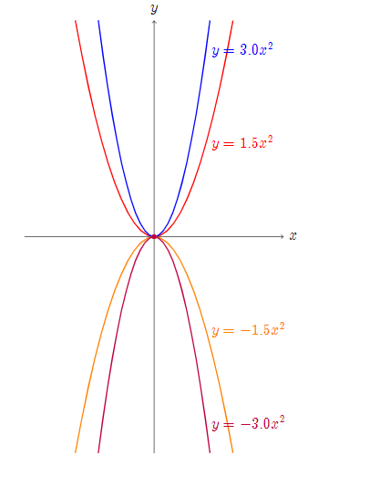
 
 - $x = ay^2$
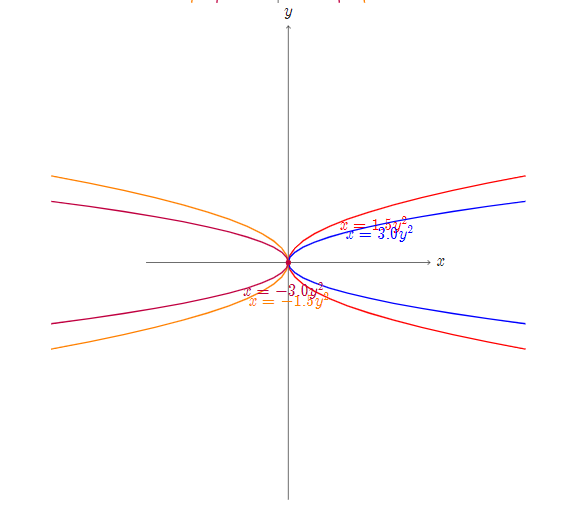

**"The larger the value of _a_, the narrower the opening."**

### 4.3 Ellipses

 - **Horizontal major axis:**

$$
\frac{x^2}{a^2} + \frac{y^2}{b^2} = 1 \quad (a > b)
$$

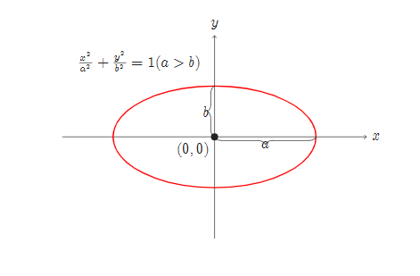

 - **Vertical major axis:**
\(
\frac{x^2}{b^2} + \frac{y^2}{a^2} = 1 \quad (a > b)
\)
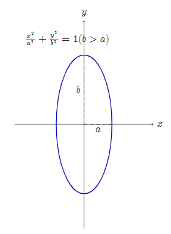

 - **centered at (h, k):**    $\boxed{\frac{(x - h)^2}{a^2} + \frac{(y - k)^2}{b^2} = 1}$

## 5.  Elementary Functions

### 5.1 Core Function Types
#### 5.1.1 Exponential Functions
- **Definition**: $f(x) = a^x$ where $a > 0$ ($a \neq 1$)
- **Key Example**: $e^x$ (natural exponential)
- **Properties**:
  - Domain: $\mathbb{R}$
  - Range: $(0, +\infty)$
  - Always increasing if $a > 1$
  - Horizontal asymptote: $y = 0$

#### *Natural Exponential Function*

##### Definition
The natural exponential function is defined as:
$$y = e^x$$
where:
- $e \approx 2.71828$ (Euler's number)
- The function equals its own derivative: $\frac{dy}{dx} = e^x$
##### Key Properties
1. **Domain**: $(-\infty, \infty)$
2. **Range**: $(0, \infty)$
3. **y-intercept**: (0,1)
4. **Asymptote**: y=0 (horizontal)
5. **Always increasing**
6. **Concave up everywhere**
##### Special Property at (0,1)
The tangent line at x=0 has:
- Slope = $e^0 = 1$
- Equation: $y = x + 1$
##### Graph Visualization
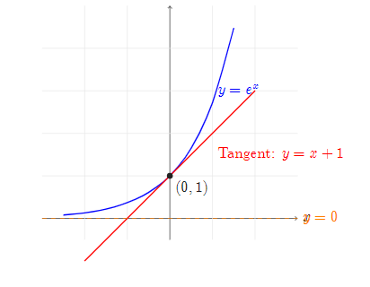

#### 5.1.2 Logarithmic Functions
- **Definition**: $f(x) = \log_a x$ (inverse of $a^x$)
- **Key Example**: $\ln x$ (natural log, base $e$)
- **Properties**:
  - Domain: $(0, +\infty)$
  - Range: $\mathbb{R}$
  - Vertical asymptote: $x = 0$
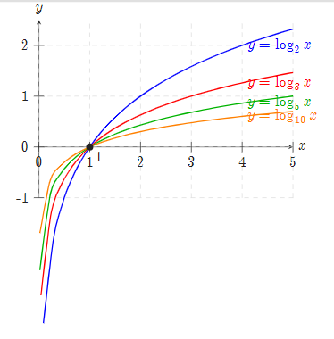

#### 5.1.3 Trigonometric Functions
- **Key Examples**:
  - $\sin x$: Periodic with period $2\pi$, range $[-1, 1]$
  - $\cos x$, $\tan x$ (similar analysis)
- **Properties**:
  - Amplitude (height): $|A|$ in $A\sin(Bx)$
  - Period: $\frac{2\pi}{|B|}$

#### 5.1.4 Power Functions
- **Definition**: $f(x) = x^n$ ($n \in \mathbb{R}$)
- **Examples**:
  - $x^2$: Parabola, domain $\mathbb{R}$, range $[0, +\infty)$
  - $\sqrt{x} = x^{1/2}$: Domain $[0, +\infty)$
 
 (i)  $a = n$, where $n$ is a positive integer:
 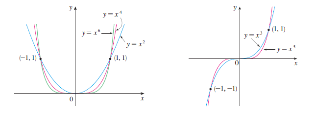
 (ii)  $a = \frac{1}{n}$, where $n$ is a positive integer:
 - The function $f(x) = x^{\frac{1}{n}} = \sqrt[n]{x}$ is a root function
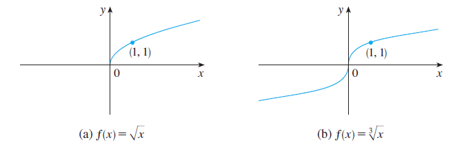

(iii) $a = -1$:
 - ***reciprocal function***: $f(x) = x^{-1} = \frac{1}{x}$

### 5.2 Function Transformations
For any function $y = f(x)$:
1. **Vertical Shift**: $y = f(x) + k$  
   - Up if $k > 0$, down if $k < 0$
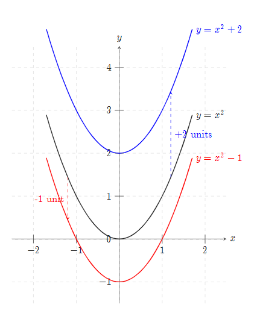
1. **Horizontal Shift**: $y = f(x - h)$  
   - Right if $h > 0$, left if $h < 0$
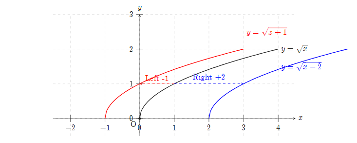

1. **Scaling**:
   - Vertical: $y = A f(x)$ (stretch if $|A| > 1$, shrink if $0 < |A| < 1$)
   - Horizontal: $y = f(Bx)$ (compressed if $|B| > 1$, stretched if $0 < |B| < 1$)
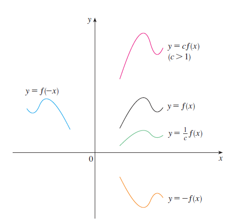
1. **Reflection**:
   - $y = -f(x)$ (flip vertically)
   - $y = f(-x)$ (flip horizontally)

### 5.3 inverse functions and Logarithms
**Definition 1** 
A function f is called a ***one-to-one function*** if it never takes on
the same value twice; that is:
$$
f(x_{1}) \neq f(x_{2}) \quad whenever x_{1} \neq x_{2}
$$
***Horizontal Line Test***  A function is one-to-one if and only if no horizontal line intersects its graph more than once.

**Definition 2** 
Let $f$ be a one-to-one function with domain $A$ and range $B$.  
Then its ***inverse function*** $f^{-1}$ has domain $B$ and range $A$, and is defined by

$$
f^{-1}(y) = x \quad \text{if and only if} \quad f(x) = y
$$

for any $y \in B$.

**Definition 3**
- $f^{-1}(x) = y \iff f(y) = x$  

**Definition 4: cancellation equation**
- $f^{-1}(f(x)) = x$ for every $x \in A$  
- $f(f^{-1}(x)) = x$ for every $x \in B$

##### How to Find the Inverse Function of a One-to-One Function $f$

**Step 1**: Write the equation 
\(y = f(x)\)

**Step 2**: Solve this equation for $x$ in terms of $y$ (if possible): $\boxed{f(y) = x}$

**Step 3**: Interchange $x$ and $y$ to express $f^{-1}$ as a function of $x$: 
$$y = f^{-1}(x)$$
**Example** 
Find the inverse function of $f(x) = x^3 + 2$.

**Solution**  
According to the inverse function process:

1. Write  $y = x^3 + 2$

2. Solve for $x$ in terms of $y$ :   $x^3 = y - 2, \quad x = \sqrt[3]{y - 2}$

3. Interchange $x$ and $y$ :   $y = \sqrt[3]{x - 2}$

Therefore, the inverse function is: 
$$f^{-1}(x) = \sqrt[3]{x - 2}$$

#### Definition of Logarithm and its Inverse Relationship

- $\log_b x = y \iff b^y = x$  
- $\log_b(b^x) = x$ for every $x \in \mathbb{R}$  
- $b^{\log_b x} = x$ for every $x > 0$

#### Laws of Logarithms 
If $x$ and $y$ are **positive numbers**, and $r$ is any **real number**, then:

1. $\log_b(xy) = \log_b x + \log_b y$  
2. $\log_b\left(\dfrac{x}{y}\right) = \log_b x - \log_b y$  
3. $\log_b(x^r) = r \log_b x$

***Natural Logarithm and Its Inverse***

- $\log_e x = \ln x$  
- $\ln x = y \iff e^y = x$  
- $\ln(e^x) = x$ for every $x \in \mathbb{R}$  
- $e^{\ln x} = x$ for every $x > 0$  
- $\ln e = 1$

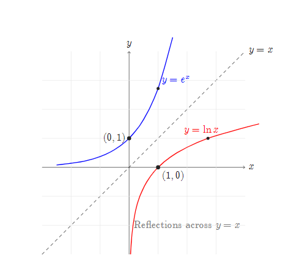

#### inverse Trigonometric functions
#### 1. $\arcsin x$

- **Definition**:  
    $y = \arcsin x \iff \sin y = x$
    
- **Domain**: $[-1, 1]$
    
- **Range**: $\left[ -\dfrac{\pi}{2}, \dfrac{\pi}{2} \right]$
#### 2. $\arccos x$

- **Definition**:  
    $y = \arccos x \iff \cos y = x$
    
- **Domain**: $[-1, 1]$
    
- **Range**: $[0, \pi]$
#### 3. $\arctan x$

- **Definition**:  
    $y = \arctan x \iff \tan y = x$
    
- **Domain**: $\mathbb{R}$
    
- **Range**: $\left( -\dfrac{\pi}{2}, \dfrac{\pi}{2} \right)$

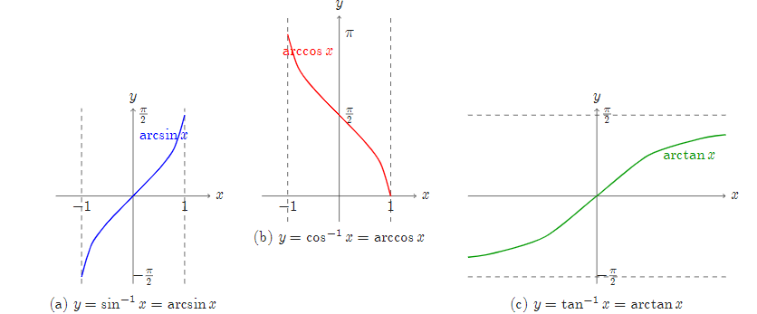

- **The inverse cosecant function:**
  $$y = \csc^{-1}(x) \quad (|x| > 1) \quad \Leftrightarrow \quad \csc(y) = x, \quad y \in \left[0, \frac{\pi}{2}\right) \cup \left(\frac{\pi}{2}, \pi\right]$$

- **The inverse secant function:**
  $$y = \sec^{-1}(x) \quad (|x| > 1) \quad \Leftrightarrow \quad \sec(y) = x, \quad y \in \left[0, \frac{\pi}{2}\right) \cup \left(\frac{\pi}{2}, \pi\right]$$

- **The inverse cotangent function:**
  $$y = \cot^{-1}(x) \quad (x \in \mathbb{R}) \quad \Leftrightarrow \quad \cot(y) = x, \quad y \in (0, \pi)$$

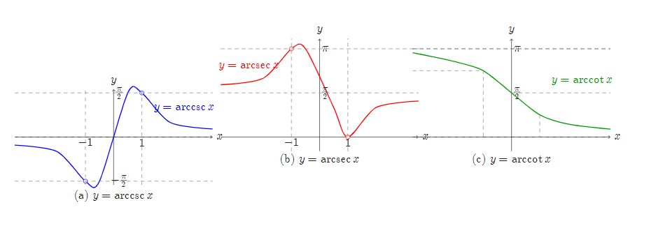

### Key Connections to Calculus
- **Derivatives**:
  - $\frac{d}{dx} e^x = e^x$
  - $\frac{d}{dx} \ln x = \frac{1}{x}$
  - $\frac{d}{dx} \sin x = \cos x$
- **Limits**:
  - $\lim_{x \to -\infty} e^x = 0$
  - $\lim_{x \to 0^+} \ln x = -\infty$

